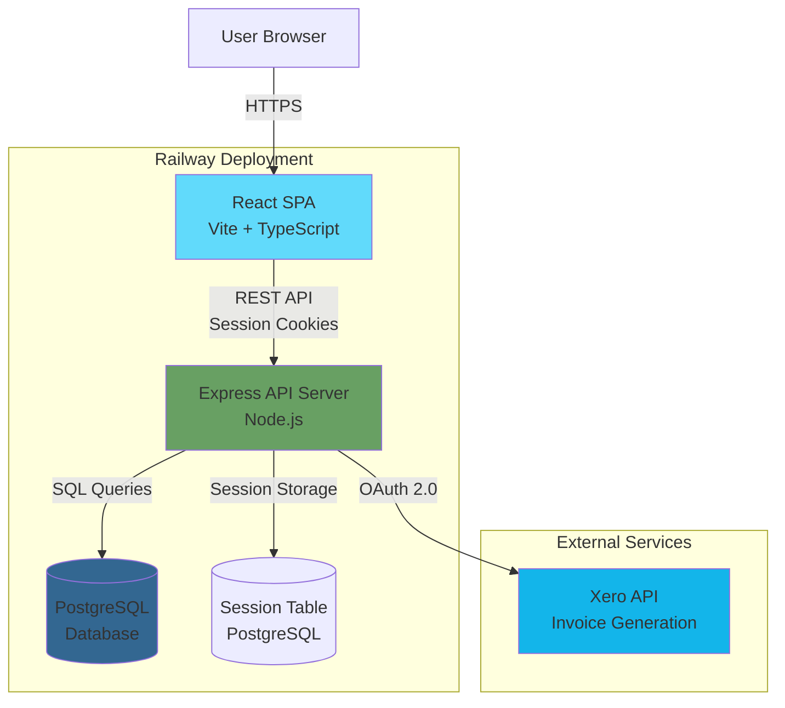

# Lean IT Consulting Ticketing System - Fullstack Architecture Document

**Version:** 1.0
**Date:** 2025-09-30
**Author:** Winston (Architect Agent)

---

## Change Log

| Date | Version | Description | Author |
|------|---------|-------------|--------|
| 2025-09-30 | 1.0 | Initial architecture document created from actual implementation | Winston (Architect) |

---

## Introduction

This document outlines the complete fullstack architecture for the **Lean IT Consulting Ticketing System**, including backend systems, frontend implementation, and their integration. It serves as the single source of truth for AI-driven development, ensuring consistency across the entire technology stack.

This unified approach combines what would traditionally be separate backend and frontend architecture documents, streamlining the development process for modern fullstack applications where these concerns are increasingly intertwined.

### Starter Template or Existing Project

**Based on:** Monorepo with separate frontend and backend applications
- **Frontend:** Custom Vite + React + TypeScript setup with shadcn/ui components (Lovable UI builder used for initial UI generation)
- **Backend:** Custom Node.js + Express setup (no starter template)
- **Architectural Constraints:**
  - Monorepo structure already established (`/frontend` and `/backend` directories)
  - Session-based authentication already implemented
  - PostgreSQL database with 8 complete migrations
  - shadcn/ui component library already integrated

**Current State:** Brownfield project with Epics 1 & 2 backend complete, frontend partially integrated. Architecture document being created retroactively to guide completion and future development.

---

## High Level Architecture

### Technical Summary

The Lean IT Consulting Ticketing System is a monolithic monorepo application deployed as a traditional server-based architecture. The frontend is a React single-page application built with TypeScript and Vite, using shadcn/ui for UI components and served as static assets. The backend is a Node.js Express REST API server handling business logic, Xero integration, and database operations against a PostgreSQL database. Authentication uses session-based cookies with HTTP-only flags stored in PostgreSQL. The system is designed for single-user deployment with minimal hosting costs (<$20/month target), prioritizing development speed and simplicity over scalability. This architecture directly supports the PRD goal of sub-10-second ticket creation through minimal client-side validation, fast API responses (<500ms), and optimized database queries.

### Platform and Infrastructure Choice

**Platform:** Railway
**Key Services:**
- Railway Web Service (Express backend + static frontend)
- Railway PostgreSQL Database
- Railway Cron Jobs (future: daily email notifications)

**Deployment Host and Regions:** Railway US-East (optimal latency for Nashville/Central timezone)

**Rationale:** Railway offers the best balance of simplicity, cost, and features for single-user MVP. Monorepo support is cleanest, and managed PostgreSQL integration is seamless. Easy migration path to other platforms if needed.

### Repository Structure

**Structure:** Monorepo (existing implementation)
**Monorepo Tool:** NPM Workspaces (lightweight, no additional tooling needed)
**Package Organization:**
- Two application packages: `/frontend` and `/backend`
- Shared types package planned: `/packages/shared` (recommended for Epic 3+)
- No complex build orchestration needed - simple npm scripts

### High Level Architecture Diagram



### Architectural Patterns

- **Monolithic Monorepo:** Single repository containing frontend and backend with shared development environment - *Rationale:* Simplifies development for solo consultant, eliminates inter-repo coordination, enables atomic commits across full stack

- **Traditional Server Architecture:** Express server handling all requests (not serverless) - *Rationale:* Simpler deployment, easier local development, no cold starts, sufficient for single-user load, aligns with 4-6 week MVP timeline

- **Session-Based Authentication:** HTTP-only cookies with PostgreSQL session store - *Rationale:* Simpler than JWT for single-user system, automatic CSRF protection, server-side session control, no token refresh complexity

- **Component-Based UI:** Reusable React components with shadcn/ui library - *Rationale:* shadcn/ui provides accessible, customizable components without runtime overhead, TypeScript ensures type safety

- **Repository Pattern (Backend):** Model layer abstracts database access - *Rationale:* Clean separation of concerns, testable business logic, easier to add validation and business rules

- **Service Layer Pattern (Frontend):** API client services abstract HTTP calls - *Rationale:* Centralized error handling, consistent request formatting, enables offline support later, simplifies component logic

- **RESTful API Design:** Standard REST endpoints with JSON payloads - *Rationale:* Simple, well-understood, excellent tooling support, sufficient for CRUD operations, easier to debug than GraphQL

---

## Tech Stack

This is the DEFINITIVE technology selection for the entire project. All development must use these exact versions and tools.

| Category | Technology | Version | Purpose | Rationale |
|----------|-----------|---------|---------|-----------|
| Frontend Language | TypeScript | ^5.8.3 | Type-safe frontend development | Catch errors at compile time, better IDE support, self-documenting code, required for shadcn/ui components |
| Frontend Framework | React | ^18.3.1 | UI component library | Industry standard, excellent ecosystem, component reusability, fast rendering with virtual DOM |
| UI Component Library | shadcn/ui | Latest (Radix UI ^1.x) | Accessible, customizable components | Copy-paste components (no runtime dependency), built on Radix UI primitives, Tailwind-based styling, excellent accessibility |
| State Management | React Query (TanStack Query) | ^5.83.0 | Server state management | Automatic caching, background refetching, optimistic updates, eliminates boilerplate for API calls |
| Backend Language | JavaScript (Node.js) | Node 18+ LTS | Server-side runtime | Shared language with frontend, excellent async I/O, large ecosystem, ES modules support |
| Backend Framework | Express | ^4.18.2 | HTTP server and routing | Minimal, flexible, well-documented, huge middleware ecosystem, perfect for REST APIs |
| API Style | REST | N/A | Client-server communication | Simple, well-understood, excellent HTTP tooling, sufficient for CRUD operations, easier debugging than GraphQL |
| Database | PostgreSQL | 14+ | Primary data store | ACID transactions, robust relational model, JSON support for flexibility, excellent performance, free on Railway |
| Cache | PostgreSQL (sessions only) | 14+ | Session storage | Reuses existing database, zero additional infrastructure, sufficient performance for 1-2 users |
| File Storage | Local filesystem (future: S3) | N/A | File attachments (future epic) | MVP uses local storage, S3 migration path for production scaling |
| Authentication | express-session + bcrypt | express-session ^1.17.3, bcrypt ^5.1.1 | Session-based auth with password hashing | HTTP-only cookies, server-side session control, industry-standard password hashing, simple to implement |
| Frontend Testing | Vitest (planned) | ^1.x | Unit and component tests | Fast, Vite-native, Jest-compatible API, built-in TypeScript support |
| Backend Testing | Jest or Node test runner (planned) | Latest | API and integration tests | Comprehensive testing framework, good mocking support, well-documented |
| E2E Testing | Manual (MVP), Playwright (future) | N/A | End-to-end workflow testing | Manual testing sufficient for MVP and single user, Playwright for automated E2E in future |
| Build Tool | npm | 9+ | Package management and scripts | Standard Node.js tooling, workspaces support for monorepo, no additional learning curve |
| Bundler | Vite | ^5.4.19 | Frontend build and dev server | Extremely fast HMR, native ES modules, optimized production builds, modern architecture |
| IaC Tool | None (Railway UI) | N/A | Infrastructure provisioning | Railway provides UI-based infrastructure management, no IaC needed for single-service deployment |
| CI/CD | GitHub Actions (planned) | N/A | Automated testing and deployment | Free for public repos, Railway GitHub integration for auto-deploy, simple YAML configuration |
| Monitoring | Railway built-in logs (MVP) | N/A | Application monitoring | Sufficient for MVP, upgrade to Sentry or LogRocket for production error tracking |
| Logging | Console + Railway logs | N/A | Application logging | Built-in console logging captured by Railway, structured logging via Winston/Pino for future |
| CSS Framework | Tailwind CSS | ^3.4.17 | Utility-first styling | Rapid UI development, excellent with shadcn/ui, small production bundle, highly customizable |
| Additional Libraries | react-hook-form + zod | ^7.61.1, ^3.25.76 | Form handling and validation | Type-safe form validation, excellent DX, integrates with shadcn/ui form components |
| HTTP Client | Fetch API (native) | Native | API requests from frontend | No additional dependencies, modern browsers support, sufficient for simple REST calls |
| Xero Integration | xero-node | ^6.0.0 | Xero API OAuth and invoicing | Official Xero SDK, handles OAuth 2.0 flow, invoice generation, token refresh |
| Session Store | connect-pg-simple | ^9.0.1 | PostgreSQL session storage | Integrates express-session with PostgreSQL, auto-creates session table, battle-tested |
| Security Headers | helmet | ^7.1.0 | HTTP security headers | Sets secure HTTP headers (CSP, HSTS, etc.), protects against common vulnerabilities |
| CORS | cors | ^2.8.5 | Cross-origin resource sharing | Enables frontend to call backend from different port/domain during development |
| Validation | express-validator | ^7.0.1 | Request validation | Sanitizes and validates API inputs, prevents injection attacks, middleware-based |

---

## Data Models

The core data models represent the business entities shared between frontend and backend. These models are derived from the implemented database schema and PRD requirements.

### User

**Purpose:** Represents authenticated users who can access the ticketing system. Single-user MVP design with multi-user support in schema.

**Key Attributes:**
- `id`: number - Unique identifier (auto-generated)
- `email`: string - User email (unique, used for login)
- `name`: string - User's display name
- `passwordHash`: string - Bcrypt hashed password (backend only, never sent to frontend)
- `createdAt`: Date - Account creation timestamp
- `updatedAt`: Date - Last modification timestamp

**TypeScript Interface:**
```typescript
// Shared type (frontend)
export interface User {
  id: number;
  email: string;
  name: string;
  createdAt: string; // ISO 8601 timestamp
}

// Backend only (includes password hash)
export interface UserEntity extends User {
  passwordHash: string;
  updatedAt: string;
}
```

**Relationships:**
- One User has many Xero Connections (one-to-one in practice for MVP)

### Client

**Purpose:** Represents client companies that work is performed for. Central entity for billing and organization.

**Key Attributes:**
- `id`: number - Unique identifier
- `companyName`: string - Client company name (required)
- `xeroCustomerId`: string | null - Xero contact ID for invoice generation
- `maintenanceContractType`: enum - Contract type (Hourly | Monthly Retainer | Project-Based | None)
- `domains`: string[] - Email domains for auto-detection (one-to-many relationship)
- `contactCount`: number - Computed count of active contacts (frontend only)
- `createdAt`: Date - Record creation timestamp
- `updatedAt`: Date - Last modification timestamp

**TypeScript Interface:**
```typescript
export interface Client {
  id: number;
  companyName: string;
  xeroCustomerId: string | null;
  maintenanceContractType: 'Hourly' | 'Monthly Retainer' | 'Project-Based' | 'None';
  domains: string[];
  contactCount?: number; // Computed field from backend
  createdAt: string;
  updatedAt?: string;
}

// Create/Update request (frontend to backend)
export interface ClientRequest {
  companyName: string;
  xeroCustomerId?: string;
  maintenanceContractType: 'Hourly' | 'Monthly Retainer' | 'Project-Based' | 'None';
  domains: string[];
}
```

**Relationships:**
- One Client has many Contacts (one-to-many)
- One Client has many Tickets (one-to-many)
- One Client has many Domains (one-to-many, stored in separate `client_domains` table)

### Contact

**Purpose:** Represents individual people at client companies. Associates tickets with specific client contacts.

**Key Attributes:**
- `id`: number - Unique identifier
- `clientId`: number - Foreign key to Client
- `name`: string - Contact full name
- `email`: string - Contact email address (unique for active contacts)
- `isSystemContact`: boolean - True for auto-generated "Deleted Contact" records
- `deletedAt`: Date | null - Soft delete timestamp (null = active)
- `createdAt`: Date - Record creation timestamp
- `updatedAt`: Date - Last modification timestamp

**TypeScript Interface:**
```typescript
export interface Contact {
  id: number;
  clientId: number;
  clientName?: string; // Populated via JOIN in API responses
  name: string;
  email: string;
  isSystemContact: boolean;
  deletedAt: string | null;
  createdAt: string;
  updatedAt?: string;
}

// Create/Update request
export interface ContactRequest {
  clientId: number;
  name: string;
  email: string;
}
```

**Relationships:**
- Many Contacts belong to one Client (many-to-one)
- One Contact has many Tickets (one-to-many)
- System Contacts are auto-created per client when contacts are deleted (preserves ticket history)

### Ticket

**Purpose:** Represents billable work items. Core entity for time tracking and invoicing.

**Key Attributes:**
- `id`: number - Unique identifier (sequential ticket number)
- `clientId`: number - Foreign key to Client
- `contactId`: number - Foreign key to Contact
- `description`: string | null - Work description (required before invoicing)
- `notes`: string | null - Additional notes (optional, internal use)
- `state`: enum - Ticket state (open | closed)
- `closedAt`: Date | null - Timestamp when ticket was closed
- `totalHours`: number - Computed sum of all time entries (frontend only)
- `createdAt`: Date - Ticket creation timestamp
- `updatedAt`: Date - Last modification timestamp

**TypeScript Interface:**
```typescript
export interface Ticket {
  id: number;
  clientId: number;
  clientName?: string; // Populated via JOIN
  contactId: number;
  contactName?: string; // Populated via JOIN
  description: string | null;
  notes: string | null;
  state: 'open' | 'closed';
  closedAt: string | null;
  totalHours?: number; // Computed from time entries
  createdAt: string;
  updatedAt: string;
}

// Create request (minimal fields for fast entry)
export interface CreateTicketRequest {
  clientId: number;
  contactId: number;
  description?: string;
  notes?: string;
  timeEntry: {
    workDate?: string; // Defaults to today
    duration: string; // Flexible format: "2h", "1.5", "90m"
    billable?: boolean; // Defaults to true
  };
}

// Update request
export interface UpdateTicketRequest {
  description?: string;
  notes?: string;
  state?: 'open' | 'closed';
}
```

**Relationships:**
- Many Tickets belong to one Client (many-to-one)
- Many Tickets belong to one Contact (many-to-one)
- One Ticket has many Time Entries (one-to-many)

### TimeEntry

**Purpose:** Represents individual time entries for billable/non-billable hours. Enables multiple work sessions per ticket.

**Key Attributes:**
- `id`: number - Unique identifier
- `ticketId`: number - Foreign key to Ticket
- `workDate`: Date - Date work was performed (no time component)
- `durationHours`: number - Hours worked (decimal, e.g., 1.5 for 90 minutes)
- `billable`: boolean - Whether time is billable (true) or non-billable (false)
- `deletedAt`: Date | null - Soft delete timestamp (audit trail per NFR9)
- `createdAt`: Date - Entry creation timestamp
- `updatedAt`: Date - Last modification timestamp

**TypeScript Interface:**
```typescript
export interface TimeEntry {
  id: number;
  ticketId: number;
  workDate: string; // ISO date (YYYY-MM-DD)
  durationHours: number; // Decimal hours
  billable: boolean;
  deletedAt: string | null;
  createdAt: string;
  updatedAt: string;
}

// Create/Update request
export interface TimeEntryRequest {
  workDate: string;
  duration: string; // Flexible format, parsed on backend
  billable: boolean;
}
```

**Relationships:**
- Many Time Entries belong to one Ticket (many-to-one)
- Time Entries are locked when associated month has invoice lock

### InvoiceLock

**Purpose:** Prevents modification of time entries after invoices are generated. Ensures billing integrity.

**Key Attributes:**
- `id`: number - Unique identifier
- `month`: Date - Month locked (YYYY-MM-01 format, unique)
- `xeroInvoiceIds`: object - JSON array of Xero invoice IDs generated
- `lockedAt`: Date - Timestamp when lock was created

**TypeScript Interface:**
```typescript
export interface InvoiceLock {
  id: number;
  month: string; // ISO date (YYYY-MM-01)
  xeroInvoiceIds: string[];
  lockedAt: string;
}
```

**Relationships:**
- Locks apply to all Time Entries where `workDate` falls within the locked month
- No foreign keys, enforced via application logic

### XeroConnection

**Purpose:** Stores OAuth credentials and connection state for Xero API integration. **System-wide singleton** (not per-user).

**Key Attributes:**
- `id`: number - Unique identifier
- `userId`: number - Foreign key to User (NOTE: Should be removed in future migration for system-wide singleton)
- `organizationName`: string | null - Xero organization name
- `organizationId`: string | null - Xero organization ID
- `accessToken`: string | null - Encrypted OAuth access token
- `refreshToken`: string | null - Encrypted OAuth refresh token
- `tokenExpiresAt`: Date | null - Access token expiration timestamp
- `connectedAt`: Date - Initial connection timestamp
- `lastSyncAt`: Date | null - Last successful API call timestamp
- `updatedAt`: Date - Last modification timestamp

**TypeScript Interface:**
```typescript
export interface XeroConnection {
  id: number;
  userId: number;
  organizationName: string | null;
  organizationId: string | null;
  isConnected: boolean; // Computed: accessToken is valid
  connectedAt: string;
  lastSyncAt: string | null;
  updatedAt: string;
}

// Frontend never receives tokens (security)
```

**Relationships:**
- One Xero Connection per system (should be system-wide singleton)
- Current schema has user_id FK (to be removed in future migration)

---

## API Specification

The system uses a RESTful API architecture for communication between the React frontend and Express backend. All endpoints require session-based authentication (except auth endpoints) and return JSON responses.

### Base URL

- **Development:** `http://localhost:3001`
- **Production:** `https://tickets.zollc.com`

### Authentication

**Method:** Session-based authentication via HTTP-only cookies

**Cookie Name:** `connect.sid`

**Protected Routes:** All `/api/*` endpoints except:
- `/api/health`
- `/api/auth/*`
- `/api/xero/callback`

### Key API Endpoints

**Authentication:**
- `POST /api/auth/register` - Create new user account
- `POST /api/auth/login` - Authenticate user and create session
- `POST /api/auth/logout` - Destroy session
- `GET /api/auth/me` - Get current authenticated user

**Clients:**
- `GET /api/clients` - List all clients (with optional search)
- `POST /api/clients` - Create new client with domains
- `GET /api/clients/:id` - Get client by ID
- `PUT /api/clients/:id` - Update client
- `DELETE /api/clients/:id` - Delete client (cascade or block if invoiced)

**Contacts:**
- `GET /api/contacts` - List all contacts (with optional client filter)
- `POST /api/contacts` - Create new contact
- `GET /api/contacts/:id` - Get contact by ID
- `PUT /api/contacts/:id` - Update contact
- `DELETE /api/contacts/:id` - Soft delete contact, reassign tickets

**Tickets (Epic 3):**
- `GET /api/tickets` - List tickets with filters (state, client)
- `POST /api/tickets` - Create ticket with initial time entry
- `GET /api/tickets/:id` - Get ticket with all time entries
- `PUT /api/tickets/:id` - Update ticket (description, notes, state)

**Time Entries (Epic 3):**
- `POST /api/tickets/:id/time-entries` - Add time entry to ticket
- `PUT /api/time-entries/:id` - Update time entry
- `DELETE /api/time-entries/:id` - Soft delete time entry

**Invoices (Epic 4):**
- `GET /api/invoices/preview?month=YYYY-MM` - Preview invoice data before generation
- `POST /api/invoices/generate` - Generate and push invoices to Xero

**Xero Integration (Epic 4):**
- `GET /api/xero/connect` - Initiate OAuth flow
- `GET /api/xero/callback` - OAuth callback handler
- `GET /api/xero/status` - Get connection status
- `POST /api/xero/disconnect` - Revoke Xero tokens

### Error Response Format

All errors follow a consistent structure:

```json
{
  "error": "ValidationError",
  "message": "Human-readable explanation"
}
```

### Data Transformation

**Backend → Frontend:** snake_case → camelCase (handled in API service layer)

**Example:**
```javascript
// Backend response
{ company_name: "Acme Corp", xero_customer_id: "123" }

// Frontend after transformation
{ companyName: "Acme Corp", xeroCustomerId: "123" }
```

### Multi-Month Ticket Handling

**Critical:** Invoice preview and generation filter time entries by `work_date` month, not by ticket creation date. This allows tickets to span multiple months:

- Ticket created in January with time entries in January and February
- January invoice includes only January time entries
- February invoice includes only February time entries
- After January invoice, January entries are locked; February entries remain editable

See "Core Workflows" section for detailed sequence diagram.

---

## Database Schema

The database schema is implemented in PostgreSQL 14+ using migrations. All tables include timestamps for auditing, and relationships enforce referential integrity through foreign keys.

### Entity Relationship Diagram

```mermaid
erDiagram
    users ||--o{ xero_connections : "has (system-wide)"

    clients ||--o{ client_domains : "has many"
    clients ||--o{ contacts : "has many"
    clients ||--o{ tickets : "has many"

    contacts ||--o{ tickets : "has many"

    tickets ||--o{ time_entries : "has many"

    invoice_locks }o--|| time_entries : "locks by work_date month"

    users {
        int id PK
        varchar email UK
        varchar password_hash
        varchar name
        timestamp created_at
        timestamp updated_at
    }

    clients {
        int id PK
        varchar company_name
        varchar xero_customer_id
        varchar maintenance_contract_type
        timestamp created_at
        timestamp updated_at
    }

    client_domains {
        int id PK
        int client_id FK
        varchar domain UK
        timestamp created_at
    }

    contacts {
        int id PK
        int client_id FK
        varchar name
        varchar email
        boolean is_system_contact
        timestamp deleted_at
        timestamp created_at
        timestamp updated_at
    }

    tickets {
        int id PK
        int client_id FK
        int contact_id FK
        text description
        text notes
        varchar state
        timestamp closed_at
        timestamp created_at
        timestamp updated_at
    }

    time_entries {
        int id PK
        int ticket_id FK
        date work_date
        decimal duration_hours
        boolean billable
        timestamp deleted_at
        timestamp created_at
        timestamp updated_at
    }

    invoice_locks {
        int id PK
        date month UK
        jsonb xero_invoice_ids
        timestamp locked_at
    }

    xero_connections {
        int id PK
        int user_id FK UK
        varchar organization_name
        varchar organization_id
        text access_token
        text refresh_token
        timestamp token_expires_at
        timestamp connected_at
        timestamp last_sync_at
        timestamp updated_at
    }
```

### Key Schema Features

**Soft Deletes:**
- `contacts.deleted_at` - Preserves ticket history when contacts removed
- `time_entries.deleted_at` - Audit trail per NFR9
- Partial unique index on `contacts(email)` excludes deleted records

**Cascade Behavior:**
- Client deletion cascades to: client_domains, contacts, tickets, time_entries
- Contact deletion does NOT cascade (handled in application logic - reassigns to system contact)
- Ticket deletion cascades to: time_entries

**Indexes:**
- All foreign key columns indexed for JOIN performance
- `idx_time_entries_work_date` for monthly invoice aggregation
- `idx_tickets_state` for open/closed filtering
- `idx_invoice_locks_month` for fast lock validation

**Data Types:**
- `work_date`: DATE (no time component, eliminates timezone issues)
- `duration_hours`: DECIMAL(5,2) (up to 999.99 hours, 2 decimal places)
- `xero_invoice_ids`: JSONB (flexible schema for invoice metadata)

See full schema DDL in implementation: [backend/src/utils/migrate.js](backend/src/utils/migrate.js:1)

---

## Unified Project Structure

```
tickets/
├── backend/                          # Backend application
│   ├── src/
│   │   ├── config/
│   │   │   └── database.js           # PostgreSQL pool
│   │   ├── controllers/              # Request handlers
│   │   ├── middleware/               # Auth, validation
│   │   ├── models/                   # Repository pattern
│   │   ├── routes/                   # Express routes
│   │   ├── utils/                    # Migrations, seed, helpers
│   │   └── index.js                  # Entry point
│   ├── .env.example
│   └── package.json
├── frontend/                         # Frontend application
│   ├── src/
│   │   ├── components/
│   │   │   ├── ui/                   # shadcn/ui primitives
│   │   │   └── ...                   # Business components
│   │   ├── hooks/                    # React Query hooks
│   │   ├── lib/
│   │   │   ├── api-client.ts         # HTTP client
│   │   │   └── api/                  # API service modules
│   │   ├── pages/                    # Route components
│   │   ├── types/                    # TypeScript types
│   │   ├── App.tsx                   # Routing
│   │   └── main.tsx                  # Entry point
│   ├── .env.example
│   └── package.json
├── packages/                         # Shared packages (future)
│   └── shared/                       # Shared types (Epic 3+)
├── docs/                             # Documentation
│   ├── architecture.md               # This document
│   ├── prd.md                        # Requirements
│   └── stories/                      # Story files
├── .github/workflows/                # CI/CD
├── package.json                      # Root (workspaces)
└── README.md
```

**NPM Workspaces:** Root package.json defines workspaces for backend, frontend, and packages/*

---

## Development Workflow

### Local Setup

```bash
# Install dependencies
npm install

# Create database
createdb ticketing_system

# Configure environment
cp backend/.env.example backend/.env
cp frontend/.env.example frontend/.env
# Edit backend/.env with DB credentials

# Run migrations
npm run migrate

# Start development servers
npm run dev  # Starts backend + frontend concurrently
```

### Development Commands

```bash
npm run dev              # Start all services
npm run dev:backend      # Backend only (port 3001)
npm run dev:frontend     # Frontend only (port 8080)
npm run migrate          # Run database migrations
npm run seed             # Seed test data
npm run build            # Build for production
```

### Environment Variables

**Backend (.env):**
```bash
PORT=3001
NODE_ENV=development
DB_HOST=localhost
DB_PORT=5432
DB_NAME=ticketing_system
DB_USER=postgres
DB_PASSWORD=your_password
SESSION_SECRET=<generate-strong-secret>
FRONTEND_URL=http://localhost:8080
TZ=America/Chicago
```

**Frontend (.env.local):**
```bash
VITE_API_URL=http://localhost:3001
```

---

## Deployment Architecture

### Production Deployment

**Platform:** Railway
**Custom Domain:** `tickets.zollc.com` (CNAME to Railway)

**Unified Deployment:** Backend serves frontend static files in production (single web service)

**Build Process:**
1. Frontend builds to `frontend/dist`
2. Backend serves static files from `dist/`
3. API routes at `/api/*`, frontend routes handled by React Router

**Database:** Railway PostgreSQL (managed, automatic backups)

**SSL/HTTPS:** Railway auto-provisions Let's Encrypt certificates

### Environments

| Environment | URL | Database | Purpose |
|-------------|-----|----------|---------|
| Development | http://localhost:8080 | Local PostgreSQL | Local dev |
| Staging | https://tickets-staging.railway.app | Railway PG (staging) | Pre-prod testing |
| Production | https://tickets.zollc.com | Railway PG (prod) | Live environment |

### Deployment Process

```bash
# Connect to Railway
railway link

# Run migrations on production
railway run npm run migrate

# Deploy (auto-deploys on push to main)
git push origin main

# Manual deploy
railway up
```

### CI/CD Pipeline

**GitHub Actions:** Auto-deploy on merge to `main` branch
- Install dependencies
- Build frontend
- Run tests (when implemented)
- Deploy to Railway

**Railway Configuration:**
- Build: `npm install && npm run build --workspace=frontend`
- Start: `npm start --workspace=backend`
- Auto-scaling: Railway handles (single instance sufficient for MVP)

### Custom Domain Setup

1. Add CNAME record: `tickets.zollc.com` → `<railway-app>.railway.app`
2. Configure custom domain in Railway dashboard
3. Update environment variables: `FRONTEND_URL=https://tickets.zollc.com`
4. Update Xero redirect URI: `https://tickets.zollc.com/api/xero/callback`

### Monitoring

- Railway built-in logs and metrics
- Health check: `https://tickets.zollc.com/api/health`
- Future: Sentry for error tracking (post-MVP)

---

## Security and Performance

### Security Requirements

**Frontend Security:**

*Content Security Policy (CSP):*
- **Implementation:** helmet middleware in production mode
- **Policy:** Restrict inline scripts, allow only same-origin resources and whitelisted CDNs
- **Headers Set:**
  - `Content-Security-Policy: default-src 'self'; script-src 'self'; style-src 'self' 'unsafe-inline'; img-src 'self' data:; connect-src 'self' https://api.xero.com`
  - `X-Frame-Options: DENY` (prevent clickjacking)
  - `X-Content-Type-Options: nosniff` (prevent MIME sniffing)
  - `Strict-Transport-Security: max-age=31536000; includeSubDomains` (enforce HTTPS)

*XSS Prevention:*
- **React Auto-Escaping:** All user input automatically escaped in JSX (default React behavior)
- **DOMPurify:** Use for any raw HTML rendering (e.g., rich text notes - future feature)
- **Input Sanitization:** Backend express-validator sanitizes all inputs before processing
- **Code Review Rule:** Never use `dangerouslySetInnerHTML` without explicit sanitization

*Secure Storage:*
- **Session Cookies Only:** No JWT or sensitive data in localStorage/sessionStorage
- **Cookie Flags:** `httpOnly=true`, `secure=true` (production), `sameSite=lax`
- **No Client-Side Secrets:** Xero tokens and API keys never sent to frontend
- **Sensitive Data Handling:** Password hashes, Xero tokens encrypted at rest in PostgreSQL

**Backend Security:**

*Input Validation:*
- **Library:** express-validator on all API endpoints
- **Validation Strategy:**
  - Whitelist approach (explicitly allow expected fields)
  - Type checking (email, URL, numeric, date formats)
  - Length limits (prevent buffer overflow attacks)
  - Sanitization (trim, escape SQL chars via parameterized queries)
- **Example Validation Chain:**
  ```javascript
  body('email').isEmail().normalizeEmail(),
  body('companyName').trim().isLength({ min: 1, max: 255 }),
  body('domains').isArray({ max: 50 }),
  body('domains.*').isString().matches(/^[a-zA-Z0-9.-]+\.[a-zA-Z]{2,}$/)
  ```

*SQL Injection Prevention:*
- **Parameterized Queries:** All database queries use `$1, $2` placeholders (never string concatenation)
- **ORM Pattern:** Model layer abstracts raw SQL, enforces parameterization
- **Code Review Rule:** Never use template literals for SQL queries

*Rate Limiting:*
- **Library:** express-rate-limit (planned for production)
- **Configuration:**
  - Global: 100 requests/15 minutes per IP
  - Auth endpoints: 5 login attempts/15 minutes per IP
  - Invoice generation: 10 requests/hour per session
- **Response:** HTTP 429 Too Many Requests with `Retry-After` header

*CORS Policy:*
- **Library:** cors middleware
- **Configuration:**
  - Development: Allow `http://localhost:8080`
  - Production: Allow `https://tickets.zollc.com` only
  - Credentials: `credentials: true` (required for session cookies)
  - Methods: `GET, POST, PUT, DELETE`
  - Headers: `Content-Type, Authorization`

**Authentication Security:**

*Token/Session Storage:*
- **Session-Based Auth:** PostgreSQL session store via connect-pg-simple
- **Session ID Generation:** Crypto-strong random (express-session default)
- **Session Table Schema:**
  - `sid` (primary key, indexed)
  - `sess` (JSONB, encrypted session data)
  - `expire` (timestamp, auto-cleanup via cron)

*Session Management:*
- **Session Lifetime:** 30 days (configurable via `SESSION_MAX_AGE`)
- **Idle Timeout:** None (MVP), consider 2-hour idle timeout post-MVP
- **Session Regeneration:** On login success (prevents session fixation)
- **Logout:** Destroys session server-side immediately
- **Concurrent Sessions:** Allowed (single user, multiple devices)

*Password Policy:*
- **Hashing Algorithm:** bcrypt with 10 rounds (balance security vs performance)
- **Password Requirements (MVP):** Minimum 8 characters (enforced client-side and backend)
- **Password Requirements (Future):**
  - Minimum 12 characters
  - Mix of uppercase, lowercase, numbers, symbols
  - Check against common password lists (e.g., Have I Been Pwned API)
- **Password Reset:** Email-based token (future feature, not in MVP)

*Additional Security Measures:*
- **CSRF Protection:** SameSite cookie attribute provides sufficient protection for session-based auth
- **Brute Force Protection:** Rate limiting on `/api/auth/login` (5 attempts/15 min)
- **Audit Logging:** Track login attempts, failed auth, and sensitive operations (future enhancement)

### Performance Optimization

**Frontend Performance:**

*Bundle Size Target:*
- **Goal:** <500KB total JavaScript (uncompressed)
- **Current Estimate:** ~350KB (React 18 + React Router + React Query + shadcn/ui)
- **Monitoring:** Vite build analyzer, track bundle size in CI/CD
- **Optimization Techniques:**
  - Tree-shaking via Vite (eliminates unused code)
  - Code splitting by route (React.lazy + Suspense for page components)
  - Dependency auditing (avoid heavy libraries, prefer lightweight alternatives)

*Loading Strategy:*
- **Initial Load:**
  - Critical CSS inlined in HTML head (Tailwind base styles)
  - Preload fonts (Inter from Google Fonts or self-hosted)
  - Lazy load route components (reduce initial bundle)
- **Route-Based Code Splitting:**
  ```typescript
  const Dashboard = lazy(() => import('./pages/Dashboard'));
  const Clients = lazy(() => import('./pages/Clients'));
  const Tickets = lazy(() => import('./pages/Tickets'));
  ```
- **Image Optimization:** Use WebP format, lazy load images below fold
- **Font Loading:** `font-display: swap` to prevent FOIT (Flash of Invisible Text)

*Caching Strategy:*
- **React Query Configuration:**
  - `staleTime: 5 minutes` (data considered fresh for 5 min)
  - `cacheTime: 10 minutes` (cache retained for 10 min after last use)
  - `refetchOnWindowFocus: true` (refresh stale data on tab focus)
  - `refetchOnReconnect: true` (refresh after network reconnection)
- **Cache Invalidation:**
  - Automatic: After mutations (create, update, delete)
  - Manual: User-triggered refresh button
  - Background: React Query auto-refetches stale data
- **Service Worker (Future):** Precache shell, offline support

**Backend Performance:**

*Response Time Target:*
- **Goal:** <500ms for 95th percentile (PRD NFR1)
- **Current Performance (local):** ~50-150ms for simple queries
- **Monitoring:** Add response time logging via middleware
- **Critical Endpoints:**
  - `GET /api/tickets` - Target <300ms (most common, list view)
  - `POST /api/tickets` - Target <500ms (includes time entry creation)
  - `GET /api/invoices/preview` - Target <1000ms (complex aggregation acceptable)

*Database Optimization:*
- **Indexes:** All foreign keys indexed automatically
- **Additional Indexes:**
  - `idx_time_entries_work_date` (for monthly invoice aggregation)
  - `idx_tickets_state` (for open/closed filtering)
  - `idx_invoice_locks_month` (for lock validation queries)
  - `idx_contacts_email` (partial index excluding deleted_at IS NOT NULL)
- **Query Optimization:**
  - Use JOINs to reduce round trips (e.g., fetch ticket with client/contact names in single query)
  - `LIMIT` and `OFFSET` for pagination (future: cursor-based pagination for scale)
  - Avoid `SELECT *` - specify only needed columns
  - Use `EXPLAIN ANALYZE` to identify slow queries
- **Connection Pooling:**
  - Max connections: 20 (sufficient for single-user load)
  - Idle timeout: 10 seconds
  - Connection reuse: Yes (pg pool)

*Caching Strategy:*
- **MVP:** No application-level caching (PostgreSQL query cache sufficient)
- **Future (if needed):**
  - Redis cache for frequently accessed data (client list, Xero connection status)
  - HTTP caching headers (`Cache-Control`, `ETag`) for static API responses
  - Memoization for expensive calculations (e.g., invoice preview aggregations)

*Database Connection Management:*
- **Library:** pg (node-postgres) with connection pooling
- **Configuration:**
  ```javascript
  const pool = new Pool({
    max: 20,                    // Max connections
    idleTimeoutMillis: 10000,   // Close idle connections after 10s
    connectionTimeoutMillis: 2000, // Timeout if no connection available
  });
  ```
- **Error Handling:** Graceful connection failure with retry logic

**Infrastructure Performance:**

*Railway Optimization:*
- **Region Selection:** US-East (closest to Nashville, Central timezone)
- **Instance Size:** Starter plan (512MB RAM sufficient for MVP)
- **Auto-Scaling:** Not needed for single-user (Railway vertical scaling if required)
- **Database:** Railway PostgreSQL managed service (SSD-backed, optimized for performance)

*CDN Strategy (Future):*
- **Static Assets:** Serve via Railway CDN or Cloudflare (for global edge caching)
- **API Responses:** No CDN (dynamic, session-based auth incompatible)

---

## Testing Strategy

### Testing Pyramid

```
       E2E (Manual)
      /            \
   Integration     API
  /                    \
Frontend Unit      Backend Unit
```

**MVP Approach:** Manual testing prioritized for 4-6 week timeline. Automated testing introduced post-MVP as technical debt paydown.

**Rationale:** Single-user system with consultant performing real-world testing during daily use. Automated tests add significant development time (estimated 2-3 weeks) that conflicts with MVP deadline. Risk is acceptable given small user base and ability to fix issues quickly.

### Test Organization

**Frontend Tests (Planned - Post-MVP):**

*Technology Stack:*
- **Test Runner:** Vitest (fast, Vite-native, Jest-compatible API)
- **Component Testing:** React Testing Library (user-centric, avoids implementation details)
- **Mocking:** MSW (Mock Service Worker) for API mocking
- **Coverage Tool:** Vitest coverage (via c8 or istanbul)

*Test Structure:*
```
frontend/
├── src/
│   ├── components/
│   │   ├── ClientList.tsx
│   │   └── ClientList.test.tsx          # Component unit test
│   ├── hooks/
│   │   ├── useClients.ts
│   │   └── useClients.test.ts           # Hook unit test
│   └── lib/
│       ├── api-client.ts
│       └── api-client.test.ts           # API client unit test
└── tests/
    ├── setup.ts                         # Global test setup
    └── mocks/
        └── handlers.ts                  # MSW API mock handlers
```

*Test Coverage Targets (Post-MVP):*
- Components: 70% line coverage
- Hooks: 90% line coverage (critical business logic)
- API client: 80% line coverage

**Backend Tests (Planned - Post-MVP):**

*Technology Stack:*
- **Test Runner:** Jest or Node.js built-in test runner (decide based on team preference)
- **Database:** In-memory PostgreSQL (pg-mem) or test database with migrations
- **API Testing:** Supertest (HTTP assertion library for Express)
- **Mocking:** Jest mocks for external APIs (Xero SDK)

*Test Structure:*
```
backend/
├── src/
│   ├── controllers/
│   │   ├── auth.controller.js
│   │   └── auth.controller.test.js      # Controller unit test
│   ├── models/
│   │   ├── client.model.js
│   │   └── client.model.test.js         # Model unit test
│   └── utils/
│       ├── time-parser.js
│       └── time-parser.test.js          # Utility unit test
└── tests/
    ├── integration/
    │   ├── auth.integration.test.js     # Auth flow integration test
    │   └── tickets.integration.test.js  # Ticket CRUD integration test
    └── setup.js                         # Test database setup
```

*Test Coverage Targets (Post-MVP):*
- Controllers: 80% line coverage
- Models: 90% line coverage (critical data layer)
- Utils: 95% line coverage (pure functions, easy to test)

**E2E Tests (Planned - Future):**

*Technology Stack:*
- **Test Runner:** Playwright (cross-browser, excellent debugging, built-in video recording)
- **Test Data:** Seed scripts for consistent test data
- **CI Integration:** GitHub Actions with Playwright container

*Test Structure:*
```
tests/
└── e2e/
    ├── auth.spec.ts                     # Login/logout flows
    ├── tickets.spec.ts                  # Ticket creation workflow
    ├── invoices.spec.ts                 # Invoice generation workflow
    └── fixtures/
        └── test-data.sql                # Seed data for E2E tests
```

*Critical E2E Test Scenarios:*
1. **Authentication Flow:** Register → Login → Access protected route → Logout
2. **Ticket Creation:** Login → Create client → Create contact → Create ticket with time entry → Verify dashboard
3. **Invoice Generation:** Create tickets → Add time entries → Preview invoice → Generate in Xero → Verify lock

### Manual Testing Checklist (MVP)

Since automated tests are deferred, use this checklist for each epic completion:

**Epic 1 - Authentication:**
- [ ] Register new user (email validation, password requirements)
- [ ] Login with correct credentials
- [ ] Login with incorrect credentials (error handling)
- [ ] Session persistence (refresh page, still logged in)
- [ ] Logout (session destroyed, redirect to login)
- [ ] Protected route access (redirect to login when unauthenticated)

**Epic 2 - Client & Contact Management:**
- [ ] Create client with domains
- [ ] Update client (name, contract type, domains)
- [ ] Delete client (verify cascade or block if invoiced)
- [ ] Search clients by name
- [ ] Create contact for client
- [ ] Update contact (name, email)
- [ ] Delete contact (verify reassignment to system contact)
- [ ] Unique email validation (prevent duplicate active contacts)

**Epic 3 - Ticket & Time Entry System:**
- [ ] Create ticket with initial time entry (verify defaults)
- [ ] Add additional time entries to ticket
- [ ] Update ticket description/notes
- [ ] Close ticket (verify closedAt timestamp)
- [ ] Flexible time entry parsing ("2h", "1.5", "90m")
- [ ] Filter tickets by state (open/closed)
- [ ] Filter tickets by client
- [ ] Verify total hours calculation

**Epic 4 - Xero Integration & Invoice Generation:**
- [ ] Connect to Xero (OAuth flow)
- [ ] Preview invoice for month (verify aggregation)
- [ ] Generate invoices (verify Xero API call, invoice lock creation)
- [ ] Attempt to edit locked time entry (verify block)
- [ ] Disconnect Xero (verify token revocation)

**Epic 5 - Views, Search & Historical Access:**
- [ ] Dashboard view (stats, recent tickets)
- [ ] Search tickets by description
- [ ] Search clients by name/domain
- [ ] View historical invoices (locked months)

### Test Examples

**Frontend Component Test (Example - Post-MVP):**

```typescript
// frontend/src/components/ClientList.test.tsx
import { render, screen, waitFor } from '@testing-library/react';
import { QueryClient, QueryClientProvider } from '@tanstack/react-query';
import { ClientList } from './ClientList';
import { server } from '../tests/mocks/server';
import { rest } from 'msw';

describe('ClientList', () => {
  const queryClient = new QueryClient();

  it('displays clients from API', async () => {
    render(
      <QueryClientProvider client={queryClient}>
        <ClientList />
      </QueryClientProvider>
    );

    await waitFor(() => {
      expect(screen.getByText('Acme Corp')).toBeInTheDocument();
      expect(screen.getByText('TechStart Inc')).toBeInTheDocument();
    });
  });

  it('handles API error gracefully', async () => {
    server.use(
      rest.get('/api/clients', (req, res, ctx) => {
        return res(ctx.status(500), ctx.json({ error: 'Server error' }));
      })
    );

    render(
      <QueryClientProvider client={queryClient}>
        <ClientList />
      </QueryClientProvider>
    );

    await waitFor(() => {
      expect(screen.getByText(/error loading clients/i)).toBeInTheDocument();
    });
  });
});
```

**Backend API Test (Example - Post-MVP):**

```javascript
// backend/src/controllers/auth.controller.test.js
import request from 'supertest';
import app from '../index.js';
import { pool } from '../config/database.js';

describe('POST /api/auth/register', () => {
  afterAll(async () => {
    await pool.end();
  });

  it('creates new user with valid data', async () => {
    const response = await request(app)
      .post('/api/auth/register')
      .send({
        email: 'test@example.com',
        name: 'Test User',
        password: 'SecurePass123'
      });

    expect(response.status).toBe(201);
    expect(response.body).toHaveProperty('id');
    expect(response.body.email).toBe('test@example.com');
    expect(response.body).not.toHaveProperty('passwordHash');
  });

  it('rejects duplicate email', async () => {
    await request(app)
      .post('/api/auth/register')
      .send({ email: 'dup@example.com', name: 'User 1', password: 'Pass123' });

    const response = await request(app)
      .post('/api/auth/register')
      .send({ email: 'dup@example.com', name: 'User 2', password: 'Pass456' });

    expect(response.status).toBe(409);
    expect(response.body.error).toBe('UserAlreadyExists');
  });
});
```

**E2E Test (Example - Future):**

```typescript
// tests/e2e/tickets.spec.ts
import { test, expect } from '@playwright/test';

test('create ticket with time entry', async ({ page }) => {
  // Login
  await page.goto('http://localhost:8080/login');
  await page.fill('input[name="email"]', 'test@zollc.com');
  await page.fill('input[name="password"]', 'TestPass123');
  await page.click('button[type="submit"]');

  // Navigate to tickets
  await page.click('a[href="/tickets"]');
  await page.click('button:has-text("New Ticket")');

  // Fill ticket form
  await page.selectOption('select[name="clientId"]', '1');
  await page.selectOption('select[name="contactId"]', '1');
  await page.fill('textarea[name="description"]', 'Test ticket description');
  await page.fill('input[name="duration"]', '2h');
  await page.click('button:has-text("Create Ticket")');

  // Verify redirect to ticket detail
  await expect(page).toHaveURL(/\/tickets\/\d+/);
  await expect(page.locator('h1')).toContainText('Test ticket description');
  await expect(page.locator('text=2.00 hours')).toBeVisible();
});
```

---

## Coding Standards

### Critical Rules

- **Type Sharing:** Define types in `/packages/shared` (Epic 3+)
- **API Calls:** Always use service layer, never direct fetch in components
- **Environment Variables:** Access via config, never `process.env` directly
- **Error Handling:** All API routes use standard error format
- **State Updates:** Never mutate state directly

### Naming Conventions

| Element | Frontend | Backend | Example |
|---------|----------|---------|---------|
| Components | PascalCase | - | `ClientList.tsx` |
| Hooks | camelCase with 'use' | - | `useClients.ts` |
| API Routes | - | kebab-case | `/api/client-domains` |
| Database Tables | - | snake_case | `client_domains` |

---

## External APIs

### Xero API

- **Purpose:** Invoice generation, OAuth authentication, customer management
- **Documentation:** https://developer.xero.com/documentation/api/accounting/overview
- **Authentication:** OAuth 2.0 with PKCE, refresh token rotation
- **Rate Limits:** 60 calls/min, 5000 calls/day

**Key Endpoints:**
- `GET /connections` - Get authorized tenants
- `POST /Invoices` - Create invoices with line items
- `GET /Items` - Verify "Consulting Services" product exists

**Invoice Number Handling:**
- **Xero auto-generates invoice numbers** - system does not supply them
- Invoice numbers returned in API response and stored in `invoice_locks.xero_invoice_ids`
- No duplicate risk - Xero controls sequential numbering

**Token Management:**
- Access tokens encrypted at rest (Node.js crypto module)
- Automatic refresh before expiry (30-minute token lifetime)
- xero-node SDK handles token refresh automatically

---

## Testing Strategy

**Testing Pyramid:**
```
       E2E (Manual)
      /            \
   Integration     API
  /                    \
Frontend Unit      Backend Unit
```

**MVP Approach:** Manual testing, user acceptance testing during real-world usage

**Future:**
- Frontend: Vitest + React Testing Library
- Backend: Jest or Node test runner
- E2E: Playwright

---

## Key Architecture Decisions

### Why Monolith vs Microservices?
Single user with straightforward CRUD workflows doesn't justify microservice complexity. Monolith is faster to build, easier to deploy, and meets all NFRs.

### Why Traditional Server vs Serverless?
The PRD emphasizes <500ms response times. Serverless cold starts would violate these requirements. Session-based auth also requires persistent server state.

### Why Session-Based vs JWT?
Single-user system doesn't need distributed auth. Sessions are simpler to implement, more secure (HTTP-only, server-side revocation), and avoid token refresh complexity.

### Why PostgreSQL Sessions vs Redis?
For 1-2 users, PostgreSQL session lookup (~1-3ms) vs Redis (~0.5-1ms) difference is negligible compared to network latency (20-30ms). Zero additional infrastructure simplifies deployment and reduces costs.

### Why Railway?
Railway offers best DX for monorepo + PostgreSQL + traditional server at lowest cost ($10-15/month). Simple migration path exists (standard PostgreSQL + Express). Heroku pricing increased significantly; Vercel optimized for serverless/edge.

---

## Implementation Status

**Completed (Epics 1-2 Backend):**
- ✅ Database schema (8 migrations)
- ✅ Authentication system (register, login, logout, session management)
- ✅ Client CRUD with domains
- ✅ Contact CRUD with soft delete

**In Progress (Epic 1-2 Frontend):**
- ⚠️ Frontend auth integration (Epic 1 - to be completed)
- ⚠️ Client/Contact UI wiring (Epic 2 - replace mock data with API hooks)

**Planned:**
- Epic 3: Ticket & Time Entry System
- Epic 4: Xero Integration & Invoice Generation
- Epic 5: Views, Search & Historical Access

**For detailed implementation status, see:** [docs/sprint-change-proposal.md](docs/sprint-change-proposal.md)

---

## References

- **PRD:** [docs/prd.md](docs/prd.md)
- **Sprint Change Proposal:** [docs/sprint-change-proposal.md](docs/sprint-change-proposal.md)
- **Backend Entry Point:** [backend/src/index.js](backend/src/index.js:1)
- **Frontend Entry Point:** [frontend/src/main.tsx](frontend/src/main.tsx:1)
- **Database Migrations:** [backend/src/utils/migrate.js](backend/src/utils/migrate.js:1)
- **API Client:** [frontend/src/lib/api-client.ts](frontend/src/lib/api-client.ts:1)

---

**End of Architecture Document**
