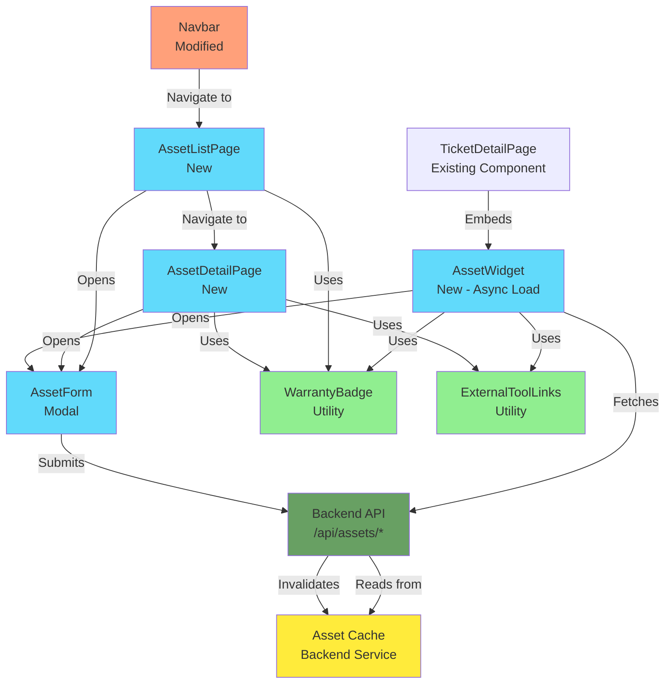

# Asset Management Integration - Brownfield Enhancement Architecture

**Version:** 1.0
**Date:** 2025-10-16
**Status:** Draft
**Architecture Type:** Brownfield Enhancement

---

## Introduction

This document outlines the architectural approach for enhancing the **Lean IT Consulting Ticketing System** with **Asset Management Integration**. Its primary goal is to serve as the guiding architectural blueprint for AI-driven development of new features while ensuring seamless integration with the existing system.

**Relationship to Existing Architecture:**
This document supplements the existing project architecture (documented in [docs/architecture/](docs/architecture/)) by defining how new asset management components will integrate with the current Client/Contact/Ticket data model. Where conflicts arise between new and existing patterns, this document provides guidance on maintaining consistency while implementing enhancements.

### Complexity Verification

✅ **This enhancement requires comprehensive architectural planning**

**Reasoning:**
- **Database Schema Extension:** New `assets` table with relationships to existing `contacts` and `clients` tables, plus foreign key constraints
- **Caching Layer:** Net-new in-memory or Redis caching system (existing system has no caching)
- **External API Integration:** Lenovo Warranty API integration (new external dependency)
- **Performance Requirements:** Strict performance budgets (<500ms asset widget, <10 seconds ticket creation must remain unchanged)
- **Multiple UI Integration Points:** Asset widget (embedded in ticket detail), asset CRUD pages, navigation refactoring
- **Backward Compatibility:** Explicit constraints (Outlook Add-in unchanged, no impact to existing ticket workflows)

### Required Inputs Status

✅ **All required inputs are available:**

1. ✅ **Completed PRD:** [docs/prd-asset-management.md](../prd-asset-management.md) - Comprehensive brownfield PRD
2. ✅ **Existing Technical Documentation:**
   - [Tech Stack](tech-stack.md)
   - [High-Level Architecture](high-level-architecture.md)
   - [Database Schema](database-schema.md)
   - [Source Tree Organization](source-tree-organization.md)
   - [Coding Standards](coding-standards.md)
3. ✅ **Project Structure:** Monorepo with NPM workspaces (backend, frontend, outlook-addin, packages/shared)

### Change Log

| Change | Date | Version | Description | Author |
|--------|------|---------|-------------|--------|
| Initial Architecture Creation | 2025-10-16 | 1.0 | Created brownfield architecture from PRD analysis | Winston (Architect) |

---

## Existing Project Analysis

### Current Project State

- **Primary Purpose:** Lean IT Consulting Ticketing System for Zero One LLC's support workflow - single-user ticketing, time tracking, client/contact management, Xero invoicing
- **Current Tech Stack:** React 18.3.1 (TypeScript 5.8.3) + Vite 5.4.19 frontend | Node.js Express backend | PostgreSQL 14+ | Session-based auth | shadcn/ui components
- **Architecture Style:** Monolithic monorepo (NPM workspaces) with traditional server architecture (not serverless)
- **Deployment Method:** Railway platform - single web service (Express + static assets), managed PostgreSQL, US-East region

### Available Documentation

- [Tech Stack Documentation](tech-stack.md) - Complete technology inventory with version tracking
- [High-Level Architecture](high-level-architecture.md) - Architectural patterns and platform decisions
- [Database Schema](database-schema.md) - ERD and schema specifications
- [Source Tree Organization](source-tree-organization.md) - Monorepo structure and file naming conventions
- [Coding Standards](coding-standards.md) - Type sharing, naming conventions, critical rules
- [API Specification](api-specification.md) - REST endpoint documentation
- [External APIs](external-apis.md) - Xero OAuth 2.0 integration patterns
- [Security and Performance](security-and-performance.md) - Authentication and optimization strategies

### Identified Constraints

- **Single-user deployment target** - No multi-tenancy, minimal hosting cost (<$20/month), prioritizes development speed over scalability
- **No existing caching layer** - All queries currently hit PostgreSQL directly, asset caching is net-new infrastructure
- **Outlook Add-in isolation requirement** - Recent enhancement (Epics 1-7), must remain completely unchanged, separate build pipeline
- **Session-based authentication only** - No JWT/token infrastructure, all endpoints use express-session middleware
- **PostgreSQL-only data store** - No Redis/MongoDB/other datastores currently deployed
- **Railway platform lock-in** - Deployment optimized for Railway, migration to other platforms would require reconfiguration
- **Performance budget: <10 seconds ticket creation** - Existing NFR that must not degrade with asset integration
- **Monolithic deployment** - No microservices, all features in single Express server process

### Analysis Findings

**Key Findings from Existing System Analysis:**

1. **Data Model Foundation:**
   - Existing hierarchy: `clients` (1) → `contacts` (N) → `tickets` (N) → `time_entries` (N)
   - Soft delete pattern: `contacts.deleted_at`, `time_entries.deleted_at` (audit trail)
   - Foreign key constraints with specific cascade behaviors: Client deletion cascades, Contact deletion reassigns to system contact
   - **Implication:** Asset entity should follow same patterns - FK to `contacts`, soft delete via `status='retired'` + `retired_at` timestamp

2. **API Patterns:**
   - RESTful endpoints: `/api/clients`, `/api/contacts`, `/api/tickets`, `/api/time-entries`
   - Standard error format (consistent across endpoints)
   - Session middleware on all routes (no public endpoints except login)
   - **Implication:** New `/api/assets` endpoints should mirror existing structure and auth patterns

3. **Frontend Architecture:**
   - Service layer pattern: API calls in `/frontend/src/lib/api/` modules (e.g., `clients.ts`, `tickets.ts`)
   - Component organization: `/frontend/src/components/` with PascalCase naming
   - No state management library (React state + hooks only)
   - shadcn/ui components: Button, Table, Dialog, Badge already in use
   - **Implication:** Asset components should follow same patterns - API service in `lib/api/assets.ts`, components in `components/assets/`

4. **Build and Deployment:**
   - NPM workspaces: Root package.json orchestrates frontend/backend/outlook-addin
   - Vite builds frontend to static assets, Express serves them
   - Single Railway service deployment (no separate frontend/backend services)
   - **Implication:** Asset features bundle with existing frontend build, no infrastructure changes needed

5. **Recent Outlook Add-in Integration (Epics 1-7):**
   - Separate workspace: `/outlook-addin/` with own package.json
   - Shared types planned: `/packages/shared` (may or may not exist yet)
   - Explicit constraint: Add-in must remain unchanged
   - **Implication:** Linting rule needed to prevent asset imports in outlook-addin, separate build verification

---

## Enhancement Scope and Integration Strategy

### Enhancement Overview

- **Enhancement Type:** Integration with New Systems (Lenovo Warranty API) + New Feature Addition (Asset Management)
- **Scope:** Add asset tracking capabilities linked to contacts, with one-click ScreenConnect/PDQ access from ticket workflows. Includes asset CRUD operations, warranty automation via Lenovo API, caching layer for performance, and navigation refactoring.
- **Integration Impact:** Moderate Impact - New database table + FK relationships, new UI sections embedded in ticket detail page, new API endpoints, navbar restructuring. No modifications to existing Client/Contact/Ticket core functionality.

### Integration Approach

**Code Integration Strategy:**
- **Additive Architecture** - Zero modifications to existing endpoints (`/api/clients`, `/api/contacts`, `/api/tickets`)
- **New Module Pattern** - Asset features isolated in dedicated modules: `backend/src/routes/assets.js`, `frontend/src/components/assets/`, `frontend/src/lib/api/assets.ts`
- **Async Widget Loading** - Asset widget on ticket detail loads asynchronously (React.lazy or useEffect) to prevent blocking ticket page render
- **Linting Enforcement** - ESLint rule prevents asset imports in `outlook-addin/` workspace (explicit isolation)

**Database Integration:**
- **Schema Extension (Non-Breaking):**
  - New `assets` table with FK to `contacts.id` (ON DELETE SET NULL - assets become unassigned)
  - New `clients.notion_url` column (nullable, backward compatible)
  - Indexes for performance: `idx_assets_contact_id`, `idx_assets_status`, `idx_assets_warranty_expiration`
- **Migration Strategy:** Two separate migrations (assets table + clients column) enable independent deployment/rollback

**API Integration:**
- **RESTful Endpoints (New):** `/api/assets`, `/api/assets/:id`, `/api/assets/widget/:ticketId`, `/api/assets/:id/warranty-lookup`
- **Existing Endpoint Extension:** `PUT /api/clients/:id` accepts optional `notion_url` field (backward compatible)
- **Authentication:** Reuse existing `express-session` middleware (no new auth logic)

**UI Integration:**
- **Ticket Detail Page:** Inject `<AssetWidget />` component below contact info, above time entries. Widget collapses on mobile.
- **Navigation Refactoring:** Replace top-level "Clients", "Contacts", "Settings" with "Manage" dropdown (includes new "Assets" link). Reduces navbar 8→5 items.
- **New Pages:** `/assets` (list), `/assets/:id` (detail), modal dialogs for create/edit forms
- **Component Reuse:** shadcn/ui Button, Table, Dialog, Badge, Form components (existing patterns)

### Compatibility Requirements

- **Existing API Compatibility:** All existing endpoints unchanged - `/api/tickets`, `/api/clients`, `/api/contacts` maintain identical request/response schemas
- **Database Schema Compatibility:**
  - `assets.contact_id` nullable (permits unassigned assets)
  - ON DELETE SET NULL for contact FK (assets persist when contact deleted, don't cascade)
  - `clients.notion_url` nullable (backward compatible with existing client records)
- **UI/UX Consistency:**
  - Asset pages use identical shadcn/ui component library, Tailwind CSS classes, layout patterns
  - Warranty color-coding follows existing badge patterns (red/yellow/green utility classes)
  - Asset forms mirror existing ticket/client/contact form validation patterns
- **Performance Impact:**
  - Asset widget <500ms load time (NFR1) via caching + async load
  - Ticket creation remains <10 seconds (NFR4) - widget doesn't block ticket page render
  - Cache warmup on startup (<2 seconds for 1000 assets)

---

## Tech Stack

### Existing Technology Stack

| Category | Current Technology | Version | Usage in Enhancement | Notes |
|----------|-------------------|---------|---------------------|-------|
| Frontend Framework | React | 18.3.1 | Asset UI components | Match main frontend version |
| Frontend Language | TypeScript | 5.8.3 | Type-safe asset data models | Shared types in `/packages/shared` |
| Build Tool | Vite | 5.4.19 | Asset module bundling | Existing build config, no changes |
| CSS Framework | Tailwind CSS | 3.4.17 | Asset widget styling | Reuse existing config and utility classes |
| UI Components | shadcn/ui (Radix UI) | 1.x | Asset forms, tables, badges | Button, Dialog, Table, Badge components |
| HTTP Client | Fetch API (native) | Native | Lenovo API calls, asset API | No new dependencies (no axios) |
| Backend Framework | Node.js Express | Current | Asset REST API endpoints | Extend existing server |
| Database | PostgreSQL | 14+ | Assets table, indexes | Use existing connection pool |
| Authentication | express-session cookies | Current | Asset endpoint auth | Reuse existing middleware |
| Session Store | connect-pg-simple | 9.0.1 | Session storage | No changes needed |
| Package Manager | npm | 9+ | Dependency management | NPM workspaces pattern |
| Deployment Platform | Railway | Current | Deploy with existing service | No infrastructure changes |

### New Technology Additions

**IMPORTANT:** No new external dependencies for MVP. All features use existing stack.

| Technology | Version | Purpose | Rationale | Integration Method |
|------------|---------|---------|-----------|-------------------|
| **None for MVP** | - | - | Asset management uses existing React, TypeScript, PostgreSQL, Express stack | No new npm packages required |

**Lenovo Warranty API Integration:**
- **Not a package dependency** - Direct HTTPS API calls using native Fetch API
- **Endpoint:** `https://supportapi.lenovo.com/v2.5/warranty`
- **Authentication:** `ClientID` header with `LENOVO_API_KEY` environment variable
- **Integration:** Backend service `lenovoWarranty.js` (port from AssetFlow project, convert axios → fetch)

**Asset Caching:**
- **In-Memory Cache (Node.js Map)** - No Redis package for MVP
- **Rationale:** Expected <1000 assets, in-memory sufficient. Defer Redis to Phase 2 if dataset grows >5000 assets.
- **Implementation:** Backend service `assetCache.js` with Map data structure

**Migration/Integration Notes:**
- **AssetFlow Migration:** Port Lenovo warranty service code (axios → native fetch conversion), no data migration (fresh start)
- **Shared Types:** Extend `/packages/shared/src/types/` with Asset, WarrantyInfo interfaces (already planned for Outlook Add-in)
- **No Bundle Size Impact Target:** <50KB additional gzipped JS for asset features

---

## Data Models and Schema Changes

### New Data Model: Asset

**Purpose:** Track IT assets (computers, devices) with warranty information and external tool integration (ScreenConnect, PDQ)

**Integration with Existing Models:**
- Assets belong **directly** to **one Client** (many-to-one relationship, **required**)
- Assets **optionally** belong to **one Contact** within that Client (many-to-one relationship, **nullable**)
- Assets can be **unassigned from contact** (contact_id = null) when ownership unclear or contact deleted
- When Contact deleted, assets become unassigned (ON DELETE SET NULL) but **remain linked to Client**
- When Client deleted, assets are cascade deleted (business rule: client owns assets)

**Key Attributes:**

```typescript
interface Asset {
  id: number;                           // Primary key
  hostname: string;                     // Required - primary identifier
  client_id: number;                    // FK to clients.id (required - NOT NULL)
  contact_id: number | null;            // FK to contacts.id (nullable - optional)
  manufacturer: string | null;          // e.g., "Lenovo", "Dell", "HP"
  model: string | null;                 // e.g., "ThinkPad X1 Carbon Gen 9"
  serial_number: string | null;         // Used for warranty lookups
  in_service_date: Date;                // Required - for age calculations
  warranty_expiration_date: Date | null;// Color-coded display (red/yellow/green)
  pdq_device_id: string | null;         // For PDQ Connect URL construction
  screenconnect_session_id: string | null; // For ScreenConnect URL construction
  status: 'active' | 'retired';         // Soft delete pattern
  retired_at: Date | null;              // Timestamp when retired
  created_at: Date;                     // Auto-generated
  updated_at: Date;                     // Auto-updated
}
```

**Relationships:**
- **With Existing Models:**
  - `assets.client_id` → `clients.id` (many-to-one, **required** - NOT NULL)
  - `assets.contact_id` → `contacts.id` (many-to-one, **optional** - nullable)
  - Contact must belong to the same client as the asset (enforced in application logic)
- **With New Models:** None (Asset is standalone entity)

**Business Rules:**
- **Client assignment is required** - every asset must have a client_id (enforced by DB: NOT NULL)
- **Contact assignment is optional** - contact_id can be null (unassigned)
- Hostname must be unique per client (enforced in application logic, not DB constraint)
- Status defaults to 'active' on creation
- Retired assets (status='retired') excluded from widget and active lists
- Permanent delete allowed only if retired_at > 2 years ago
- Contact assignment can be changed (including set to null/unassigned), but client cannot be null
- If contact is selected, it must belong to the asset's client (validated on create/update)

---

### Schema Integration Strategy

#### Database Changes Required

**New Table: `assets`**

```sql
CREATE TABLE assets (
  id SERIAL PRIMARY KEY,
  hostname VARCHAR(255) NOT NULL,
  client_id INTEGER NOT NULL REFERENCES clients(id) ON DELETE CASCADE,
  contact_id INTEGER REFERENCES contacts(id) ON DELETE SET NULL,
  manufacturer VARCHAR(255),
  model VARCHAR(255),
  serial_number VARCHAR(255),
  in_service_date DATE NOT NULL,
  warranty_expiration_date DATE,
  pdq_device_id VARCHAR(255),
  screenconnect_session_id VARCHAR(255),
  status VARCHAR(50) DEFAULT 'active' NOT NULL CHECK (status IN ('active', 'retired')),
  retired_at TIMESTAMP,
  created_at TIMESTAMP DEFAULT CURRENT_TIMESTAMP NOT NULL,
  updated_at TIMESTAMP DEFAULT CURRENT_TIMESTAMP NOT NULL
);

-- Indexes for performance
CREATE INDEX idx_assets_client_id ON assets(client_id);
CREATE INDEX idx_assets_contact_id ON assets(contact_id);
CREATE INDEX idx_assets_status ON assets(status);
CREATE INDEX idx_assets_warranty_expiration ON assets(warranty_expiration_date);
CREATE INDEX idx_assets_hostname ON assets(hostname); -- For search

-- Trigger for updated_at
CREATE TRIGGER update_assets_updated_at
  BEFORE UPDATE ON assets
  FOR EACH ROW
  EXECUTE FUNCTION update_updated_at_column();
```

**Modified Table: `clients`**

```sql
-- Add notion_url column (backward compatible)
ALTER TABLE clients ADD COLUMN notion_url VARCHAR(500);
```

**Indexes Rationale:**
- `idx_assets_client_id`: Fast lookup for client-level asset queries (required relationship)
- `idx_assets_contact_id`: Fast lookup for widget query (get assets by ticket's contact)
- `idx_assets_status`: Filter active vs. retired assets
- `idx_assets_warranty_expiration`: Warranty expiration reports, color-coding queries
- `idx_assets_hostname`: Search functionality on asset list page

#### Migration Strategy

**Migration 1: Create Assets Table**
- File: `backend/src/migrations/XXX_create_assets_table.sql`
- Safe to deploy: New table, no impact on existing data
- Rollback: `DROP TABLE assets CASCADE;`

**Migration 2: Add Clients Notion URL**
- File: `backend/src/migrations/XXX_add_clients_notion_url.sql`
- Safe to deploy: Nullable column, backward compatible
- Rollback: `ALTER TABLE clients DROP COLUMN notion_url;`

**Deployment Order:**
1. Deploy migrations (both can run in single deployment)
2. Deploy backend (asset endpoints available)
3. Deploy frontend (asset UI available)
4. No data seeding required (fresh start, no AssetFlow migration)

#### Backward Compatibility

- **Contacts Deletion Behavior:** ON DELETE SET NULL ensures assets persist (not cascade deleted), remain linked to client
- **Clients Deletion Behavior:** ON DELETE CASCADE removes assets when client deleted (client owns assets)
- **Client Records:** notion_url nullable, existing clients unaffected
- **Existing Queries:** No changes to contacts/clients/tickets queries (assets table isolated)
- **API Responses:** No changes to existing endpoint responses (asset data not included unless explicitly requested)

---

## Component Architecture

### New Components

#### 1. AssetWidget (Ticket Detail Integration)

**Responsibility:** Display contact's assets within ticket detail page for one-click remote tool access

**Integration Points:**
- Embedded in TicketDetailPage component (below contact info, above time entries)
- Fetches data from `/api/assets/widget/:ticketId` endpoint
- Async load (React.lazy or useEffect) - non-blocking to ticket page render

**Key Interfaces:**
- Props: `ticketId: number`, `contactId: number | null`, `clientId: number` (required)
- State: `assets: Asset[]`, `loading: boolean`, `error: Error | null`

**Dependencies:**
- **Existing Components:** Reuses Badge, Button from shadcn/ui
- **New Components:** WarrantyBadge, ExternalToolLinks

**Technology Stack:** React 18.3.1, TypeScript, Tailwind CSS, native fetch API

**Behavior:**
- If `contactId` is null (ticket has no contact), widget hidden
- Shows skeleton UI during load (<500ms target)
- Displays max 2 assets (sorted by created_at DESC)
- "View all X assets" link if contact has >2 assets
- Empty state: "No assets tracked for [Contact Name]" with "Add Asset" button
- Collapses on mobile (hidden by default, "View Assets" button reveals)
- Error boundary: Failures don't crash ticket page

---

#### 2. AssetList (Asset Browse Page)

**Responsibility:** Display all assets with filtering, search, and bulk operations

**Integration Points:**
- Route: `/assets`
- Navbar: Accessible via "Manage" → "Assets" dropdown
- Fetches from `/api/assets` with query params for filtering

**Key Interfaces:**
- Query params: `?client_id={id}`, `?contact_id={id}`, `?status=active|retired`, `?search={term}`
- State: `assets: Asset[]`, `filters: FilterState`, `loading: boolean`

**Dependencies:**
- **Existing Components:** Table, Button, Badge, Input (search) from shadcn/ui
- **New Components:** WarrantyBadge, AssetTableRow

**Technology Stack:** React 18.3.1, TypeScript, Tailwind CSS, React Router

**Behavior:**
- Table columns: Hostname, Contact, Client, Warranty Expiration (color-coded), Status, Actions
- Filters: Client dropdown, Status dropdown, search input (hostname/model/serial)
- Real-time search (debounced 300ms)
- Quick actions per row: View, Edit (modal), Retire (confirm dialog)
- Pagination if >50 assets
- Responsive: Table → card layout on mobile

---

#### 3. AssetDetail (Asset Detail Page)

**Responsibility:** Display full asset information with edit/retire/delete actions

**Integration Points:**
- Route: `/assets/:id`
- Accessible from AssetList row click or AssetWidget hostname link
- Fetches from `/api/assets/:id`

**Key Interfaces:**
- URL param: `id: number`
- State: `asset: Asset`, `loading: boolean`, `editing: boolean`

**Dependencies:**
- **Existing Components:** Badge, Button, Dialog from shadcn/ui
- **New Components:** AssetForm (modal), WarrantyBadge, ExternalToolLinks

**Technology Stack:** React 18.3.1, TypeScript, Tailwind CSS

**Behavior:**
- Asset header: Hostname (h1), Status badge, Client/Contact breadcrumb
- Info display: Manufacturer, Model, Serial, In-service Date, Warranty Date, External IDs
- Contact assignment dropdown (editable)
- External tool buttons: ScreenConnect (primary), PDQ (secondary) - disabled if IDs missing
- Actions: Edit (opens modal), Retire (confirm), Permanently Delete (if retired >2 years)
- Retirement badge: "Retired on [date]" if status='retired'

---

#### 4. AssetForm (Create/Edit Modal)

**Responsibility:** Form UI for creating or editing assets, including Lenovo warranty lookup

**Integration Points:**
- Modal dialog (not dedicated page)
- Opened from AssetList "Add Asset", AssetDetail "Edit", or AssetWidget "Add Asset"
- Submits to `POST /api/assets` or `PUT /api/assets/:id`

**Key Interfaces:**
- Props: `mode: 'create' | 'edit'`, `asset?: Asset`, `onSave: (asset: Asset) => void`, `onCancel: () => void`
- State: `formData: AssetFormData`, `errors: ValidationErrors`, `lookupLoading: boolean`

**Dependencies:**
- **Existing Components:** Dialog, Input, Select, Button, Label from shadcn/ui
- **New Components:** LenovoWarrantyLookup (button + logic)

**Technology Stack:** React 18.3.1, TypeScript, Tailwind CSS, React Hook Form (optional)

**Behavior:**
- All fields visible (no collapsed "Advanced" section)
- Required fields: Hostname, In-service Date
- Optional fields: Contact, Manufacturer, Model, Serial, Warranty Date, External IDs
- Contact dropdown: Grouped by client, includes "Unassigned" option
- Lenovo API integration: "Lookup Warranty" button visible when manufacturer="Lenovo"
  - Button click triggers `/api/assets/:id/warranty-lookup`
  - Auto-populates: warranty_expiration_date, in_service_date, model (if empty)
  - All fields remain editable after lookup (manual override allowed)
- Form validation: Hostname required, date pickers, inline error messages
- Cancel/Save buttons in modal footer

---

#### 5. WarrantyBadge (Utility Component)

**Responsibility:** Color-coded warranty status display (red/yellow/green/gray)

**Integration Points:**
- Used by: AssetWidget, AssetList, AssetDetail

**Key Interfaces:**
- Props: `warrantyExpirationDate: Date | null`
- Returns: Badge component with calculated color

**Dependencies:**
- **Existing Components:** Badge from shadcn/ui

**Technology Stack:** React 18.3.1, TypeScript, Tailwind CSS

**Logic:**
```typescript
function getWarrantyColor(date: Date | null): 'red' | 'yellow' | 'green' | 'gray' {
  if (!date) return 'gray';
  const daysRemaining = Math.floor((date.getTime() - Date.now()) / (1000 * 60 * 60 * 24));
  if (daysRemaining < 0 || daysRemaining < 30) return 'red';    // Expired or <30 days
  if (daysRemaining < 180) return 'yellow';                     // 30-180 days
  return 'green';                                               // >180 days
}
```

---

#### 6. ExternalToolLinks (Utility Component)

**Responsibility:** Construct and display ScreenConnect/PDQ Connect buttons

**Integration Points:**
- Used by: AssetWidget, AssetDetail

**Key Interfaces:**
- Props: `screenconnectSessionId: string | null`, `pdqDeviceId: string | null`, `hostname: string`

**Dependencies:**
- **Existing Components:** Button from shadcn/ui

**Technology Stack:** React 18.3.1, TypeScript

**URL Construction:**
- ScreenConnect: `https://zollc.screenconnect.com/Host#Access///{sessionID}/Join`
- PDQ Connect: `https://app.pdq.com/zero-one-llc/devices/{pdqDeviceId}/info`
- Both open in new tab (`target="_blank"`, `rel="noopener noreferrer"`)
- Buttons disabled if IDs not provided

---

#### 7. Navbar (Modified Existing Component)

**Responsibility:** Navigation refactoring to add "Manage" dropdown, reduce navbar crowding

**Integration Points:**
- Modified component: Existing navbar/header component
- Adds shadcn/ui DropdownMenu for "Manage" menu

**New Structure:**
- Desktop: Dashboard | Tickets | Create Ticket | **Manage ▾** | Invoices
  - Manage dropdown: Clients, Contacts, Assets (NEW), Settings
- Mobile: Hamburger menu with nested "Manage" expandable section

**Dependencies:**
- **Existing Components:** Button, DropdownMenu from shadcn/ui

**Technology Stack:** React 18.3.1, TypeScript, Tailwind CSS

**Behavior:**
- Dropdown opens on click (not hover, for accessibility)
- Active state: "Manage" highlighted when on Clients/Contacts/Assets/Settings page
- Keyboard navigation: Tab, Enter/Space, Arrow keys
- Routes unchanged: `/clients`, `/contacts`, `/assets`, `/settings`

---

### Component Interaction Diagram



---

## API Design and Integration

### API Integration Strategy

**Pattern:** RESTful JSON API following existing endpoint conventions

**Authentication:** All endpoints protected by existing `express-session` middleware (reuse auth.js from backend/src/middleware/)

**Error Handling:** Standard error response format matching existing endpoints:
```json
{ "error": "Error message", "code": "ERROR_CODE", "status": 400 }
```

**Versioning:** No API versioning for MVP (v1 implicit). Future: `/api/v2/assets` if breaking changes needed.

### New API Endpoints

#### 1. `POST /api/assets`
**Purpose:** Create new asset

**Request:**
```json
{
  "hostname": "WIN-DESKTOP-01",
  "contact_id": 123,
  "manufacturer": "Lenovo",
  "model": "ThinkPad X1 Carbon Gen 9",
  "serial_number": "PF3ABCDE",
  "in_service_date": "2023-01-15",
  "warranty_expiration_date": "2026-01-15",
  "pdq_device_id": "device-uuid",
  "screenconnect_session_id": "session-guid"
}
```

**Response (201 Created):**
```json
{
  "id": 456,
  "hostname": "WIN-DESKTOP-01",
  "contact_id": 123,
  "status": "active",
  ...
  "created_at": "2025-10-16T12:00:00Z"
}
```

**Validation:**
- Hostname required (400 if missing)
- in_service_date required and valid date format
- contact_id must exist in contacts table (404 if not found)

**Integration:** Invalidates asset cache on success

---

####  2. `GET /api/assets`
**Purpose:** List assets with filtering

**Query Params:**
- `?client_id={id}` - Filter by client
- `?contact_id={id}` - Filter by contact
- `?status=active|retired` - Filter by status (default: active)
- `?search={term}` - Search hostname, model, serial
- `?page={n}&limit={m}` - Pagination (default: page=1, limit=50)

**Response (200 OK):**
```json
{
  "assets": [
    { "id": 1, "hostname": "...", ... },
    { "id": 2, "hostname": "...", ... }
  ],
  "pagination": {
    "total": 150,
    "page": 1,
    "limit": 50,
    "pages": 3
  }
}
```

**Integration:** Reads from asset cache (not database) for performance

---

#### 3. `GET /api/assets/:id`
**Purpose:** Get single asset detail

**Response (200 OK):**
```json
{
  "id": 456,
  "hostname": "WIN-DESKTOP-01",
  "contact": { "id": 123, "name": "John Doe", "client_id": 45 },
  "client": { "id": 45, "company_name": "Acme Corp" },
  ...
}
```

**Response (404):** Asset not found

**Integration:** Includes contact and client data via JOIN queries

---

#### 4. `PUT /api/assets/:id`
**Purpose:** Update asset

**Request:** Same as POST, all fields optional except those being updated

**Response (200 OK):** Updated asset object

**Integration:** Invalidates cache after update

---

#### 5. `DELETE /api/assets/:id`
**Purpose:** Retire asset (soft delete)

**Response (200 OK):**
```json
{
  "message": "Asset retired successfully",
  "asset_id": 456,
  "retired_at": "2025-10-16T14:30:00Z"
}
```

**Logic:** Sets `status='retired'`, `retired_at=NOW()`

**Integration:** Invalidates cache, retired assets excluded from widget/list queries

---

#### 6. `DELETE /api/assets/:id/permanent`
**Purpose:** Permanently delete asset (hard delete)

**Requirements:** Asset must be retired for >730 days (2 years)

**Response (200 OK):** `{ "message": "Asset permanently deleted" }`

**Response (403 Forbidden):** If retired <2 years ago

**Integration:** Hard deletes from database, no cache invalidation needed (already retired)

---

#### 7. `POST /api/assets/:id/warranty-lookup`
**Purpose:** Trigger Lenovo Warranty API lookup

**Request:**
```json
{
  "serial_number": "PF3ABCDE"
}
```

**Response (200 OK):**
```json
{
  "warranty_expiration_date": "2026-01-15",
  "in_service_date": "2023-01-15",
  "service_level": "Premium Support",
  "product_name": "ThinkPad X1 Carbon Gen 9"
}
```

**Response (404):** Serial number not found in Lenovo database

**Response (429):** Lenovo API rate limit exceeded

**Response (503):** Lenovo API unavailable/timeout

**Integration:** Calls Lenovo API via `lenovoWarranty.js` service, 10-second timeout

---

#### 8. `GET /api/assets/widget/:ticketId`
**Purpose:** Get assets for ticket's contact (optimized for widget)

**Response (200 OK):**
```json
{
  "assets": [
    {
      "id": 456,
      "hostname": "WIN-DESKTOP-01",
      "warranty_expiration_date": "2026-01-15",
      "screenconnect_session_id": "session-guid",
      "pdq_device_id": "device-uuid",
      "status": "active"
    }
  ],
  "contact_name": "John Doe",
  "total_assets": 5
}
```

**Logic:**
- Fetch ticket by ticketId
- Get ticket's contact_id
- Return up to 2 active assets for that contact (sorted by created_at DESC)

**Response (200 with empty array):** If ticket has no contact or contact has no assets

**Integration:** Reads from cache (<10ms), includes total_assets count for "View all" link

---

#### 9. `PUT /api/clients/:id` (Extended)
**Purpose:** Update client including new notion_url field

**Request:**
```json
{
  "company_name": "Acme Corp",
  "notion_url": "https://notion.so/acme-workspace"
}
```

**Response:** Updated client object

**Integration:** Backward compatible - notion_url optional, existing client update logic unchanged

---

### External API: Lenovo Warranty

**Endpoint:** `https://supportapi.lenovo.com/v2.5/warranty`

**Method:** GET with query param `?serial={serialNumber}`

**Headers:**
- `ClientID: {LENOVO_API_KEY}` (from environment variable)

**Response Example:**
```json
{
  "Warranty": [{
    "Start": "2023-01-15",
    "End": "2026-01-15",
    "Type": "Base Warranty"
  }],
  "Product": "ThinkPad X1 Carbon Gen 9"
}
```

**Error Handling:**
- 10-second timeout
- Graceful degradation: Manual entry always available
- Rate limiting: Queue requests, 1 per second max

---

## Source Tree

### Existing Project Structure (Context)

```
tickets/                              # Monorepo root
├── backend/                          # Backend Express API
│   ├── src/
│   │   ├── routes/                   # Express routes
│   │   ├── services/                 # Business logic
│   │   ├── middleware/               # auth.js, validation.js
│   │   └── migrations/               # Database migrations
│   └── package.json
├── frontend/                         # React web app
│   ├── src/
│   │   ├── components/               # React components
│   │   ├── pages/                    # Page components
│   │   ├── lib/api/                  # API service modules
│   │   └── types/                    # TypeScript types
│   └── package.json
├── outlook-addin/                    # Add-in (UNCHANGED)
├── packages/shared/                  # Shared types
│   ├── src/types/                    # Shared TypeScript interfaces
│   └── package.json
└── package.json                      # Root (workspaces)
```

### New File Organization (Asset-Specific)

```
backend/src/
├── routes/
│   ├── assets.js                     # NEW - Asset CRUD endpoints
│   └── warranty.js                   # NEW - Lenovo API integration endpoint
├── services/
│   ├── assetCache.js                 # NEW - In-memory cache service
│   └── lenovoWarranty.js             # NEW - Lenovo API client (port from AssetFlow)
├── migrations/
│   ├── XXX_create_assets_table.sql   # NEW - Assets table creation
│   └── XXX_add_clients_notion_url.sql# NEW - Clients column addition

frontend/src/
├── components/
│   └── assets/                       # NEW - Asset components folder
│       ├── AssetWidget.tsx           # Asset widget for ticket detail
│       ├── AssetList.tsx             # Asset list page
│       ├── AssetDetail.tsx           # Asset detail page
│       ├── AssetForm.tsx             # Create/edit modal form
│       ├── WarrantyBadge.tsx         # Color-coded warranty display
│       └── ExternalToolLinks.tsx     # ScreenConnect/PDQ buttons
├── pages/
│   ├── AssetListPage.tsx             # NEW - /assets route
│   └── AssetDetailPage.tsx           # NEW - /assets/:id route
├── lib/api/
│   ├── assets.ts                     # NEW - Asset API client functions
│   └── lenovoWarranty.ts             # NEW - Lenovo API wrapper (optional)
├── hooks/
│   └── useAssetCache.ts              # NEW - Client-side caching hook (optional)

packages/shared/src/types/
└── asset.ts                          # NEW - Asset, WarrantyInfo interfaces
```

### Integration Guidelines

**File Naming:**
- Asset components: PascalCase (AssetWidget.tsx)
- API services: camelCase (assets.ts)
- Backend routes: camelCase (assets.js)
- Hooks: camelCase with `use` prefix (useAssetCache.ts)

**Import/Export Patterns:**
- Shared types: `import { Asset } from '@tickets/shared'`
- Asset components: `import { AssetWidget } from '@/components/assets/AssetWidget'`
- API services: `import * as assetsApi from '@/lib/api/assets'`

**Outlook Add-in Isolation:**
- ESLint rule: No imports from `frontend/src/components/assets` in `outlook-addin/`
- Separate build verification in CI
- Shared types OK (`@tickets/shared`)

---

## Infrastructure and Deployment Integration

### Existing Infrastructure

**Current Deployment:** Railway US-East, single web service (Express backend + static frontend), managed PostgreSQL

**Infrastructure Tools:** Railway CLI, PostgreSQL client, Git-based deployments

**Environments:** Production (main branch auto-deploy), Local development (localhost)

### Enhancement Deployment Strategy

**Deployment Approach:** Standard monolith deployment - no infrastructure changes

**Infrastructure Changes:**
- None required (no new services, no Redis for MVP)

**Pipeline Integration:**
- Existing Railway auto-deploy on git push to main
- Database migrations run automatically on deploy (existing pattern)
- Frontend builds with Vite, assets bundled into existing build output

**Environment Variables:**
```bash
# Add to Railway environment
LENOVO_API_KEY=your_lenovo_api_key_here
ASSET_CACHE_TTL=86400  # Optional: 24 hours (default: indefinite)
```

### Rollback Strategy

**Rollback Method:**
- Git revert + redeploy (standard Railway process)
- Database rollback: Run migration rollback SQL manually if needed

**Risk Mitigation:**
- Two-phase deploy: (1) Migrations + backend, (2) Frontend (if issues, frontend stays old)
- Feature flag: `ENABLE_ASSETS=false` hides asset features (optional)

**Monitoring:**
- Railway logs: Asset API errors, Lenovo API timeouts
- Cache hit rate logging (console.log on cache access)
- Performance: Asset widget load time (<500ms validation)

---

## Coding Standards

### Existing Standards Compliance

**Code Style:** Follow existing ESLint/Prettier configuration (no changes)

**Linting Rules:** TypeScript strict mode, no unused variables, consistent formatting

**Testing Patterns:** Unit tests for business logic, manual QA for UI (existing approach)

**Documentation Style:** JSDoc comments for public functions, inline comments for complex logic

### Enhancement-Specific Standards

#### Asset Module Standards

**Type Safety:**
- Define all Asset types in `/packages/shared/src/types/asset.ts`
- Export: `Asset`, `AssetFormData`, `WarrantyInfo`, `AssetFilters`
- Use strict TypeScript (no `any` types except external API responses)

**API Service Pattern:**
```typescript
// frontend/src/lib/api/assets.ts
export async function fetchAssets(filters?: AssetFilters): Promise<Asset[]> {
  const response = await fetch('/api/assets?' + new URLSearchParams(filters));
  if (!response.ok) throw new Error('Failed to fetch assets');
  return response.json();
}
```

**Component Organization:**
- One component per file
- Export component as default
- Co-locate types/interfaces used only by that component

**Error Handling:**
- API errors: Use try/catch, display user-friendly messages (Toast/Alert components)
- Form validation: Inline error messages, no modal alerts

### Critical Integration Rules

**Existing API Compatibility:** Never modify existing endpoint request/response schemas

**Database Integration:**
- All asset queries use prepared statements (SQL injection prevention)
- Asset cache invalidation MUST trigger on create/update/delete

**Error Handling:**
- Lenovo API failures: Graceful degradation (manual entry fallback)
- Widget failures: Error boundary prevents ticket page crash

**Logging Consistency:**
- Backend: Use existing logger (Winston/Pino/console)
- Log format: `[ASSET] Action: result` (e.g., `[ASSET] Cache hit: contact_id=123`)

**Outlook Add-in Isolation (CRITICAL):**
- ESLint rule: `no-restricted-imports` for `frontend/src/components/assets` in `outlook-addin/`
- Pre-commit hook: Verify no asset imports in add-in build output

---

## Testing Strategy

### Integration with Existing Tests

**Existing Test Framework:** Manual QA-focused (no comprehensive unit test suite per analysis)

**Test Organization:** Tests adjacent to source files (if unit tests exist)

**Coverage Requirements:** No formal coverage target (pragmatic single-user app)

### New Testing Requirements

#### Unit Tests for New Components

**Framework:** None required for MVP (follow existing manual QA pattern)

**Optional Unit Tests (if time permits):**
- Warranty color logic: `getWarrantyColor(date)` function
- URL construction: ScreenConnect/PDQ URL builders
- Asset age calculation: `calculateAssetAge(inServiceDate)`

**Location:** `frontend/src/components/assets/__tests__/` (if created)

#### Integration Tests

**Scope:**
- Asset CRUD API endpoints (Postman/Thunder Client manual testing)
- Widget endpoint with ticket context
- Cache invalidation triggers

**Approach:** Manual API testing during development

**Existing System Verification:**
- Smoke test: Create ticket, verify no errors (asset widget doesn't break page)
- Regression: Existing ticket/client/contact operations unchanged

#### Regression Testing

**Existing Feature Verification:**
- Ticket creation: <10 seconds target maintained
- Contact deletion: Assets become unassigned (not cascade deleted)
- Client CRUD: notion_url field works, existing operations unchanged

**Automated Regression Suite:** Not required for MVP (manual checklist)

**Manual Testing Requirements (Story 15.11):**
- Create asset (manual + Lenovo API)
- Edit asset (contact reassignment, field updates)
- Retire → Reactivate → Permanently Delete workflow
- ScreenConnect/PDQ buttons open correct URLs
- Mobile: Widget hidden, "View Assets" reveals
- Navbar "Manage" dropdown works

---

## Security Integration

### Existing Security Measures

**Authentication:** Session-based cookies (express-session), HTTP-only flag, SameSite=Lax

**Authorization:** Single-user system (all authenticated users have full access)

**Data Protection:** PostgreSQL connection over SSL (Railway managed), password hashing (bcrypt)

**Security Tools:** Helmet.js (HTTP headers), CORS configured, rate limiting (optional)

### Enhancement Security Requirements

**New Security Measures:**
- Lenovo API key stored in environment variable (not hardcoded)
- Asset data: No PII except hostname/model (low sensitivity)
- External tool URLs: Constructed server-side (prevent URL injection)

**Integration Points:**
- Asset endpoints: Reuse existing session middleware (no new auth logic)
- Lenovo API calls: Server-side only (API key never exposed to frontend)

**Compliance Requirements:** None (internal single-user tool, no regulatory requirements)

### Security Testing

**Existing Security Tests:** None formal (manual verification)

**New Security Test Requirements:**
- Verify `LENOVO_API_KEY` not exposed in frontend bundle
- Test asset endpoints require authentication (401 if not logged in)
- Validate contact_id FK prevents injection (400 if invalid contact)

**Penetration Testing:** Not required (internal tool, low attack surface)

---

## Next Steps

### Story Manager Handoff

**Reference this architecture document:** [asset-management-architecture.md](asset-management-architecture.md)

**Key Integration Requirements Validated:**
- Asset entity follows existing data model patterns (FK to contacts, soft delete)
- Widget async loading prevents ticket page performance impact
- Navbar "Manage" dropdown reduces crowding (8→5 top-level items)
- In-memory cache sufficient for <1000 assets (defer Redis to Phase 2)

**Existing System Constraints:**
- Zero impact to Outlook Add-in (separate build, lint enforcement)
- Ticket creation <10 seconds maintained (widget non-blocking)
- PostgreSQL-only data store (no new infrastructure)

**First Story to Implement:**
Story 15.1: Asset Database Schema and Models
- Low risk: New table, no existing data impact
- Enables parallel development: Backend API (15.2) and Frontend (15.3+)
- Integration checkpoint: Verify migration runs, contact deletion sets assets to unassigned

**Implementation Sequencing (minimize risk):**
1. Database + Models (15.1) - Foundation, reversible
2. API Endpoints (15.2) - Testable independently via Postman
3. Asset List Page (15.3) - Standalone feature, doesn't touch tickets
4. Asset Detail + Form (15.4) - Builds on list page
5. Lenovo API (15.5) - Optional enhancement, graceful degradation
6. Caching Layer (15.6) - Performance optimization, non-breaking
7. Asset Widget (15.7) - **CRITICAL:** Test ticket page performance
8. Notion URL (15.8) - Small independent feature
9. Navigation (15.9) - UI refactor, test mobile thoroughly
10. Lifecycle (15.10) - Retirement workflow
11. Testing + Validation (15.11) - Final integration verification

### Developer Handoff

**Reference Architecture and Coding Standards:**
- This document: [asset-management-architecture.md](asset-management-architecture.md)
- Existing standards: [coding-standards.md](coding-standards.md)
- Tech stack: [tech-stack.md](tech-stack.md)

**Integration Requirements:**
- Follow existing API patterns (REST, standard error format, session auth)
- Use existing shadcn/ui components (Button, Table, Dialog, Badge, Form)
- Type definitions in `/packages/shared/src/types/asset.ts`
- No new npm dependencies (use native fetch, existing React/TypeScript)

**Key Technical Decisions:**
- In-memory cache (Node.js Map) for <1000 assets (not Redis)
- Asset widget async load (React.lazy or useEffect, skeleton UI)
- Warranty color logic: Red <30 days, Yellow 30-180 days, Green >180 days
- URL construction: Server-side only (security)

**Existing System Compatibility:**
- Assets table: ON DELETE SET NULL for contact FK (not cascade)
- Clients.notion_url: Nullable column (backward compatible)
- Widget placement: Below contact info, above time entries on ticket detail
- Linting rule: Prevent asset imports in outlook-addin workspace

**Implementation Verification Steps:**
- After each story: Run existing ticket workflow (ensure no breakage)
- Widget integration: Measure load time (<500ms target)
- Cache invalidation: Update asset → verify widget shows new data
- Mobile testing: Widget hidden by default, "View Assets" button works
- Outlook Add-in: Verify separate build, no asset code imported

**Performance Budgets:**
- Asset widget load: <500ms (NFR1)
- Cache lookup: <10ms (NFR2)
- Ticket page load: <10 seconds unchanged (NFR4)
- Asset list page: <2 seconds for 300 assets

---

## Validation Summary

### Architecture Validation

✅ **Complexity Justified:** Multi-table schema, caching layer, external API, performance budgets require architectural planning

✅ **Brownfield Integration:** Extends existing data model (contacts → assets), no breaking changes to Client/Contact/Ticket APIs

✅ **Technology Alignment:** Uses existing React 18.3.1, TypeScript 5.8.3, PostgreSQL 14+, Express - zero new dependencies

✅ **Performance Requirements:** Async widget (<500ms), in-memory cache (<10ms), ticket page unchanged (<10 seconds)

✅ **Backward Compatibility:** Nullable FKs, separate migrations, Outlook Add-in isolation, no API breaking changes

### Integration Checkpoints

**Database Integration:**
- ✅ Assets table with FK to contacts (ON DELETE SET NULL)
- ✅ Clients.notion_url column (nullable)
- ✅ Indexes for performance (contact_id, status, warranty_expiration)

**API Integration:**
- ✅ RESTful endpoints follow existing patterns
- ✅ Session-based auth reused (no new auth logic)
- ✅ Standard error format maintained
- ✅ Cache invalidation on mutations

**UI Integration:**
- ✅ Widget embeds in ticket detail (async load, non-blocking)
- ✅ Navbar refactored (Manage dropdown, reduces crowding)
- ✅ shadcn/ui components reused (Button, Table, Dialog, Badge)
- ✅ Responsive design (mobile widget hidden by default)

**Security Integration:**
- ✅ Lenovo API key in environment variable
- ✅ Asset endpoints session-protected
- ✅ URL construction server-side
- ✅ Outlook Add-in isolation enforced

### Acceptance Criteria Met

- **FR1-FR18:** All functional requirements architecturally supported
- **NFR1-NFR10:** Performance budgets defined, caching strategy specified
- **CR1-CR4:** Compatibility requirements validated (additive architecture, no breaking changes)

---

**Architecture Status:** ✅ Complete - Ready for Story Manager handoff and development implementation

**Next Action:** Story Manager to create Epic 15 stories following PRD story structure (15.1 through 15.11)

---
