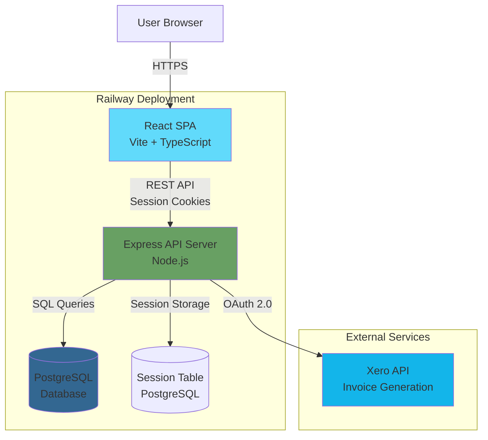

# High Level Architecture

## Technical Summary

The Lean IT Consulting Ticketing System is a monolithic monorepo application deployed as a traditional server-based architecture. The frontend is a React single-page application built with TypeScript and Vite, using shadcn/ui for UI components and served as static assets. The backend is a Node.js Express REST API server handling business logic, Xero integration, and database operations against a PostgreSQL database. Authentication uses session-based cookies with HTTP-only flags stored in PostgreSQL. The system is designed for single-user deployment with minimal hosting costs (<$20/month target), prioritizing development speed and simplicity over scalability. This architecture directly supports the PRD goal of sub-10-second ticket creation through minimal client-side validation, fast API responses (<500ms), and optimized database queries.

## Platform and Infrastructure Choice

**Platform:** Railway
**Key Services:**
- Railway Web Service (Express backend + static frontend)
- Railway PostgreSQL Database
- Railway Cron Jobs (future: daily email notifications)

**Deployment Host and Regions:** Railway US-East (optimal latency for Nashville/Central timezone)

**Rationale:** Railway offers the best balance of simplicity, cost, and features for single-user MVP. Monorepo support is cleanest, and managed PostgreSQL integration is seamless. Easy migration path to other platforms if needed.

## Repository Structure

**Structure:** Monorepo (existing implementation)
**Monorepo Tool:** NPM Workspaces (lightweight, no additional tooling needed)
**Package Organization:**
- Two application packages: `/frontend` and `/backend`
- Shared types package planned: `/packages/shared` (recommended for Epic 3+)
- No complex build orchestration needed - simple npm scripts

## High Level Architecture Diagram

## Architectural Patterns

- **Monolithic Monorepo:** Single repository containing frontend and backend with shared development environment - *Rationale:* Simplifies development for solo consultant, eliminates inter-repo coordination, enables atomic commits across full stack

- **Traditional Server Architecture:** Express server handling all requests (not serverless) - *Rationale:* Simpler deployment, easier local development, no cold starts, sufficient for single-user load, aligns with 4-6 week MVP timeline

- **Session-Based Authentication:** HTTP-only cookies with PostgreSQL session store - *Rationale:* Simpler than JWT for single-user system, automatic CSRF protection, server-side session control, no token refresh complexity

- **Component-Based UI:** Reusable React components with shadcn/ui library - *Rationale:* shadcn/ui provides accessible, customizable components without runtime overhead, TypeScript ensures type safety

- **Repository Pattern (Backend):** Model layer abstracts database access - *Rationale:* Clean separation of concerns, testable business logic, easier to add validation and business rules

- **Service Layer Pattern (Frontend):** API client services abstract HTTP calls - *Rationale:* Centralized error handling, consistent request formatting, enables offline support later, simplifies component logic

- **RESTful API Design:** Standard REST endpoints with JSON payloads - *Rationale:* Simple, well-understood, excellent tooling support, sufficient for CRUD operations, easier to debug than GraphQL

---
