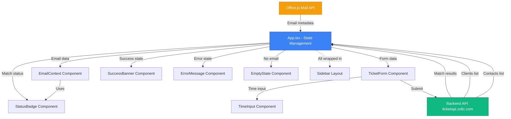
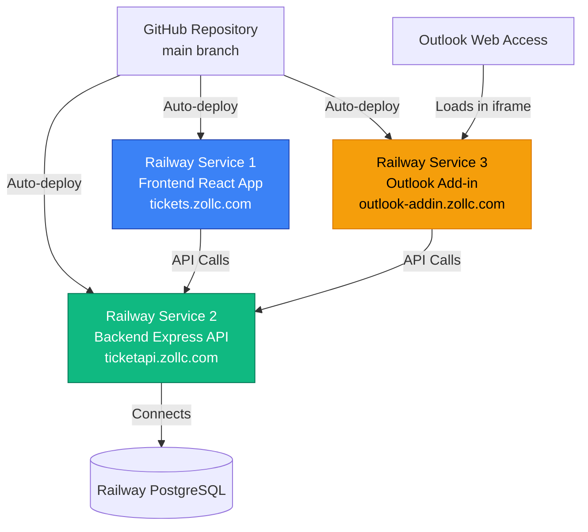

# Outlook Web Add-in for Email-to-Ticket Conversion - Brownfield Enhancement Architecture

## Introduction

This document outlines the architectural approach for enhancing the Ticketing System with an **Outlook Web Add-in for Email-to-Ticket Conversion**. Its primary goal is to serve as the guiding architectural blueprint for AI-driven development of this new feature while ensuring seamless integration with the existing system.

**Relationship to Existing Architecture:**
This document supplements the existing project architecture (documented in `/docs/architecture/`) by defining how the new Outlook Add-in components will integrate with current systems. Where conflicts arise between new and existing patterns, this document provides guidance on maintaining consistency while implementing enhancements. All architectural decisions respect the established technology stack, coding standards, and deployment patterns.

**Document Version:** 1.0
**Created:** 2025-10-09
**Status:** Final

### Change Log

| Date | Version | Description | Author |
|------|---------|-------------|--------|
| 2025-10-09 | 1.0 | Initial architecture document created | Winston (Architect) |

---

## Existing Project Analysis

Based on analysis of the codebase, I've identified the following about your existing system:

### Current Project State

- **Primary Purpose:** Lean IT consulting ticketing and time-tracking system with Xero integration for invoice generation. Built for solo consultants to track billable hours and client work.
- **Current Tech Stack:**
  - Frontend: React 18.3.1 + TypeScript 5.8.3 + Vite 5.4.19 + shadcn/ui (Radix UI components) + Tailwind CSS 3.4.17
  - Backend: Node.js (ES modules) + Express 4.18.2 + PostgreSQL 14+
  - State Management: TanStack Query 5.83.0 for server state
  - Authentication: express-session 1.17.3 + bcrypt 5.1.1 (session-based with HTTP-only cookies)
  - Deployment: Railway (separate frontend and backend services)
- **Architecture Style:** Monorepo with NPM workspaces, REST API, Repository pattern on backend, component-based React frontend, session-based authentication
- **Deployment Method:** Railway platform with **separate services**:
  - **Frontend service:** Hosts built React application (static files) at `https://tickets.zollc.com`
  - **Backend service:** Express API server at `https://ticketapi.zollc.com`
  - **Database service:** Railway-managed PostgreSQL
  - **Custom domains:** tickets.zollc.com (frontend), ticketapi.zollc.com (backend)

### Available Documentation

- [/docs/architecture/tech-stack.md](docs/architecture/tech-stack.md:1) - Complete technology selection and rationale
- [/docs/architecture/database-schema.md](docs/architecture/database-schema.md:1) - ERD and schema details including `clients`, `contacts`, `client_domains` tables
- [/docs/architecture/deployment-architecture.md](docs/architecture/deployment-architecture.md:1) - Railway deployment process and environment configuration
- [/docs/architecture/coding-standards.md](docs/architecture/coding-standards.md:1) - Naming conventions and critical rules
- [/docs/architecture/unified-project-structure.md](docs/architecture/unified-project-structure.md:1) - Monorepo organization
- [/docs/prd-outlook-addin.md](docs/prd-outlook-addin.md:1) - Comprehensive PRD with 5 epics, 32 stories
- [/docs/front-end-spec-outlook-addin.md](docs/front-end-spec-outlook-addin.md:1) - Detailed UX/UI specification

### Identified Constraints

- **Single-user system:** No multi-tenancy, single admin user per deployment
- **Session-based auth:** Uses PostgreSQL-backed sessions via `connect-pg-simple`, HTTP-only cookies
- **CORS configured:** Backend allows frontend origin via `cors` middleware (currently `process.env.FRONTEND_URL` or `http://localhost:8080`)
- **Separate Railway services:** Frontend and backend deployed as independent services (impacts add-in deployment strategy)
- **Cross-origin session sharing required:** Frontend and backend on different Railway services means add-in (third origin) needs careful CORS + cookie configuration
- **Monorepo structure:** All code must fit within `backend/`, `frontend/`, or `packages/` workspaces
- **Domain matching infrastructure exists:** `client_domains` table already implemented (validated in schema)
- **Manual testing approach:** No automated E2E tests, unit tests for backend using Node test runner

---

## Enhancement Scope and Integration Strategy

### Enhancement Overview

- **Enhancement Type:** Existing UI mockup (Lovable prototype) requiring backend integration and Office.js implementation
- **Scope:** Convert existing React prototype in `/outlook-addin` to production Office.js add-in with real API integration
- **Integration Impact:** Low-Medium - Frontend mockup exists, needs backend API endpoints and Office.js email detection

### Integration Approach

**Code Integration Strategy:**
- **Existing workspace:** `/outlook-addin` directory already exists as standalone project (not yet NPM workspace)
- **Mockup status:** Full UI implemented with components: Sidebar, EmailContext, TicketForm, StatusBadge, SuccessBanner, ErrorMessage
- **Next steps:**
  1. Convert to NPM workspace in monorepo
  2. Replace mock API calls ([mocks.ts](outlook-addin/src/mocks.ts:1)) with real backend integration
  3. Add Office.js integration for email detection (currently simulated with debug buttons)
  4. Add Office Add-in manifest for Outlook Web Access
- **Shared type library:** Create `/packages/shared` workspace for types shared between main frontend, add-in, and backend

**Database Integration:**
- **Zero schema changes:** Add-in leverages existing tables: `clients`, `contacts`, `client_domains`, `tickets`, `time_entries`
- **Domain matching:** Uses existing `client_domains` table (FK to `clients`, unique `domain` column)
- **Contact creation:** Calls existing contact creation logic (may need minor endpoint modification for add-in-specific flow)
- **Ticket creation:** Reuses existing `POST /api/tickets` endpoint with same payload structure

**API Integration:**
- **Backend API URL:** `https://ticketapi.zollc.com` (existing backend service)
- **New endpoints to implement:**
  - `GET /api/contacts/match-email?email={email}` - Email-to-contact lookup
  - `GET /api/clients/match-domain?domain={domain}` - Domain-to-client matching
  - `GET /api/clients` - List all clients (may already exist)
  - `GET /api/contacts?client_id={id}` - List contacts for client (may already exist)
- **Replace mocks:** Current `mockMatchEmail`, `mockLoadClients`, `mockLoadContactsForClient`, `mockCreateTicket` functions replaced with real API calls
- **Authentication:** Shared session-based auth with `SameSite=None; Secure` cookies for cross-origin iframe access
- **CORS configuration:** Backend CORS updated to allow `https://outlook-addin.zollc.com` origin with credentials

**UI Integration:**
- **Existing UI complete:** All components from front-end spec already implemented:
  - [EmailContext](outlook-addin/src/components/EmailContext.tsx:1) component with status badges
  - [TicketForm](outlook-addin/src/components/TicketForm.tsx:1) with client/contact dropdowns
  - [TimeInput](outlook-addin/src/components/TimeInput.tsx:1) with flexible parsing
  - [SuccessBanner](outlook-addin/src/components/SuccessBanner.tsx:1) and [ErrorMessage](outlook-addin/src/components/ErrorMessage.tsx:1) components
  - [EmptyState](outlook-addin/src/components/EmptyState.tsx:1) for "no email selected"
- **Technology stack matches:** React + TypeScript + Tailwind CSS (consistent with main frontend)
- **Needs Office.js:** Add email selection detection replacing current mock/debug buttons

### Compatibility Requirements

**Existing API Compatibility:**
- Add-in `POST /api/tickets` requests use identical payload structure to main frontend
- Current mock uses `TicketFormData` type: `clientId`, `contactId`, `timeHours`, `description`, `notes`, `closeImmediately`, optional `contactName`/`contactEmail` for new contacts
- No breaking changes to existing API endpoints
- New matching endpoints follow existing REST conventions

**Database Schema Compatibility:**
- No schema migrations required for MVP
- Leverages existing `client_domains.domain` column for matching
- Contact creation follows existing validation rules (email uniqueness within client)

**UI/UX Consistency:**
- Mockup already uses Tailwind CSS with consistent color scheme
- Same component patterns (buttons, forms, badges) as shadcn/ui in main frontend
- Sidebar layout optimized for narrow width (max-w-sm class = 384px)

**Performance Impact:**
- Add-in adds 2 new API endpoints with simple SELECT queries (indexed columns)
- No impact on existing frontend/backend performance
- Add-in hosted as separate Railway service (isolated resource consumption)
- Target: <500ms matching API response time (NFR2)

---

## Tech Stack

### Existing Technology Stack

The add-in must align with the existing project's technology decisions while accommodating Office.js requirements.

| Category | Current Technology | Version | Usage in Enhancement | Notes |
|----------|-------------------|---------|---------------------|-------|
| Frontend Framework | React | 18.3.1 | **Downgrade from 19.1.1** in mockup | Align with main frontend; React 19 bleeding edge, Office.js compatibility unproven |
| Frontend Language | TypeScript | 5.8.3 | **Downgrade from ~5.9.3** in mockup | Match main frontend version for consistency |
| Build Tool | Vite | 5.4.19 | **Downgrade from 7.1.7** in mockup | Align with main frontend; Vite 7 too new |
| CSS Framework | Tailwind CSS | 3.4.17 | **Downgrade from 4.1.14** in mockup | Tailwind 4 has breaking changes; reuse main frontend config |
| UI Component Library | shadcn/ui (Radix UI) | 1.x | Existing mockup components compatible | Add-in already uses shadcn/ui pattern (custom components) |
| State Management | React State + Hooks | N/A | Existing mockup pattern (useState, useEffect) | No React Query needed for add-in (simple state, not data-heavy) |
| HTTP Client | Fetch API (native) | Native | Replace mock functions with real fetch calls | Consistent with main frontend approach |
| Authentication | express-session cookies | N/A | Cross-origin session cookies from backend | Requires `SameSite=None; Secure` configuration |
| Session Store | connect-pg-simple (backend) | 9.0.1 | No add-in changes needed | Backend manages sessions |
| Package Manager | npm | 9+ | Convert add-in to NPM workspace | Enable shared types via `/packages/shared` |

### New Technology Additions

| Technology | Version | Purpose | Rationale | Integration Method |
|------------|---------|---------|-----------|-------------------|
| Office.js | Latest (CDN) | Outlook Web Add-in API | Required for email metadata access, task pane integration | Loaded from Microsoft CDN in HTML head |
| @types/office-js | Latest | TypeScript type definitions | Type safety for Office.js API calls | DevDependency, installed via npm |
| Office Add-in Manifest | 1.1 (XML) | Add-in registration and permissions | Required by Office platform for sideloading | XML file hosted at public URL |

---

## Data Models and Schema Changes

### Schema Integration Strategy

✅ **No database schema changes required for MVP**

The add-in leverages 100% existing database schema. All matching, contact creation, and ticket creation operations use current tables and relationships.

### Existing Data Models Leveraged

**clients** (existing table)
- **Purpose:** Client companies tracked in the system
- **Integration:** Used for domain matching via `client_domains` relationship
- **Key Attributes:**
  - `id`: INT (PK) - Client identifier
  - `company_name`: VARCHAR - Display name in add-in dropdowns
- **Add-in Usage:** Read-only for dropdowns and matching

**client_domains** (existing table, critical for add-in)
- **Purpose:** Map email domains to clients for domain-based matching
- **Integration:** Core matching infrastructure - extract domain from email, lookup client
- **Key Attributes:**
  - `id`: INT (PK)
  - `client_id`: INT (FK to clients) - Associates domain with client
  - `domain`: VARCHAR (UNIQUE) - Email domain (e.g., "acme.com")
- **Add-in Usage:** Read-only for `GET /api/clients/match-domain?domain={domain}` endpoint

**contacts** (existing table)
- **Purpose:** Individual contacts at client companies
- **Integration:** Email-to-contact matching, new contact creation from add-in
- **Key Attributes:**
  - `id`: INT (PK)
  - `client_id`: INT (FK to clients)
  - `name`: VARCHAR - Pre-filled from email sender display name
  - `email`: VARCHAR - Unique within client, matched against sender email
  - `deleted_at`: TIMESTAMP - Soft delete (excluded from matches)
- **Add-in Usage:** Read for matching (`GET /api/contacts/match-email`), Write for new contact creation

**tickets** (existing table)
- **Purpose:** Billable work tickets
- **Integration:** Add-in creates tickets via existing `POST /api/tickets` endpoint
- **Key Attributes:**
  - `id`: INT (PK)
  - `client_id`: INT (FK to clients)
  - `contact_id`: INT (FK to contacts)
  - `description`: TEXT - Optional, user-entered in add-in form
  - `notes`: TEXT - Optional, user-entered in add-in form
  - `state`: VARCHAR - "open" or "closed" based on add-in checkbox
- **Add-in Usage:** Write-only via `POST /api/tickets`

**time_entries** (existing table)
- **Purpose:** Time tracking for tickets
- **Integration:** Created automatically with ticket (1-to-1 in add-in flow)
- **Key Attributes:**
  - `work_date`: DATE - Auto-set to current date by add-in
  - `duration_hours`: DECIMAL(5,2) - Parsed from TimeInput component
  - `billable`: BOOLEAN - Always true for add-in (billable time tracking)
- **Add-in Usage:** Created implicitly via ticket creation (backend handles)

### Backward Compatibility

**Database Changes Required:** None

**Migration Strategy:** No migrations needed

**Compatibility Measures:**
- Add-in reads from existing tables without schema modifications
- New contact creation uses existing validation rules (email unique within client)
- Ticket creation follows existing payload structure (no new fields)
- Soft-deleted contacts (`deleted_at IS NOT NULL`) excluded from matches via query filters
- All queries use existing indexes (no performance impact)

---

## Component Architecture

### New Components (Existing Mockup)

The add-in's component architecture is **already implemented** in the Lovable mockup at `/outlook-addin/src/components/`. The following components exist and require backend integration:

**Sidebar** - Main Layout Container
- **File:** [/outlook-addin/src/components/Sidebar.tsx](outlook-addin/src/components/Sidebar.tsx:1)
- **Responsibility:** Root layout wrapper providing scrollable container for add-in UI
- **Technology:** React functional component, Tailwind CSS (flexbox, overflow-y-auto)

**EmailContext** - Email Display + Match Status
- **File:** [/outlook-addin/src/components/EmailContext.tsx](outlook-addin/src/components/EmailContext.tsx:1)
- **Responsibility:** Display sender information and matching status with visual badge indicators
- **Dependencies:** StatusBadge component
- **Technology:** React functional component, controlled input for name editing

**StatusBadge** - Visual Match Indicator
- **File:** [/outlook-addin/src/components/StatusBadge.tsx](outlook-addin/src/components/StatusBadge.tsx:1)
- **Responsibility:** Display color-coded badge for matching status (✓ matched, ⚠ warning, ? neutral, spinner loading)
- **Technology:** React functional component, Tailwind CSS (conditional classes), Lucide icons

**TicketForm** - Ticket Creation Form
- **File:** [/outlook-addin/src/components/TicketForm.tsx](outlook-addin/src/components/TicketForm.tsx:1)
- **Responsibility:** Render ticket creation form with client/contact dropdowns, time input, description/notes fields
- **Integration Points:** Loads clients/contacts from API, submits to `POST /api/tickets`
- **Dependencies:** TimeInput component, shadcn/ui form components

**TimeInput** - Flexible Time Entry
- **File:** [/outlook-addin/src/components/TimeInput.tsx](outlook-addin/src/components/TimeInput.tsx:1)
- **Responsibility:** Parse flexible time formats (2h, 30m, 1.5h, 1h30m) and convert to decimal hours
- **Technology:** React functional component, custom parsing logic (to be shared with backend)

**SuccessBanner** - Ticket Creation Success
- **File:** [/outlook-addin/src/components/SuccessBanner.tsx](outlook-addin/src/components/SuccessBanner.tsx:1)
- **Responsibility:** Display success message with created ticket ID, auto-dismiss after 3 seconds

**ErrorMessage** - Error Display
- **File:** [/outlook-addin/src/components/ErrorMessage.tsx](outlook-addin/src/components/ErrorMessage.tsx:1)
- **Responsibility:** Display validation errors (inline) or network errors (banner) with retry option

**EmptyState** - No Email Selected
- **File:** [/outlook-addin/src/components/EmptyState.tsx](outlook-addin/src/components/EmptyState.tsx:1)
- **Responsibility:** Display instructional message when no email is selected

### Component Interaction Diagram



---

## API Design and Integration

### API Integration Strategy

**Backend API URL:** `https://ticketapi.zollc.com`
**Authentication:** Session-based auth using HTTP-only cookies with `SameSite=None; Secure` for cross-origin access
**Versioning:** No API versioning needed (single client, backward compatibility maintained)

### New API Endpoints

**GET /api/contacts/match-email**
- **Purpose:** Look up contacts by exact email address match (case-insensitive)
- **Request:** `GET /api/contacts/match-email?email=john.smith@acme.com`
- **Response (Single Client Match):**
```json
[
  {
    "contact": {
      "id": 42,
      "name": "John Smith",
      "email": "john.smith@acme.com",
      "clientId": 5
    },
    "client": {
      "id": 5,
      "name": "Acme Corp",
      "isActive": true
    }
  }
]
```
- **Response (No Match):** `[]`
- **Error Responses:** `401 Unauthorized`, `400 Bad Request`, `500 Internal Server Error`

**GET /api/clients/match-domain**
- **Purpose:** Look up clients by email domain (fallback when email doesn't match contact)
- **Request:** `GET /api/clients/match-domain?domain=acme.com`
- **Response (Match Found):**
```json
[
  {
    "id": 5,
    "name": "Acme Corp",
    "domains": ["acme.com", "acme.net"],
    "isActive": true
  }
]
```
- **Response (No Match):** `[]`

### Reused Existing Endpoints

**GET /api/clients**
- **Purpose:** List all clients for dropdown in manual mode
- **Current Implementation:** [/backend/src/routes/clients.js:44](backend/src/routes/clients.js:44)

**GET /api/contacts**
- **Purpose:** List contacts for selected client (filtered by `client_id` query param)
- **Current Implementation:** [/backend/src/routes/contacts.js:34](backend/src/routes/contacts.js:34)
- **Request:** `GET /api/contacts?client_id=5`

**POST /api/tickets**
- **Purpose:** Create new ticket with time entry
- **Request Payload:**
```json
{
  "clientId": 5,
  "contactId": 42,
  "description": "Email support",
  "notes": "Helped with email configuration",
  "state": "closed",
  "timeEntry": {
    "workDate": "2025-10-09",
    "durationHours": 0.5,
    "billable": true
  },
  "newContact": {
    "name": "John Smith",
    "email": "john.smith@acme.com"
  }
}
```

### CORS Configuration

**Backend CORS Update Required:**

```javascript
const allowedOrigins = [
  process.env.FRONTEND_URL || 'http://localhost:8080',
  process.env.ADDIN_URL || 'http://localhost:5173', // Dev
  'https://tickets.zollc.com',
  'https://outlook-addin.zollc.com' // Production
];

app.use(cors({
  origin: (origin, callback) => {
    if (!origin || allowedOrigins.includes(origin)) {
      callback(null, true);
    } else {
      callback(new Error('Not allowed by CORS'));
    }
  },
  credentials: true,
}));
```

**Session Cookie Configuration Update:**

```javascript
app.use(session({
  store: new PgSession({ /* ... */ }),
  secret: process.env.SESSION_SECRET,
  resave: false,
  saveUninitialized: false,
  cookie: {
    httpOnly: true,
    secure: process.env.NODE_ENV === 'production', // HTTPS only in prod
    sameSite: process.env.NODE_ENV === 'production' ? 'none' : 'lax', // 'none' for cross-origin
    maxAge: 24 * 60 * 60 * 1000 // 24 hours
  }
}));
```

---

## Source Tree Organization

### Existing Project Structure (Relevant Parts)

```
tickets/                              # Monorepo root
├── backend/                          # Backend Express API
│   ├── src/
│   │   ├── controllers/              # Request handlers
│   │   ├── routes/                   # Express routes
│   │   │   ├── clients.js            # Existing: GET /api/clients
│   │   │   ├── contacts.js           # Existing: GET /api/contacts
│   │   │   └── tickets.js            # Existing: POST /api/tickets
│   │   └── middleware/               # auth.js, validation.js
│   └── package.json
├── frontend/                         # React web app
│   ├── src/
│   │   ├── components/               # React components
│   │   └── lib/api/                  # API service modules
│   └── package.json
├── outlook-addin/                    # Add-in (existing mockup)
│   ├── src/
│   │   ├── components/               # React components (8 exist)
│   │   ├── types.ts                  # TypeScript types
│   │   ├── mocks.ts                  # Mock API (to be removed)
│   │   └── App.tsx                   # Main component
│   ├── manifest/                     # (TO CREATE) Office manifest
│   └── package.json                  # Standalone (convert to workspace)
├── packages/                         # (TO CREATE) Shared packages
│   └── shared/                       # (TO CREATE) Shared types/utils
│       ├── src/
│       │   ├── types/                # Shared TypeScript types
│       │   └── utils/                # Shared utilities (timeParser)
│       └── package.json              # @tickets/shared
├── docs/
│   ├── architecture/                 # Existing architecture docs
│   ├── prd-outlook-addin.md          # PRD
│   └── front-end-spec-outlook-addin.md
└── package.json                      # Root (workspaces)
```

### New File Organization (Add-in Specific)

```
outlook-addin/
├── src/
│   ├── components/                   # (EXISTING) UI components
│   ├── lib/                          # (TO CREATE) Utilities and API
│   │   ├── api-client.ts             # HTTP client wrapper (fetch + auth)
│   │   ├── api/                      # API service modules
│   │   │   ├── clients.ts            # GET /api/clients
│   │   │   ├── contacts.ts           # GET /api/contacts, match-email
│   │   │   ├── tickets.ts            # POST /api/tickets
│   │   │   └── matching.ts           # match-email, match-domain
│   │   └── office.ts                 # Office.js wrapper utilities
│   ├── hooks/                        # (TO CREATE) Custom React hooks
│   │   ├── useEmailContext.ts        # Office.js email detection
│   │   ├── useMatching.ts            # Email/domain matching
│   │   └── useTicketSubmission.ts    # Ticket creation
│   └── types.ts                      # (EXISTING) Add-in-specific types
├── manifest/                         # (TO CREATE) Office manifest
│   ├── outlook-addin-manifest.xml    # Dev manifest (localhost)
│   └── outlook-addin-manifest.prod.xml # Prod manifest (Railway)
└── package.json                      # Dependencies
```

### Integration Guidelines

**File Naming:**
- Add-in components: PascalCase (e.g., `EmailContext.tsx`)
- API service modules: camelCase (e.g., `api-client.ts`)
- Hooks: camelCase with `use` prefix (e.g., `useEmailContext.ts`)
- Backend routes: kebab-case (e.g., `match-email`)

**Import/Export Patterns:**
- Shared types: `import { Client } from '@tickets/shared'`
- Add-in components: `import { Sidebar } from './components/Sidebar'`

---

## Infrastructure and Deployment Integration

### Existing Infrastructure

**Current Deployment Architecture:**
- **Frontend:** Railway service → `https://tickets.zollc.com`
- **Backend:** Railway service → `https://ticketapi.zollc.com`
- **Database:** Railway PostgreSQL (managed, automatic backups)
- **SSL/HTTPS:** Railway auto-provisions Let's Encrypt certificates
- **CI/CD:** Auto-deploy from GitHub `main` branch

### Enhancement Deployment Strategy

**Add-in Deployment:** New Railway service hosting Office Add-in static files at `https://outlook-addin.zollc.com`

**Deployment Architecture:**



### Railway Service Configuration

**Service Name:** `outlook-addin`
**Build Command:** `npm install && npm run build --workspace=outlook-addin`
**Start Command:** `npx serve -s outlook-addin/dist -p $PORT`
**Custom Domain:** `outlook-addin.zollc.com`

**Environment Variables:**
```bash
# Add-in service
VITE_API_URL=https://ticketapi.zollc.com
NODE_ENV=production

# Backend service (UPDATED)
ADDIN_URL=https://outlook-addin.zollc.com
```

### Rollback Strategy

**Method:** Railway UI rollback to previous deployment
**Risk Mitigation:** Add-in failure doesn't affect main frontend/backend (isolated service)

---

## Coding Standards and Integration Rules

### Existing Standards Compliance

**Code Style:** TypeScript with strict mode, ESLint rules from main frontend
**Linting Rules:** ESLint config aligned with main frontend
**Testing Patterns:** Node test runner for backend, manual testing for add-in UI

### Enhancement-Specific Standards

**Office.js Integration:**
1. All Office.js API calls wrapped in try-catch error handlers
2. Office.onReady() called before any Office.js API access
3. Office.js errors fail gracefully (show manual mode, never crash)

**API Integration:**
1. All API calls use centralized API client
2. API client includes `credentials: 'include'` for session cookies
3. Authentication errors (401) handled with clear messaging

**TypeScript Standards:**
1. Shared types imported from `@tickets/shared`
2. Add-in-specific types remain in `outlook-addin/src/types.ts`
3. No `any` types without justification

### Critical Integration Rules

**Existing API Compatibility:**
```typescript
// Ticket creation payload must match existing format
const payload = {
  clientId: number,
  contactId: number,
  description: string,
  notes: string,
  state: 'open' | 'closed',
  timeEntry: {
    workDate: string, // ISO date format YYYY-MM-DD
    durationHours: number, // Decimal hours
    billable: true,
  },
  newContact?: {
    name: string,
    email: string,
  }
};
```

**Database Integration:**
1. No direct database access from add-in (all via API)
2. Backend excludes soft-deleted contacts in match queries

**Error Handling:**
1. Network errors preserve form data for retry
2. Validation errors display inline next to fields

---

## Testing Strategy

### Integration with Existing Tests

**Existing Test Framework:** Node test runner for backend unit tests
**Coverage Target:** >80% for matching logic

### New Testing Requirements

**Unit Tests for Backend Matching:**
- **Location:** `backend/src/controllers/__tests__/matchingController.test.js`
- **Scenarios:**
  - Email-to-contact matching (exact match, multiple clients, no match, case-insensitive)
  - Domain-to-client matching (exact match, multiple clients, no match)
  - Domain extraction utility (standard email, subdomain, uppercase, invalid)

**Manual Testing for Add-in UI:**
- Office.js integration (email selection, metadata extraction)
- Email-to-contact matching (exact match, disambiguation, domain match, no match)
- Form submission (success, error handling, validation)
- Cross-browser tests (Chrome, Safari on macOS)

**No Automated E2E Tests for MVP:** Office Add-in E2E testing requires complex Outlook automation not justified for 3-4 week timeline

### Regression Testing

**Existing System Verification:**
1. Main frontend unchanged (tickets.zollc.com still works)
2. Backend API compatibility (both web app and add-in work)
3. Database integrity (tickets from add-in visible in web app)

---

## Security Integration

### Existing Security Measures

**Authentication:** express-session + bcrypt (session-based with HTTP-only cookies)
**Security Tools:** helmet, express-validator, express-rate-limit, cors, csurf

### Enhancement Security Requirements

**Cross-Origin Session Cookie Configuration:**
```javascript
cookie: {
  httpOnly: true,
  secure: process.env.NODE_ENV === 'production',
  sameSite: process.env.NODE_ENV === 'production' ? 'none' : 'lax',
  maxAge: 24 * 60 * 60 * 1000
}
```

**CORS Configuration Update:**
```javascript
const allowedOrigins = [
  'https://tickets.zollc.com',
  'https://outlook-addin.zollc.com',
  process.env.FRONTEND_URL || 'http://localhost:8080',
  process.env.ADDIN_URL || 'http://localhost:5173',
];
```

**CSP Adjustments for Office.js:**
```javascript
contentSecurityPolicy: {
  directives: {
    scriptSrc: [
      "'self'",
      "'unsafe-inline'", // Required for Office.js
      "https://appsforoffice.microsoft.com",
    ],
  },
}
```

**Input Validation for New Endpoints:**
```javascript
router.get('/match-email', [
  query('email').isEmail().normalizeEmail(),
  validate,
], matchEmailController);
```

**Rate Limiting:**
```javascript
const matchingLimiter = rateLimit({
  windowMs: 15 * 60 * 1000,
  max: 100,
});
```

### Security Trade-offs

- ⚠️ **SameSite=None:** Increases CSRF risk (mitigated by existing csurf middleware)
- ⚠️ **CSP unsafe-inline:** Required for Office.js (limited to Microsoft CDN)
- ✅ **CORS whitelist:** Only specified origins allowed

---

## Next Steps

### Story Manager Handoff

**Context:** Outlook Web Add-in brownfield enhancement architecture is complete. Existing UI mockup at `/outlook-addin` significantly de-risks the project.

**Architecture Document:** [docs/architecture-outlook-addin.md](docs/architecture-outlook-addin.md:1)

**Key Integration Requirements Validated:**
1. ✅ Separate Railway services confirmed (tickets.zollc.com, ticketapi.zollc.com)
2. ✅ `client_domains` table exists (domain matching ready)
3. ✅ Full React UI implemented (8 components exist)
4. ⚠️ Dependency alignment needed (React 19→18, Tailwind 4→3)

**Critical Technical Decisions:**
- **Authentication:** Session cookies with `SameSite=None; Secure`
- **Deployment:** Third Railway service at `outlook-addin.zollc.com`
- **API Integration:** Two new endpoints, reuse existing ticket creation
- **Zero schema changes:** All data models exist

**First Story to Implement:**

**Epic 1, Story 1.1: Office.js API Research & Capability Validation**

**Why this story first:** De-risks entire project by validating Office.js provides required email metadata access.

**Integration Checkpoints:**
1. Confirm `Office.context.mailbox.item.from` accessible
2. Validate task pane persists across email selections
3. Test in macOS + Chrome/Safari
4. Document any Office.js limitations

**Emphasis on System Integrity:**
- ⚠️ Backend CORS changes must not break main frontend
- ⚠️ Session cookie changes must not break existing sessions
- ✅ Add-in isolated (failure doesn't affect main system)

---

### Developer Handoff

**Context:** Begin with Epic 1 (Technical Discovery) to validate Office.js before building backend APIs. Existing mockup provides head start.

**Architecture Reference:** [docs/architecture-outlook-addin.md](docs/architecture-outlook-addin.md:1)

**Existing Coding Standards:**
- Frontend: React 18.3.1 + TypeScript 5.8.3 + Vite 5.4.19 + Tailwind 3.4.17
- Backend: JavaScript ES modules, Express 4.18.2, Node test runner

**Key Technical Decisions:**

1. **Dependency Alignment (Story 1.3):**
   - Downgrade React 19→18, Tailwind 4→3, Vite 7→5
   - Align with main frontend for compatibility

2. **Backend Endpoints (Epic 2):**
   - `GET /api/contacts/match-email`
   - `GET /api/clients/match-domain`
   - Use express-validator for validation

3. **CORS/Session Configuration:**
   - Update backend to allow outlook-addin.zollc.com
   - Add `sameSite: 'none'` for production

**Clear Sequencing:**

**Phase 1: Validation (Epic 1, Week 1)**
1. Office.js research (validate email access)
2. Convert to NPM workspace, align dependencies
3. Create manifest, sideload add-in
4. Deploy to Railway

**Phase 2: Backend API (Epic 2, Week 1-2)**
1. Implement matching endpoints with unit tests
2. Update CORS and session config

**Phase 3: Office.js Integration (Epic 3, Week 2)**
1. Add email selection event listener
2. Extract sender metadata
3. Update EmailContext component

**Phase 4: API Integration (Epic 4, Week 2-3)**
1. Replace mocks with real API calls
2. Wire up matching to form

**Phase 5: Submission (Epic 5, Week 3)**
1. Replace mockCreateTicket with real POST
2. Test new contact creation
3. Verify error handling

**Why this sequence:** Epic 1 validates feasibility first (fail fast), then builds backend APIs, then integrates with existing mockup (lowest risk).

---

## Validation Summary

🎯 **Architecture Document Complete**

This brownfield enhancement architecture provides:

✅ Validated existing system analysis (separate Railway services, session auth, client_domains exists)
✅ Zero schema changes (leverages 100% existing tables)
✅ Existing mockup integration plan (convert Lovable prototype to production)
✅ Clear API contracts (two new endpoints, reuse existing)
✅ Deployment strategy (third Railway service, CORS/cookie config)
✅ Security integration (SameSite=None cookies, CORS whitelist, CSP for Office.js)
✅ Testing strategy (backend unit tests, manual UI testing)
✅ Sequenced implementation (Epic 1 validates Office.js first)

**Ready for Story Manager to create stories from PRD Epic 1, Story 1.1.**

---

**End of Document**
