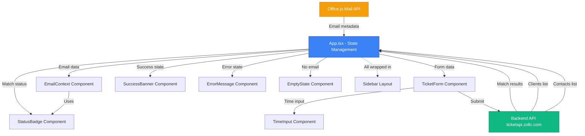

# Component Architecture

## New Components (Existing Mockup)

The add-in's component architecture is **already implemented** in the Lovable mockup at `/outlook-addin/src/components/`. The following components exist and require backend integration:

**Sidebar** - Main Layout Container
- **File:** [/outlook-addin/src/components/Sidebar.tsx](outlook-addin/src/components/Sidebar.tsx:1)
- **Responsibility:** Root layout wrapper providing scrollable container for add-in UI
- **Technology:** React functional component, Tailwind CSS (flexbox, overflow-y-auto)

**EmailContext** - Email Display + Match Status
- **File:** [/outlook-addin/src/components/EmailContext.tsx](outlook-addin/src/components/EmailContext.tsx:1)
- **Responsibility:** Display sender information and matching status with visual badge indicators
- **Dependencies:** StatusBadge component
- **Technology:** React functional component, controlled input for name editing

**StatusBadge** - Visual Match Indicator
- **File:** [/outlook-addin/src/components/StatusBadge.tsx](outlook-addin/src/components/StatusBadge.tsx:1)
- **Responsibility:** Display color-coded badge for matching status (✓ matched, ⚠ warning, ? neutral, spinner loading)
- **Technology:** React functional component, Tailwind CSS (conditional classes), Lucide icons

**TicketForm** - Ticket Creation Form
- **File:** [/outlook-addin/src/components/TicketForm.tsx](outlook-addin/src/components/TicketForm.tsx:1)
- **Responsibility:** Render ticket creation form with client/contact dropdowns, time input, description/notes fields
- **Integration Points:** Loads clients/contacts from API, submits to `POST /api/tickets`
- **Dependencies:** TimeInput component, shadcn/ui form components

**TimeInput** - Flexible Time Entry
- **File:** [/outlook-addin/src/components/TimeInput.tsx](outlook-addin/src/components/TimeInput.tsx:1)
- **Responsibility:** Parse flexible time formats (2h, 30m, 1.5h, 1h30m) and convert to decimal hours
- **Technology:** React functional component, custom parsing logic (to be shared with backend)

**SuccessBanner** - Ticket Creation Success
- **File:** [/outlook-addin/src/components/SuccessBanner.tsx](outlook-addin/src/components/SuccessBanner.tsx:1)
- **Responsibility:** Display success message with created ticket ID, auto-dismiss after 3 seconds

**ErrorMessage** - Error Display
- **File:** [/outlook-addin/src/components/ErrorMessage.tsx](outlook-addin/src/components/ErrorMessage.tsx:1)
- **Responsibility:** Display validation errors (inline) or network errors (banner) with retry option

**EmptyState** - No Email Selected
- **File:** [/outlook-addin/src/components/EmptyState.tsx](outlook-addin/src/components/EmptyState.tsx:1)
- **Responsibility:** Display instructional message when no email is selected

## Component Interaction Diagram

---
