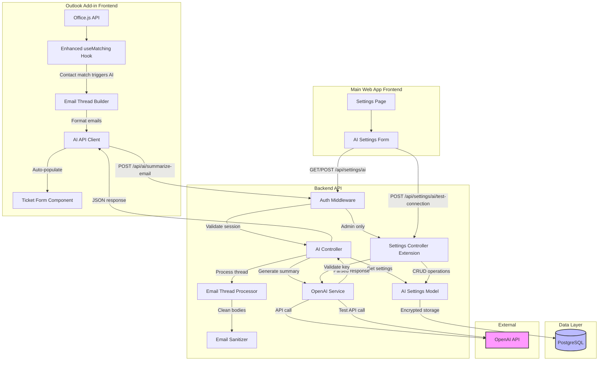

# Epic 7: AI Email Summarization - Brownfield Enhancement Architecture

## Table of Contents
- [Introduction](#introduction)
- [Existing Project Analysis](#existing-project-analysis)
- [Enhancement Scope and Integration Strategy](#enhancement-scope-and-integration-strategy)
- [Tech Stack](#tech-stack)
- [Data Models and Schema Changes](#data-models-and-schema-changes)
- [Component Architecture](#component-architecture)
- [API Design and Integration](#api-design-and-integration)
- [External API Integration](#external-api-integration)
- [Source Tree](#source-tree)
- [Infrastructure and Deployment Integration](#infrastructure-and-deployment-integration)
- [Coding Standards and Testing Strategy](#coding-standards-and-testing-strategy)
- [Security Integration](#security-integration)
- [Next Steps](#next-steps)

---

## Introduction

This document outlines the architectural approach for enhancing the Outlook Add-in ticketing system with AI-powered email summarization. Its primary goal is to serve as the guiding architectural blueprint for AI-driven development of new features while ensuring seamless integration with the existing system.

**Relationship to Existing Architecture:**
This document supplements existing project architecture by defining how new components will integrate with current systems. Where conflicts arise between new and existing patterns, this document provides guidance on maintaining consistency while implementing enhancements.

### Enhancement Summary

This architecture defines the approach for adding AI-powered email summarization to the existing Outlook add-in ticketing system. The enhancement adds automatic generation of ticket descriptions and notes using gpt-5-mini, triggered on contact-match events.

**Relationship to Existing Architecture:**
This supplements existing Outlook add-in architecture by defining:
- New backend AI service layer (OpenAI integration)
- Email sanitization and processing pipeline
- Admin settings UI extension in main web app
- Integration with Epic 4 (contact matching) and Epic 6 (ticket updates)

### Change Log

| Change | Date | Version | Description | Author |
|--------|------|---------|-------------|--------|
| Initial Draft | 2025-01-13 | 1.0 | Created Epic 7 architecture from PRD and existing codebase analysis | Winston (Architect Agent) |

---

## Existing Project Analysis

### Current Project State

Based on analysis of the codebase, the existing system has the following characteristics:

**Primary Purpose:** Lean IT consulting ticketing and time-tracking system with Xero integration for invoice generation. The system was built for solo consultants to track billable hours and client work. A comprehensive Outlook Web Add-in was recently added (Epics 1-6) to enable rapid ticket creation directly from email.

**Current Tech Stack:**
- **Frontend (Main App):** React 18.3.1 + TypeScript 5.8.3 + Vite 5.4.19 + shadcn/ui (Radix UI) + Tailwind CSS 3.4.17 + TanStack Query 5.83.0
- **Frontend (Outlook Add-in):** React 18.3.1 + TypeScript 5.8.3 + Vite 5.4.19 + shadcn/ui + Tailwind CSS 3.4.17 + Office.js + Native Fetch API
- **Backend:** Node.js (ES modules) + Express 4.18.2 + PostgreSQL 14+
- **Authentication:** express-session 1.17.3 + bcrypt 5.1.1 (session-based with HTTP-only cookies)
- **State Management:** React hooks in add-in, TanStack Query in main app
- **Deployment:** Railway platform with **three separate services** (frontend, backend, PostgreSQL database)

**Architecture Style:**
- Monorepo with NPM workspaces (`backend/`, `frontend/`, `outlook-addin/`, `packages/shared`)
- REST API with repository pattern on backend
- Component-based React frontend
- Session-based authentication (PostgreSQL-backed sessions via connect-pg-simple)
- Separate deployment services on Railway (frontend, backend, database)

**Deployment Method:** Railway platform with separate services:
- **Main Frontend:** https://tickets.zollc.com (static React build)
- **Outlook Add-in Frontend:** Deployed as separate Railway service alongside main frontend
- **Backend API:** https://ticketapi.zollc.com (Express server)
- **Database:** Railway-managed PostgreSQL 14+

### Available Documentation

- [/docs/architecture/tech-stack.md](../../architecture/tech-stack.md) - Definitive technology selection and versions
- [/docs/architecture/database-schema.md](../../architecture/database-schema.md) - ERD with clients, contacts, client_domains, tickets, time_entries, invoice_locks, xero_connections tables
- [/docs/architecture/deployment-architecture.md](../../architecture/deployment-architecture.md) - Railway deployment configuration
- [/docs/architecture/coding-standards.md](../../architecture/coding-standards.md) - Naming conventions (PascalCase components, camelCase hooks, kebab-case API routes, snake_case DB columns)
- [/docs/outlook-addin/architecture/existing-project-analysis.md](./existing-project-analysis.md) - Outlook add-in specific architecture
- [/docs/outlook-addin/architecture/tech-stack.md](./tech-stack.md) - Add-in technology alignment with main app
- [/docs/outlook-addin/prd/epic-7-ai-email-summarization.md](../prd/epic-7-ai-email-summarization.md) - Source PRD for this architecture

### Identified Constraints

- **Single-user system:** No multi-tenancy, single admin user per deployment
- **Session-based authentication:** PostgreSQL-backed sessions via connect-pg-simple, HTTP-only cookies with `SameSite=None; Secure` for cross-origin add-in access
- **CORS configuration:** Backend explicitly allows frontend origins via cors middleware (`FRONTEND_URL` + additional add-in origin)
- **Separate Railway services:** Frontend, backend, and add-in deployed as independent Railway services (impacts API key storage and settings UI location)
- **Monorepo structure:** All new code must fit within existing NPM workspace structure (`backend/`, `outlook-addin/`, `packages/shared`)
- **Existing settings pattern:** Settings are stored in database (see InvoiceConfig model) with dedicated controller pattern
- **Contact-matching infrastructure:** Email-to-contact and domain-to-client matching already implemented in Epic 4
- **Ticket form workflow:** Established pattern for form auto-population after match
- **Testing approach:** Backend uses Node test runner (no Jest), manual testing for add-in integration, no E2E automation
- **No shared types yet:** While `packages/shared` exists in structure, actual type sharing between backend and add-in needs implementation

---

## Enhancement Scope and Integration Strategy

### Enhancement Overview

**Enhancement Type:** New Feature Addition + Integration with New External System

**Scope:** Add AI-powered automatic generation of ticket descriptions and detailed notes from email content. The system will use gpt-5-mini (via OpenAI API) to summarize email threads into two outputs:
1. **Description:** One-line, invoice-friendly ticket title
2. **Notes:** Detailed summary for billing dispute reference and memory jogging

This enhancement eliminates manual note-taking friction while improving quality over the current practice of using email subject lines as descriptions.

**Integration Impact:** Moderate Impact (some existing code changes)

- ✅ **No changes to core data models** (clients, contacts, tickets, time_entries tables remain unchanged)
- ✅ **No changes to core workflows** (matching, form validation, submission flows work identically)
- ⚠️ **New database settings** (AI API key, model selection, system prompt) via new columns or settings table extension
- ⚠️ **New backend services** (OpenAI integration, email sanitization, thread processing)
- ⚠️ **Enhanced auto-population logic** (existing form population extended to include AI-generated content)
- ⚠️ **New admin UI section** (main web app settings page adds AI configuration)
- ✅ **Graceful degradation** (AI failures never block ticket creation—users can manually enter content)

### Integration Approach

**Code Integration Strategy:**

**Backend Integration:**
- **New Service Layer:** Create dedicated `backend/src/services/` modules for AI functionality:
  - `openaiService.js` - OpenAI API client wrapper
  - `emailSanitizer.js` - Signature/footer stripping
  - `emailThreadProcessor.js` - Thread selection and word count limiting
- **New Controller:** `backend/src/controllers/aiController.js` for AI summarization endpoint
- **Extended Controller:** Add AI settings CRUD methods to existing `settingsController.js`
- **New Routes:** `backend/src/routes/ai.js` for AI-specific endpoints
- **No changes to existing routes:** Ticket creation/update endpoints unchanged (AI-generated content treated identically to manual input)

**Frontend (Outlook Add-in) Integration:**
- **New API Client:** `outlook-addin/src/lib/api/ai.ts` for summarization API calls
- **New Utility:** `outlook-addin/src/lib/utils/emailThreadBuilder.ts` to format Office.js emails for backend
- **Enhanced Matching Hook:** Extend existing `useMatching.ts` hook to trigger AI summarization after contact match
- **Form Component Enhancement:** Modify `TicketForm.tsx` to accept and display AI-generated content in description/notes fields
- **No new UI components:** Reuse existing loading states (Spinner/Skeleton) and error handling (ErrorMessage component)

**Frontend (Main Web App) Integration:**
- **New Settings Section:** Add "AI Email Summarization Settings" to existing settings page
- **Settings API Integration:** Call new `/api/settings/ai` and `/api/settings/ai/test-connection` endpoints
- **Follow existing patterns:** Use TanStack Query for data fetching, shadcn/ui components for form controls

**Database Integration:**

**Approach:** Extend existing settings infrastructure rather than creating isolated AI tables.

**New AI Settings Table:**
```sql
CREATE TABLE IF NOT EXISTS ai_settings (
  id SERIAL PRIMARY KEY CHECK (id = 1),  -- Singleton constraint
  openai_api_key TEXT NOT NULL,
  openai_model VARCHAR(50) NOT NULL DEFAULT 'gpt-5-mini',
  system_prompt TEXT NOT NULL,
  created_at TIMESTAMP WITH TIME ZONE DEFAULT CURRENT_TIMESTAMP,
  updated_at TIMESTAMP WITH TIME ZONE DEFAULT CURRENT_TIMESTAMP
);
```

**Migration Strategy:**
- Use existing migration infrastructure ([backend/src/utils/migrate.js](../../../backend/src/utils/migrate.js))
- Add migration step for AI settings table
- Provide default system prompt in migration
- No changes to core ticketing tables (clients, contacts, tickets, time_entries)

**API Integration:**

**New Backend Endpoints:**

```javascript
// AI Summarization Endpoint
POST /api/ai/summarize-email
Request: { emails: [{ from, subject, body }] }
Response: { description, notes, truncated, emailCount, success, error? }

// AI Settings CRUD
GET /api/settings/ai         // Get current AI settings (API key masked)
POST /api/settings/ai        // Save AI settings
POST /api/settings/ai/test-connection  // Validate API key before saving
```

**Integration with Existing APIs:**
- ✅ No changes to existing endpoints (contacts, clients, tickets, time-entries)
- ✅ AI-generated content flows through existing ticket creation/update endpoints
- ✅ Authentication reuses existing session middleware
- ✅ CORS configuration already supports add-in origin

**UI Integration:**

**Outlook Add-in (Minimal UI Footprint):**
- **No new buttons or controls** (proactive automation on contact-match event)
- **Reuse existing loading states** during AI processing
- **Reuse existing error handling** (ErrorMessage component for AI failures)
- **Auto-population pattern** (description/notes fields populate automatically, identical to existing client/contact auto-fill)
- **User edit capability** (fields remain fully editable text inputs)

**Main Web App (New Admin Settings Section):**
- **New section:** "AI Email Summarization Settings" on settings page
- **Form fields:**
  - OpenAI API Key (password input with show/hide toggle)
  - AI Model Selection (dropdown: gpt-5-mini, gpt-5, gpt-5-nano)
  - System Prompt (textarea with character count)
- **Buttons:**
  - "Save Settings" (validates and saves configuration)
  - "Test Connection" (validates API key before saving)
- **UI consistency:** Follow existing shadcn/ui patterns from settings page

### Compatibility Requirements

**Existing API Compatibility:**
- ✅ No breaking changes to existing API endpoints
- ✅ AI summarization is additive (new endpoint `/api/ai/summarize-email`)
- ✅ Existing ticket creation/update endpoints accept AI-generated fields without modification
- ✅ Authentication and session management unchanged

**Database Schema Compatibility:**
- ✅ Core ticketing tables unchanged (clients, contacts, tickets, time_entries)
- ✅ New settings table added via migration (non-breaking)
- ✅ No foreign key changes or cascade behavior modifications
- ✅ Existing indexes and constraints remain intact

**UI/UX Consistency:**
- ✅ AI auto-population follows same visual pattern as Epic 4 contact/client auto-fill
- ✅ Loading states reuse existing Spinner/Skeleton components
- ✅ Error messages follow established ErrorMessage component pattern
- ✅ No visual distinction between AI-generated vs. manually-entered content
- ✅ Admin settings page integrates seamlessly with existing settings UI

**Integration Compatibility:**
- ✅ Xero integration unaffected (AI operates before ticket submission)
- ✅ Email metadata extraction (Epic 3) unchanged
- ✅ Contact/client matching (Epic 4) remains primary trigger
- ✅ Form validation logic applies identically to AI-generated content
- ✅ Open ticket updates (Epic 6) extended with AI support (no breaking changes)

---

## Tech Stack

### Existing Technology Stack

All existing technologies will be maintained at current versions to ensure compatibility and reduce risk.

| Category | Current Technology | Version | Usage in Enhancement | Notes |
|----------|-------------------|---------|---------------------|-------|
| **Backend Language** | JavaScript (Node.js) | Node 18+ LTS | AI service implementation | ES modules for all new AI services |
| **Backend Framework** | Express | ^4.18.2 | AI endpoints and routes | New `/api/ai/*` routes follow existing patterns |
| **Database** | PostgreSQL | 14+ | AI settings storage | New ai_settings table |
| **Session Store** | connect-pg-simple | ^9.0.1 | No changes | AI endpoints reuse existing session authentication |
| **Authentication** | express-session + bcrypt | ^1.17.3, ^5.1.1 | API key encryption | Use crypto module for encrypting OpenAI API key at rest |
| **HTTP Client (Backend)** | node-fetch or native fetch | Native (Node 18+) | OpenAI API calls | Use native fetch for external API calls |
| **Frontend Language** | TypeScript | ^5.8.3 | Add-in AI client implementation | Type-safe API client for AI endpoints |
| **Frontend Framework (Add-in)** | React | ^18.3.1 | No new components | Extend existing components with AI auto-population |
| **Build Tool** | Vite | ^5.4.19 | No changes | Existing build process unchanged |
| **UI Components** | shadcn/ui (Radix UI) | ^1.x | Reuse existing components | Spinner, ErrorMessage, Input, Textarea |
| **CSS Framework** | Tailwind CSS | ^3.4.17 | No new styles | Use existing utility classes |
| **State Management (Add-in)** | React hooks | Native | AI loading states | useState, useEffect for AI workflow |
| **State Management (Main App)** | TanStack Query | ^5.83.0 | AI settings fetching | Query hooks for settings CRUD |
| **HTTP Client (Frontend)** | Fetch API | Native | AI summarization calls | Existing apiClient wrapper extended |
| **Validation** | express-validator | ^7.0.1 | AI endpoint validation | Validate email payloads and settings |
| **Security Headers** | helmet | ^7.1.0 | No changes | Existing security headers apply to AI endpoints |
| **CORS** | cors | ^2.8.5 | No changes | Existing CORS config covers AI endpoints |
| **Testing (Backend)** | Node test runner | Native | AI service tests | Unit tests for sanitization, thread processing, OpenAI service |
| **Package Manager** | npm | 9+ | Install OpenAI SDK | npm install openai --workspace=backend |

### New Technology Additions

| Technology | Version | Purpose | Rationale | Integration Method |
|------------|---------|---------|-----------|-------------------|
| **openai** | ^4.73.0 | OpenAI API client SDK | Official SDK with TypeScript support, handles authentication, rate limiting, and streaming | npm install openai --workspace=backend |

**Notes on New Dependencies:**

**OpenAI SDK Rationale:**
- **Official SDK:** Maintained by OpenAI with automatic updates for API changes
- **Built-in Error Handling:** SDK provides typed error classes for rate limits, authentication failures, timeouts
- **Token Counting:** Optional token counting utilities for cost monitoring
- **Streaming Support:** Future capability for real-time summary generation (not MVP)
- **Minimal Size:** ~50KB gzipped, acceptable overhead for backend

**Why No Frontend AI SDK:**
- AI calls ONLY from backend (security: API key never exposed to frontend)
- Add-in uses existing apiClient wrapper to call backend `/api/ai/summarize-email`
- Zero new frontend dependencies for Epic 7

---

## Data Models and Schema Changes

### New Data Models

#### AI Settings Model

**Purpose:** Store OpenAI API configuration (API key, model selection, system prompt) for AI-powered email summarization.

**Integration:** Follows existing InvoiceConfig singleton pattern - single row (id=1) configuration model. No relationships with existing data models (clients, contacts, tickets).

**Key Attributes:**
- `id` (SERIAL PRIMARY KEY) - Always 1 (singleton pattern)
- `openai_api_key` (TEXT NOT NULL) - Encrypted OpenAI API key (never sent to frontend)
- `openai_model` (VARCHAR(50) DEFAULT 'gpt-5-mini') - Model selection (gpt-5-mini, gpt-5, gpt-5-nano, future models)
- `system_prompt` (TEXT NOT NULL) - Customizable prompt for AI summarization behavior
- `created_at` (TIMESTAMP WITH TIME ZONE DEFAULT CURRENT_TIMESTAMP) - Record creation timestamp
- `updated_at` (TIMESTAMP WITH TIME ZONE DEFAULT CURRENT_TIMESTAMP) - Last modification timestamp

**Relationships:**
- **With Existing:** None (configuration table, no foreign keys)
- **With New:** None (standalone settings model)

**Model Implementation Pattern:**
```javascript
// backend/src/models/AiSettings.js
export const AiSettings = {
  async getSettings() {
    // Returns settings object or creates default
    // API key is decrypted before returning (masked for API responses)
  },

  async updateSettings(apiKey, model, systemPrompt) {
    // Validates inputs, encrypts API key, updates row id=1
  },

  async testConnection(apiKey, model) {
    // Validates API key with minimal OpenAI API call
    // Does NOT save settings (validation only)
  }
};
```

### Schema Integration Strategy

**Database Changes Required:**

**New Tables:**
```sql
-- Migration: 009_create_ai_settings_table
CREATE TABLE IF NOT EXISTS ai_settings (
  id SERIAL PRIMARY KEY CHECK (id = 1),  -- Singleton constraint
  openai_api_key TEXT NOT NULL,
  openai_model VARCHAR(50) NOT NULL DEFAULT 'gpt-5-mini',
  system_prompt TEXT NOT NULL,
  created_at TIMESTAMP WITH TIME ZONE DEFAULT CURRENT_TIMESTAMP,
  updated_at TIMESTAMP WITH TIME ZONE DEFAULT CURRENT_TIMESTAMP
);

-- Default system prompt
INSERT INTO ai_settings (id, openai_api_key, openai_model, system_prompt)
VALUES (
  1,
  '',  -- Empty string until admin configures
  'gpt-5-mini',
  'You are an AI assistant helping to summarize email threads for IT consulting ticket creation.

Generate two outputs:
1. Description: A concise one-line summary suitable for invoice line items (max 100 characters)
2. Notes: A detailed summary of the email thread for billing reference and memory jogging

Rules:
- Focus on technical issues, requests, and context
- Preserve important details (error messages, dates, versions, steps taken)
- Omit pleasantries and signature content
- Adjust summary length based on email content length (short emails = brief notes, long threads = detailed notes)
- Use professional, neutral tone

Respond with JSON format:
{
  "description": "one-line summary here",
  "notes": "detailed multi-paragraph summary here"
}'
)
ON CONFLICT (id) DO NOTHING;
```

**Modified Tables:** None (zero changes to existing tables)

**New Indexes:** None required (singleton table, no queries beyond id=1 lookups)

**Migration Strategy:**
1. Add new migration file `backend/src/utils/migrate.js` following existing pattern (migrations array)
2. Migration creates `ai_settings` table with singleton constraint
3. Migration inserts default row with empty API key and default prompt
4. Migration is idempotent (uses `IF NOT EXISTS` and `ON CONFLICT DO NOTHING`)
5. Run migration via existing `npm run migrate` command (or equivalent)

**Backward Compatibility:**
- ✅ No changes to existing tables (clients, contacts, tickets, time_entries, invoice_locks, xero_connections)
- ✅ No foreign key additions or cascade behavior changes
- ✅ No data migrations required (new table only)
- ✅ Existing migrations remain valid (new migration appends to array)
- ✅ System works without AI if settings not configured (graceful degradation)
- ✅ Rollback strategy: Drop `ai_settings` table (no cascade effects)

---

## Component Architecture

### New Components

#### Backend Component: OpenAI Service

**Responsibility:** Communicate with OpenAI API to generate email summaries. Handles API authentication, request formatting, response parsing, error handling, and timeout management.

**Integration Points:**
- Called by AI Controller (`aiController.js`)
- Uses AI Settings Model (`AiSettings.js`) for API key and model configuration
- Returns structured response: `{ description, notes, success, error? }`

**Key Interfaces:**
- `summarizeEmail(emails: Email[], settings: AiSettings, emailLength: 'short' | 'medium' | 'long'): Promise<SummarizeResponse>`
  - Input: Array of email objects, AI settings, length classification
  - Output: Description + notes + success flag
  - Throws: OpenAI API errors (rate limit, auth failure, timeout)

**Dependencies:**
- **Existing Components:** None (standalone service)
- **New Components:** Email Thread Processor (for formatted input), Email Sanitizer (for cleaned content)
- **External:** OpenAI npm SDK

**Technology Stack:** Node.js ES modules, OpenAI SDK 4.x, native fetch as fallback

---

#### Backend Component: Email Sanitizer Service

**Responsibility:** Strip signatures, disclaimers, quoted replies, and boilerplate content from email bodies before AI processing. Reduces token costs by 30-50% and improves summary quality.

**Integration Points:**
- Called by Email Thread Processor before building thread for AI
- Operates on raw email body strings
- Returns cleaned email body

**Key Interfaces:**
- `sanitizeEmailBody(emailBody: string): { sanitized: string, tokensRemoved: number }`
  - Input: Raw email body (may include signatures, footers, quoted text)
  - Output: Cleaned body + approximate token savings
  - Handles: Multi-language emails, nested quotes, common signature patterns

**Dependencies:**
- **Existing Components:** None (standalone utility)
- **New Components:** None
- **External:** None (pure string processing)

**Technology Stack:** Node.js ES modules, regex patterns for signature detection

---

#### Backend Component: Email Thread Processor Service

**Responsibility:** Select and format emails from thread for AI summarization. Implements intelligent limits (5 emails or 4,000 words) and classifies thread length (short/medium/long) for smart minification.

**Integration Points:**
- Called by AI Controller before sending to OpenAI Service
- Uses Email Sanitizer to clean email bodies
- Returns formatted thread + metadata

**Key Interfaces:**
- `processEmailThread(emails: RawEmail[]): ProcessedThread`
  - Input: Array of raw email objects from add-in
  - Output: `{ selectedEmails, truncated, emailCount, wordCount, lengthClass }`
  - Logic: Sort chronologically, sanitize, limit to 5 emails or 4K words, classify length

**Dependencies:**
- **Existing Components:** None
- **New Components:** Email Sanitizer (for cleaning)
- **External:** None

**Technology Stack:** Node.js ES modules, string utilities for word counting

---

#### Backend Component: AI Controller

**Responsibility:** Orchestrate AI summarization workflow. Receives email threads from add-in, coordinates processing services, calls OpenAI, returns formatted response.

**Integration Points:**
- Handles `/api/ai/summarize-email` endpoint
- Uses Email Thread Processor to prepare input
- Uses OpenAI Service to generate summaries
- Uses AI Settings Model to fetch configuration
- Returns JSON response to add-in

**Key Interfaces:**
- `POST /api/ai/summarize-email` handler
  - Request validation (email array required)
  - Authentication check (session required)
  - Configuration check (API key exists)
  - Error handling (graceful degradation on failures)

**Dependencies:**
- **Existing Components:** Authentication middleware, express-validator
- **New Components:** OpenAI Service, Email Thread Processor, AI Settings Model
- **External:** Express framework

**Technology Stack:** Node.js ES modules, Express 4.x, express-validator

---

#### Backend Component: AI Settings Model

**Responsibility:** Database interface for AI configuration (API key, model, system prompt). Implements singleton pattern with encryption/decryption for API keys.

**Integration Points:**
- Called by AI Controller to fetch settings
- Called by Settings Controller for CRUD operations
- Handles API key encryption/decryption

**Key Interfaces:**
- `getSettings(): Promise<AiSettings>` - Retrieves settings, decrypts API key
- `updateSettings(apiKey, model, prompt): Promise<void>` - Validates and saves, encrypts API key
- `testConnection(apiKey, model): Promise<boolean>` - Validates API key with OpenAI

**Dependencies:**
- **Existing Components:** Database pool (config/database.js)
- **New Components:** OpenAI Service (for test connection)
- **External:** crypto module for encryption, OpenAI SDK

**Technology Stack:** Node.js ES modules, PostgreSQL via node-postgres

---

#### Backend Component: Settings Controller Extension

**Responsibility:** Handle HTTP endpoints for AI settings CRUD. Extends existing settingsController.js with AI-specific methods.

**Integration Points:**
- Routes: `GET /api/settings/ai`, `POST /api/settings/ai`, `POST /api/settings/ai/test-connection`
- Uses AI Settings Model for database operations
- Requires admin authentication (existing middleware)

**Key Interfaces:**
- `getAiSettings(req, res)` - Returns masked API key (e.g., `sk-***abc`)
- `updateAiSettings(req, res)` - Validates and saves settings
- `testAiConnection(req, res)` - Tests API key before saving

**Dependencies:**
- **Existing Components:** Authentication middleware, express-validator
- **New Components:** AI Settings Model
- **External:** Express framework

**Technology Stack:** Node.js ES modules, Express 4.x

---

#### Frontend Component: AI API Client (Add-in)

**Responsibility:** Frontend API client for AI summarization. Calls backend `/api/ai/summarize-email` endpoint and handles responses/errors.

**Integration Points:**
- Called by matching hook or form component after contact match
- Uses existing apiClient wrapper for authentication/CORS
- Returns typed response (description, notes, truncated, success)

**Key Interfaces:**
- `summarizeEmail(emails: EmailThread): Promise<AiSummaryResponse>`
  - Input: Formatted email thread from Office.js
  - Output: `{ description, notes, truncated, emailCount }`
  - Throws: Network errors, authentication errors, AI failures

**Dependencies:**
- **Existing Components:** apiClient wrapper (lib/api-client.ts)
- **New Components:** Email Thread Builder (formats Office.js emails)
- **External:** Fetch API

**Technology Stack:** TypeScript, native Fetch API

---

#### Frontend Component: Email Thread Builder Utility (Add-in)

**Responsibility:** Convert Office.js email items into format expected by backend API. Extracts from/subject/body fields and builds thread array.

**Integration Points:**
- Called by AI API client before making summarization request
- Interacts with Office.js API to read email properties
- Returns formatted thread array

**Key Interfaces:**
- `buildEmailThreadFromOffice(item: Office.MessageRead): Promise<EmailThread>`
  - Input: Office.js mail item
  - Output: Array of `{ from, subject, body }` objects
  - Handles: Conversation history extraction, async Office.js calls

**Dependencies:**
- **Existing Components:** None
- **New Components:** None
- **External:** Office.js API

**Technology Stack:** TypeScript, Office.js

---

#### Frontend Component: Enhanced Matching Hook (Add-in)

**Responsibility:** Extend existing `useMatching` hook to trigger AI summarization after contact match. Manages AI loading state and error handling.

**Integration Points:**
- Extends current `useMatching.ts` hook
- Calls AI API client when match succeeds
- Updates form state with AI-generated content
- Handles AI failures gracefully (doesn't block form)

**Key Interfaces:**
- Hook returns: `{ matchingResult, isMatching, aiSummary, isGeneratingAi, aiError }`
- Triggers AI call after successful contact/domain match
- Debounces AI calls to prevent duplicate requests

**Dependencies:**
- **Existing Components:** Current useMatching hook, matchContactByEmail, matchClientByDomain
- **New Components:** AI API client
- **External:** React hooks (useEffect, useState)

**Technology Stack:** TypeScript, React 18.3.1

---

#### Frontend Component: AI Settings Form (Main Web App)

**Responsibility:** UI for admin to configure AI settings (API key, model, system prompt). Includes test connection button and validation.

**Integration Points:**
- Integrated into existing settings page
- Calls `/api/settings/ai` endpoints via TanStack Query
- Uses shadcn/ui components (Input, Textarea, Select, Button)

**Key Interfaces:**
- Form fields: API key (password), model (dropdown), system prompt (textarea)
- Buttons: Save Settings, Test Connection
- Validation: Required fields, API key format check

**Dependencies:**
- **Existing Components:** Settings page container, shadcn/ui components, TanStack Query hooks
- **New Components:** None (reuses existing UI components)
- **External:** React 18.3.1, TanStack Query 5.x

**Technology Stack:** TypeScript, React 18.3.1, shadcn/ui, Tailwind CSS

---

### Component Interaction Diagram



---

## API Design and Integration

### API Integration Strategy

**API Integration Strategy:** RESTful endpoints following existing backend patterns. All new endpoints namespaced under `/api/ai/` and `/api/settings/ai` to maintain clear separation. Authentication reuses existing express-session middleware. All responses follow existing error format convention.

**Authentication:** Session-based authentication (existing express-session middleware). All AI endpoints require authenticated session. Settings endpoints require admin privileges (existing auth check).

**Versioning:** No API versioning required for MVP (internal API, no external consumers). Future versioning would follow existing pattern if needed (e.g., `/api/v2/ai/...`).

---

### New API Endpoints

#### Endpoint: AI Email Summarization

**Method:** POST
**Endpoint:** `/api/ai/summarize-email`
**Purpose:** Generate AI-powered description and notes from email thread content
**Integration:** Called by Outlook add-in after contact match succeeds

**Authentication:** Required (session-based)
**Rate Limiting:** No custom rate limiting (relies on OpenAI SDK built-in retry logic)
**Timeout:** 5 seconds (enforced by OpenAI service layer)

##### Request

```json
{
  "emails": [
    {
      "from": "john.smith@acme.com",
      "subject": "Server down - urgent",
      "body": "Hi team, our production server is completely unresponsive since 2pm. We've tried rebooting but no luck. Can you help ASAP?"
    }
  ]
}
```

**Request Schema:**
- `emails` (array, required) - Array of email objects (min: 1, max: 5)
  - `from` (string, required) - Sender email address
  - `subject` (string, required) - Email subject line
  - `body` (string, required) - Email body content (HTML or plain text)

**Validation Rules:**
- `emails` array must have 1-5 elements
- Each email object must have all three fields (from, subject, body)
- `body` cannot be empty string
- Total payload size limited to 500KB (prevents abuse)

##### Response

**Success Response (200):**
```json
{
  "success": true,
  "description": "Production server unresponsive since 2pm - investigating",
  "notes": "Client reported production server completely unresponsive since 2:00 PM. Initial troubleshooting included server reboot with no success. Issue classified as urgent. Support team committed to investigating immediately with 30-minute response timeline.",
  "truncated": false,
  "emailCount": 2,
  "wordCount": 45
}
```

**Error Response - No API Key Configured (400):**
```json
{
  "success": false,
  "error": "AINotConfigured",
  "message": "AI summarization is not configured. Please configure OpenAI API key in settings."
}
```

**Error Response - OpenAI API Failure (200 with success: false):**
```json
{
  "success": false,
  "error": "AIGenerationFailed",
  "message": "Failed to generate summary: Rate limit exceeded. Please try again in a few moments."
}
```

---

#### Endpoint: Get AI Settings

**Method:** GET
**Endpoint:** `/api/settings/ai`
**Purpose:** Retrieve current AI configuration for admin settings UI
**Authentication:** Required (admin only)

##### Response

```json
{
  "openaiApiKey": "sk-***abc123",
  "openaiModel": "gpt-5-mini",
  "systemPrompt": "You are an AI assistant helping to summarize email threads...",
  "configured": true
}
```

---

#### Endpoint: Update AI Settings

**Method:** POST
**Endpoint:** `/api/settings/ai`
**Purpose:** Save AI configuration (API key, model, system prompt)
**Authentication:** Required (admin only)

##### Request

```json
{
  "openaiApiKey": "sk-proj-abc123def456...",
  "openaiModel": "gpt-5-mini",
  "systemPrompt": "You are an AI assistant..."
}
```

---

#### Endpoint: Test AI Connection

**Method:** POST
**Endpoint:** `/api/settings/ai/test-connection`
**Purpose:** Validate OpenAI API key before saving
**Authentication:** Required (admin only)

##### Request

```json
{
  "openaiApiKey": "sk-proj-abc123def456...",
  "openaiModel": "gpt-5-mini"
}
```

##### Response

```json
{
  "success": true,
  "message": "Connection successful. API key is valid and model is accessible.",
  "model": "gpt-5-mini",
  "latency": 847
}
```

---

## External API Integration

### OpenAI API

**Purpose:** Generate AI-powered email summaries using GPT models

**Documentation:** https://platform.openai.com/docs/api-reference

**Base URL:** `https://api.openai.com/v1`

**Authentication:** Bearer token (API key in Authorization header)

**Integration Method:** Official OpenAI npm SDK (version ^4.73.0)

**Key Endpoints Used:**

1. **Chat Completions** (`POST /v1/chat/completions`)
   - Purpose: Generate email summaries
   - Model: `gpt-5-mini` (default), `gpt-5` (optional), `gpt-5-nano` (optional)
   - Input: System prompt + formatted email thread
   - Output: JSON with description and notes
   - Parameters:
     - `model`: Model name (from settings)
     - `messages`: System prompt + user message with emails
     - `temperature`: 0.3 (consistent, less creative summaries)
     - `max_tokens`: 500 (sufficient for description + notes)
     - `response_format`: `{ type: "json_object" }` (enforce JSON output)
   - Timeout: 5 seconds
   - Retry: Automatic (OpenAI SDK handles transient failures)

**Error Handling:**

- **Rate Limiting (429):** OpenAI SDK automatically retries with exponential backoff
- **Authentication Errors (401):** Invalid API key → return clear error message to admin
- **Timeout Errors:** 5-second timeout enforced by SDK configuration
- **Model Availability Errors (404):** Requested model doesn't exist or is deprecated

**Cost Management:**
- Email sanitization reduces tokens by 30-50%
- 5-email/4K-word limit caps maximum cost per request
- Contact-match gating prevents processing non-ticket emails
- Estimated cost: $0.0001-0.0005 per summary (gpt-5-mini pricing)

**Security Considerations:**
- API key stored encrypted in database (AES-256)
- API key never sent to frontend (backend-only access)
- All OpenAI calls originate from backend (add-in calls backend proxy)
- No user content logged (privacy compliance)

---

## Source Tree

### Existing Project Structure

```
tickets/
├── backend/
│   ├── src/
│   │   ├── config/
│   │   │   ├── database.js              # PostgreSQL pool
│   │   │   └── xero.js                  # Xero OAuth config
│   │   ├── controllers/                  # Request handlers
│   │   │   ├── __tests__/               # Controller tests
│   │   │   ├── settingsController.js    # EXISTING - will extend
│   │   │   └── [other controllers]
│   │   ├── middleware/
│   │   │   ├── auth.js                  # Session auth
│   │   │   └── validation.js
│   │   ├── models/                       # Repository pattern
│   │   │   ├── __tests__/
│   │   │   ├── InvoiceConfig.js         # PATTERN to follow
│   │   │   └── [other models]
│   │   ├── routes/                       # Express routes
│   │   │   ├── settings.js              # EXISTING - will extend
│   │   │   └── [other routes]
│   │   ├── services/                     # Service layer
│   │   │   └── xeroService.js           # PATTERN to follow
│   │   ├── utils/                        # Utilities
│   │   │   └── migrate.js               # EXISTING - will extend
│   │   └── index.js                      # Entry point
│   └── package.json
├── outlook-addin/
│   ├── src/
│   │   ├── hooks/
│   │   │   └── useMatching.ts           # EXISTING - will extend
│   │   ├── lib/
│   │   │   └── api/
│   │   └── types.ts
│   └── package.json
└── docs/
```

### New File Organization

```
tickets/
├── backend/
│   ├── src/
│   │   ├── config/
│   │   │   └── openai.js                # NEW - OpenAI client config
│   │   ├── controllers/
│   │   │   ├── __tests__/
│   │   │   │   └── aiController.test.js        # NEW
│   │   │   ├── aiController.js                 # NEW
│   │   │   └── settingsController.js           # MODIFY
│   │   ├── models/
│   │   │   ├── __tests__/
│   │   │   │   └── AiSettings.test.js          # NEW
│   │   │   └── AiSettings.js                   # NEW
│   │   ├── routes/
│   │   │   ├── ai.js                           # NEW
│   │   │   └── settings.js                     # MODIFY
│   │   ├── services/
│   │   │   ├── __tests__/
│   │   │   │   ├── emailSanitizer.test.js      # NEW
│   │   │   │   ├── emailThreadProcessor.test.js # NEW
│   │   │   │   └── openaiService.test.js       # NEW
│   │   │   ├── emailSanitizer.js               # NEW
│   │   │   ├── emailThreadProcessor.js         # NEW
│   │   │   └── openaiService.js                # NEW
│   │   ├── utils/
│   │   │   ├── encryption.js                   # NEW
│   │   │   ├── maskApiKey.js                   # NEW
│   │   │   └── migrate.js                      # MODIFY
│   │   └── index.js                            # MODIFY
│   └── package.json                            # MODIFY
├── outlook-addin/
│   ├── src/
│   │   ├── hooks/
│   │   │   └── useMatching.ts                  # MODIFY
│   │   ├── lib/
│   │   │   ├── api/
│   │   │   │   ├── __tests__/
│   │   │   │   │   └── ai.test.ts              # NEW
│   │   │   │   └── ai.ts                       # NEW
│   │   │   └── utils/
│   │   │       ├── __tests__/
│   │   │       │   └── emailThreadBuilder.test.ts  # NEW
│   │   │       └── emailThreadBuilder.ts           # NEW
│   │   └── types.ts                            # MODIFY
│   └── package.json
└── docs/
    └── outlook-addin/
        └── architecture/
            └── epic-7-ai-email-summarization-architecture.md  # THIS DOCUMENT
```

### Integration Guidelines

**File Naming:**
- **Backend:** `camelCase.js` for files, `PascalCase.js` for model classes
- **Frontend/Add-in:** `PascalCase.tsx` for components, `camelCase.ts` for utilities
- **Tests:** `__tests__/` subdirectories, `*.test.js` or `*.test.ts` suffix

**Folder Organization:**
- **Backend Services:** New `services/` directory for business logic
- **Backend Config:** OpenAI client configuration in `config/openai.js`
- **Test Colocation:** Tests in `__tests__/` subdirectories near source files
- **API Clients:** Frontend API modules in `lib/api/`
- **Utilities:** Shared utilities in `lib/utils/`

**Import/Export Patterns:**
- **Backend (ES Modules):** Named exports for functions, default export for models
- **Frontend/Add-in (ES Modules):** Named exports preferred, types exported with `export type`

---

## Infrastructure and Deployment Integration

### Existing Infrastructure

**Current Deployment:** Railway platform with separate services

**Infrastructure Tools:** Railway UI-based management (no IaC)

**Environments:**
- **Development:** http://localhost:8080 (local PostgreSQL)
- **Staging:** https://tickets-staging.railway.app (Railway PostgreSQL staging)
- **Production:** https://tickets.zollc.com (Railway PostgreSQL production)

### Enhancement Deployment Strategy

**Deployment Approach:** Sequential deployment with zero-downtime strategy

**Deployment Sequence:**
1. **Backend Deployment First:** Deploy new AI endpoints, run migration
2. **Frontend Deployments Second:** Deploy main frontend + Outlook add-in
3. **Configuration Final:** Admin configures OpenAI API key

**Infrastructure Changes:**

**New Environment Variables (Backend Service):**
```bash
# Encryption key for API key storage (32-byte random string)
ENCRYPTION_KEY=<generate-random-32-byte-hex-string>

# Optional: Custom OpenAI API base URL
OPENAI_API_BASE_URL=https://api.openai.com/v1  # Default value
```

**No Changes Required:**
- No new Railway services
- No infrastructure provisioning
- No CDN or caching changes

**Pipeline Integration:**

**Deployment Steps:**
```bash
# 1. Pre-deployment: Run migration on production
railway run npm run migrate

# 2. Deploy backend (auto or manual)
git push origin main  # Auto-deploys via GitHub Actions

# 3. Deploy frontend/add-in (auto or manual)
# Same commands as backend

# 4. Post-deployment: Configure AI settings
# Admin logs into https://tickets.zollc.com/settings
# Adds OpenAI API key, tests connection, saves
```

### Rollback Strategy

**Rollback Method:** Git revert + database migration rollback

**Rollback Steps:**

**Level 1 - Disable AI Feature (No Code Rollback):**
```bash
# Admin removes API key from settings UI
# Zero code changes required
```

**Level 2 - Code Rollback (Keep Data):**
```bash
# Revert Epic 7 commits
git revert <epic-7-commit-range>
git push origin main
```

**Level 3 - Full Rollback (Remove Data):**
```bash
# Remove ai_settings table
railway run psql -c "DROP TABLE IF EXISTS ai_settings CASCADE;"

# Revert code
git revert <epic-7-commit-range>
git push origin main
```

### Monitoring Approach

**Existing Monitoring:**
- Railway built-in logs and metrics
- Health check endpoint: `/api/health`

**Epic 7 Monitoring Additions:**

**New Log Events:**
- AI summarization requests (with response time and token usage)
- AI failures (rate limits, timeouts, authentication errors)
- Settings updates (API key changes, model selection)

**Log Format:**
```javascript
// Successful AI call
console.log('[AI] Summarization successful:', {
  emailCount: 3,
  wordCount: 450,
  responseTimeMs: 1247,
  tokensUsed: 523,
  model: 'gpt-4o-mini'
});
```

---

## Coding Standards and Testing Strategy

### Existing Standards Compliance

**Code Style:** Existing project standards apply to all Epic 7 code

**Backend Standards:**
- **Language:** JavaScript ES modules
- **Function Names:** camelCase
- **Class/Model Names:** PascalCase
- **Constants:** SCREAMING_SNAKE_CASE
- **Async/Await:** All async operations use async/await

**Frontend/Add-in Standards:**
- **Language:** TypeScript (strict mode)
- **Component Names:** PascalCase
- **Hook Names:** camelCase with 'use' prefix
- **Type Names:** PascalCase

**Database Standards:**
- **Table Names:** snake_case
- **Column Names:** snake_case

**API Route Standards:**
- **Route Paths:** kebab-case

### Enhancement-Specific Standards

**AI Service Layer Standards:**

```javascript
/**
 * Generate email summary using OpenAI API
 * @param {Array<Email>} emails - Array of email objects
 * @param {Object} settings - AI settings
 * @param {string} lengthClass - 'short' | 'medium' | 'long'
 * @returns {Promise<Object>} Summary response
 */
export async function summarizeEmail(emails, settings, lengthClass) {
  // Implementation
}
```

**Error Handling Standards:**

```javascript
export async function summarizeEmail(req, res) {
  try {
    // Validate, process, return success
  } catch (error) {
    // Log with context, return graceful error
    res.json({
      success: false,
      error: error.constructor.name,
      message: error.message
    });
  }
}
```

**Security Standards:**

```javascript
// NEVER log full API key
console.log('API key:', maskApiKey(settings.openaiApiKey)); // ✅ CORRECT
```

### Testing Strategy

**Integration with Existing Tests:**

**Existing Test Framework:** Node test runner (native, no Jest)

**Test Organization:** `__tests__/` subdirectories next to source files

**Test Execution:**
```bash
NODE_OPTIONS="--no-warnings" node --test backend/src/**/__tests__/*.test.js
```

### New Testing Requirements

**Unit Tests for New Components:**

**Framework:** Node test runner (matches existing)

**Location:**
- `backend/src/services/__tests__/emailSanitizer.test.js`
- `backend/src/services/__tests__/emailThreadProcessor.test.js`
- `backend/src/services/__tests__/openaiService.test.js`
- `backend/src/models/__tests__/AiSettings.test.js`
- `outlook-addin/src/lib/api/__tests__/ai.test.ts`

**Coverage Target:** 80%+ for service layer (critical business logic)

---

## Security Integration

### Existing Security Measures

**Authentication:** Session-based authentication using express-session 1.17.3

**Authorization:** Basic role-based access (admin vs. unauthenticated users)

**Data Protection:**
- Passwords hashed with bcrypt 5.1.1
- Session data encrypted by connect-pg-simple
- HTTPS enforced in production

**Security Tools:**
- **helmet 7.1.0:** Secure HTTP headers
- **cors 2.8.5:** Cross-origin request filtering
- **express-validator 7.0.1:** Input validation and sanitization
- **bcrypt 5.1.1:** Password hashing

### Enhancement Security Requirements

#### 1. API Key Encryption at Rest

**Requirement:** OpenAI API keys must be encrypted before storage in database

**Encryption Algorithm:** AES-256-GCM (Authenticated Encryption)

**Key Management:**
- Encryption key stored in Railway environment variable: `ENCRYPTION_KEY`
- 32-byte (256-bit) key generated via: `node -e "console.log(require('crypto').randomBytes(32).toString('hex'))"`

**Implementation:**

```javascript
// backend/src/utils/encryption.js
import crypto from 'crypto';

const ALGORITHM = 'aes-256-gcm';
const ENCRYPTION_KEY = process.env.ENCRYPTION_KEY
  ? Buffer.from(process.env.ENCRYPTION_KEY, 'hex')
  : null;

export function encrypt(plaintext) {
  const iv = crypto.randomBytes(16);
  const cipher = crypto.createCipheriv(ALGORITHM, ENCRYPTION_KEY, iv);

  let ciphertext = cipher.update(plaintext, 'utf8', 'hex');
  ciphertext += cipher.final('hex');

  const authTag = cipher.getAuthTag().toString('hex');

  return `${iv.toString('hex')}:${authTag}:${ciphertext}`;
}

export function decrypt(encryptedData) {
  const [ivHex, authTagHex, ciphertext] = encryptedData.split(':');

  const iv = Buffer.from(ivHex, 'hex');
  const authTag = Buffer.from(authTagHex, 'hex');

  const decipher = crypto.createDecipheriv(ALGORITHM, ENCRYPTION_KEY, iv);
  decipher.setAuthTag(authTag);

  let plaintext = decipher.update(ciphertext, 'hex', 'utf8');
  plaintext += decipher.final('utf8');

  return plaintext;
}
```

#### 2. API Key Handling and Masking

**Requirement:** API keys must never be exposed in logs, error messages, or API responses

**Masking Implementation:**

```javascript
// backend/src/utils/maskApiKey.js
export function maskApiKey(apiKey) {
  if (!apiKey || apiKey.length < 12) {
    return '***';
  }

  const prefix = apiKey.substring(0, 3); // "sk-"
  const suffix = apiKey.substring(apiKey.length - 8);

  return `${prefix}***${suffix}`;
}
```

#### 3. Input Validation and Sanitization

**Requirement:** Validate and sanitize all user inputs to prevent injection attacks

**Validation Rules:**

```javascript
import { body, validationResult } from 'express-validator';

export const validateSummarizeRequest = [
  body('emails')
    .isArray({ min: 1, max: 5 })
    .withMessage('emails must be an array with 1-5 elements'),

  body('emails.*.from')
    .isEmail()
    .withMessage('from must be a valid email address'),

  body('emails.*.subject')
    .isString()
    .trim()
    .isLength({ min: 1, max: 500 }),

  body('emails.*.body')
    .isString()
    .trim()
    .isLength({ min: 1, max: 100000 }),

  (req, res, next) => {
    const errors = validationResult(req);
    if (!errors.isEmpty()) {
      return res.status(400).json({
        success: false,
        error: 'ValidationError',
        message: errors.array()[0].msg
      });
    }
    next();
  }
];
```

#### 4. Rate Limiting and Abuse Prevention

**Implementation Strategy:**

- Rely on OpenAI SDK built-in rate limiting for MVP
- Email thread processor enforces limits (5 emails, 4K words)
- Contact-match gating prevents processing non-ticket emails

#### 5. Content Security Policy (CSP)

**Epic 7 Impact:** No CSP changes required
- AI calls are backend-only (no frontend script loading)
- OpenAI SDK runs on server (not in browser)

### Integration Points

**Authentication Integration:**
- ✅ All AI endpoints reuse existing auth middleware
- ✅ Session validation unchanged

**CORS Integration:**
- ✅ No CORS changes required
- ✅ AI endpoints follow same CORS policy

**Validation Integration:**
- ✅ Extends existing express-validator patterns
- ✅ Error format matches existing API responses

---

## Next Steps

### Story Manager Handoff

**To: Product Owner / Story Manager**
**From: Winston (Holistic System Architect)**

#### Architecture Document Reference

This brownfield architecture document for Epic 7: AI Email Summarization is now complete and available at:
- **Location:** `docs/outlook-addin/architecture/epic-7-ai-email-summarization-architecture.md`
- **Source PRD:** `docs/outlook-addin/prd/epic-7-ai-email-summarization.md`

#### Key Integration Requirements Validated

✅ **Existing Settings Pattern:** Follow InvoiceConfig singleton model pattern
✅ **Contact-Match Trigger:** Leverage Epic 4's matching as primary trigger
✅ **Form Auto-Population:** Extend existing auto-fill UX
✅ **Graceful Degradation:** AI failures never block ticket creation
✅ **Security Integration:** API key encryption, session-based auth

#### Recommended Starting Point

**Story 7.1 - Backend AI Settings Infrastructure**

**Integration Checkpoints:**
1. ✅ Migration appends to existing array in migrate.js
2. ✅ AiSettings model follows InvoiceConfig pattern
3. ✅ Endpoints require authentication, mask API keys
4. ✅ Existing system integrity maintained

#### Story Sequence with Dependencies

**Phase 1: Backend Foundation (Stories 7.1-7.5)**
- 7.1: Backend AI Settings Infrastructure ← **START HERE**
- 7.2: OpenAI API Integration Service
- 7.3: Email Sanitization Pipeline
- 7.4: Smart Email Thread Processing
- 7.5: AI Summarization API Endpoint

**Phase 2: Admin Configuration (Stories 7.6-7.7)**
- 7.6: Admin Settings UI
- 7.7: Test Connection Validation

**Phase 3: Frontend Integration (Stories 7.8-7.9)**
- 7.8: Add-in AI Summarization - New Tickets
- 7.9: Add-in AI Summarization - Ticket Updates

**Phase 4: Optimization & Deployment (Stories 7.10-7.11)**
- 7.10: Smart Minification
- 7.11: End-to-End Testing & Deployment

---

### Developer Handoff

**To: Development Team**
**From: Winston (Holistic System Architect)**

#### Key Technical Decisions

**1. Service Layer Architecture:**
```
backend/src/services/
├── openaiService.js
├── emailSanitizer.js
└── emailThreadProcessor.js
```

**2. Model Pattern:**
```javascript
// backend/src/models/AiSettings.js
export const AiSettings = {
  async getSettings() { /* ... */ },
  async updateSettings(apiKey, model, prompt) { /* ... */ },
  async testConnection(apiKey, model) { /* ... */ }
};
```

**3. Controller Pattern:**
```javascript
export async function summarizeEmail(req, res) {
  try {
    // Validate, orchestrate, respond
  } catch (error) {
    // Graceful error handling
  }
}
```

#### Environment Setup

```bash
# Generate encryption key
node -e "console.log(require('crypto').randomBytes(32).toString('hex'))"

# Add to Railway environment variables
ENCRYPTION_KEY=<generated-key>

# Install dependency
npm install openai --workspace=backend

# Run migration
npm run migrate

# Start development
npm start --workspace=backend
```

#### Testing Commands

```bash
# Backend unit tests
NODE_OPTIONS="--no-warnings" node --test backend/src/services/__tests__/*.test.js
NODE_OPTIONS="--no-warnings" node --test backend/src/models/__tests__/AiSettings.test.js

# Integration tests
NODE_OPTIONS="--no-warnings" node --test backend/src/controllers/__tests__/aiController.test.js
```

---

🏗️ **Architecture handoff complete!**

This brownfield architecture document provides comprehensive technical guidance for implementing Epic 7: AI Email Summarization. All architectural decisions are based on actual analysis of the existing codebase patterns, validated constraints, and integration points.
