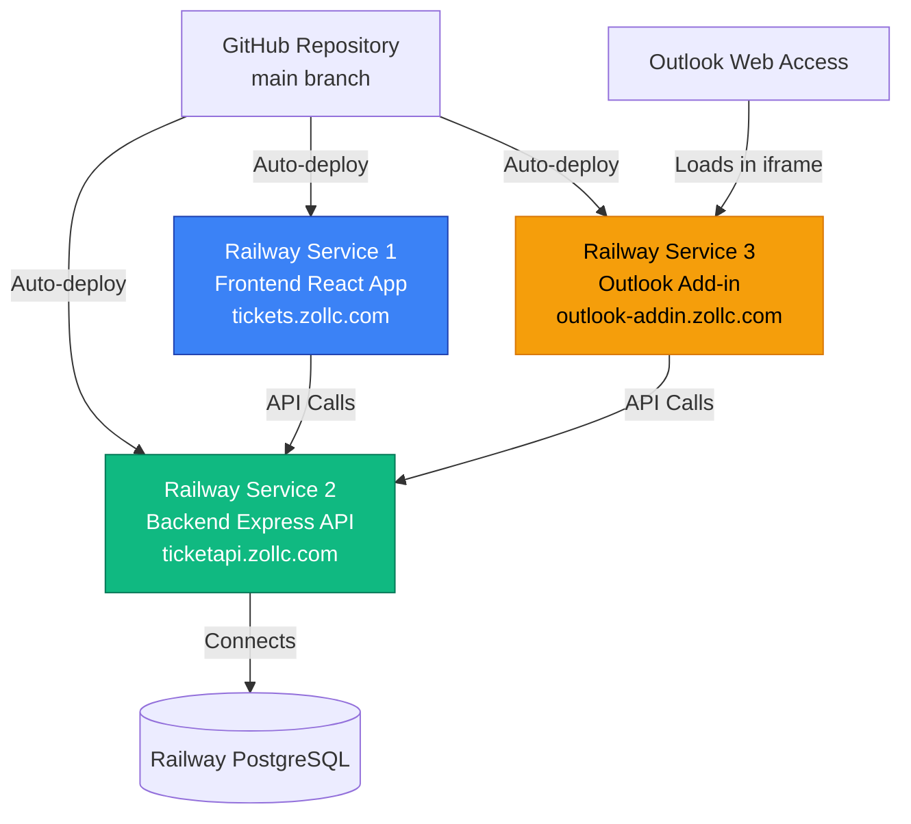

# Infrastructure and Deployment Integration

## Existing Infrastructure

**Current Deployment Architecture:**
- **Frontend:** Railway service → `https://tickets.zollc.com`
- **Backend:** Railway service → `https://ticketapi.zollc.com`
- **Database:** Railway PostgreSQL (managed, automatic backups)
- **SSL/HTTPS:** Railway auto-provisions Let's Encrypt certificates
- **CI/CD:** Auto-deploy from GitHub `main` branch

## Enhancement Deployment Strategy

**Add-in Deployment:** New Railway service hosting Office Add-in static files at `https://outlook-addin.zollc.com`

**Deployment Architecture:**



## Railway Service Configuration

**Service Name:** `outlook-addin`
**Build Command:** `npm install && npm run build --workspace=outlook-addin`
**Start Command:** `npx serve -s outlook-addin/dist -p $PORT`
**Custom Domain:** `outlook-addin.zollc.com`

**Environment Variables:**
```bash
# Add-in service
VITE_API_URL=https://ticketapi.zollc.com
NODE_ENV=production

# Backend service (UPDATED)
ADDIN_URL=https://outlook-addin.zollc.com
```

## Rollback Strategy

**Method:** Railway UI rollback to previous deployment
**Risk Mitigation:** Add-in failure doesn't affect main frontend/backend (isolated service)

---
