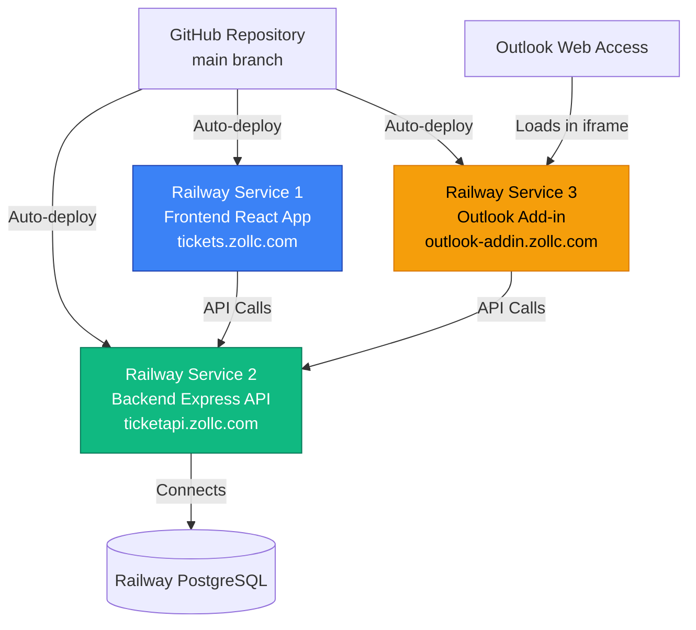

# Infrastructure and Deployment Integration

## Existing Infrastructure

**Current Deployment Architecture:**
- **Frontend:** Railway service → `https://tickets.zollc.com`
- **Backend:** Railway service → `https://ticketapi.zollc.com`
- **Database:** Railway PostgreSQL (managed, automatic backups)
- **SSL/HTTPS:** Railway auto-provisions Let's Encrypt certificates
- **CI/CD:** Auto-deploy from GitHub `main` branch

## Enhancement Deployment Strategy

**Add-in Deployment:** New Railway service hosting Office Add-in static files at `https://outlook-addin.zollc.com`

**Deployment Architecture:**



## Railway Service Configuration

**Service Name:** `outlook-addin`
**Build Command:** `npm install && npm run build --workspace=outlook-addin`
**Start Command:** `npx serve -s outlook-addin/dist -p $PORT`
**Custom Domain:** `outlook-addin.zollc.com`

**Environment Variables:**
```bash
# Add-in service
VITE_API_URL=https://ticketapi.zollc.com
NODE_ENV=production

# Backend service (UPDATED)
ADDIN_URL=https://outlook-addin.zollc.com
```

## Manifest Update Workflow

**CRITICAL:** When modifying the Office Add-in manifest, follow this workflow to ensure changes deploy to production:

### Step-by-Step Process

1. **Edit Development Manifest**
   ```bash
   # Edit the development manifest (uses localhost URLs)
   vi outlook-addin/manifest/outlook-addin-manifest.xml
   ```

2. **Regenerate Production Manifest**
   ```bash
   # Run from outlook-addin directory
   cd outlook-addin
   npm run manifest:prod
   ```

   This script:
   - Reads `manifest/outlook-addin-manifest.xml`
   - Replaces `https://localhost:5173` → `https://outlook-addin.zollc.com`
   - Writes to `manifest/outlook-addin-manifest.prod.xml`

3. **Copy to Public Directory**
   ```bash
   # Copy production manifest to public directory for Railway deployment
   cp manifest/outlook-addin-manifest.prod.xml public/manifest.xml
   ```

4. **Commit and Push**
   ```bash
   git add manifest/outlook-addin-manifest.xml \
           manifest/outlook-addin-manifest.prod.xml \
           public/manifest.xml
   git commit -m "Update manifest: [describe changes]"
   git push
   ```

5. **Railway Auto-Deploys**
   - Railway detects push to `feature/outlook-add-in` branch
   - Builds and deploys updated manifest
   - Manifest accessible at: `https://outlook-addin.zollc.com/manifest.xml`

6. **Test in Outlook**
   - Remove old sideloaded add-in
   - Re-sideload from: `https://outlook-addin.zollc.com/manifest.xml`

### Common Manifest Changes

- **Display Name/Description:** Lines 21-22 in manifest
- **Icon URLs:** Lines 26-27 in manifest
- **API Requirements:** `<Requirements><Sets>` section
- **Pinning Support:** `<SupportsPinning>true</SupportsPinning>` in `<Action>` element
- **Contextless Activation:** `<SupportsNoItemContext>true</SupportsNoItemContext>` in `<Action>` element

### Troubleshooting

**Problem:** Changes not appearing after re-sideload
- **Solution:** Verify `public/manifest.xml` was updated and committed
- **Check:** `git show HEAD:outlook-addin/public/manifest.xml | grep [YourChange]`

**Problem:** Railway deployment failed
- **Solution:** Check Railway logs for build errors
- **Common Issue:** Missing npm workspace build step

**Problem:** Manifest validation errors
- **Solution:** Run validation before committing
  ```bash
  npx office-addin-manifest validate manifest/outlook-addin-manifest.xml
  ```

## Rollback Strategy

**Method:** Railway UI rollback to previous deployment
**Risk Mitigation:** Add-in failure doesn't affect main frontend/backend (isolated service)

---
