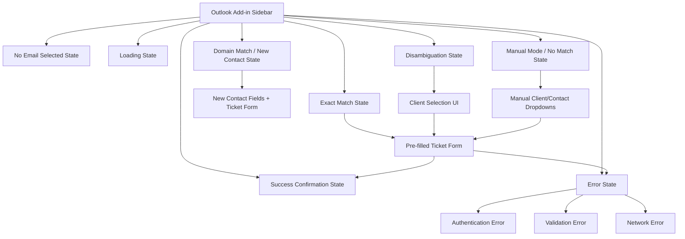
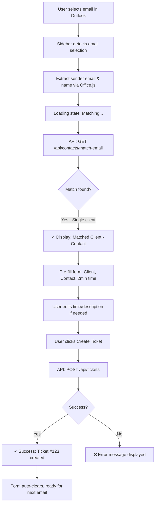
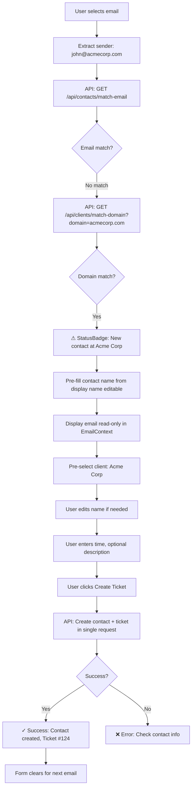
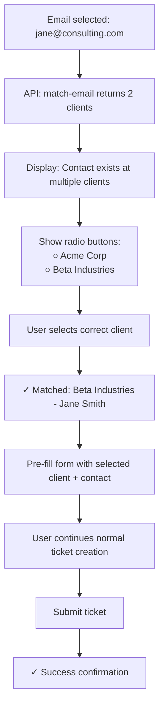
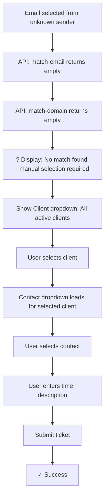

# Outlook Web Add-in for Email-to-Ticket Conversion UI/UX Specification

## Introduction

This document defines the user experience goals, information architecture, user flows, and visual design specifications for **Outlook Web Add-in for Email-to-Ticket Conversion**'s user interface. It serves as the foundation for visual design and frontend development, ensuring a cohesive and user-centered experience.

### Overall UX Goals & Principles

#### Target User Personas

**Solo IT Consultant (Primary):** Hourly-billed IT professionals who manage client work primarily through email. They need speed over features—every second counts when processing high email volume. They're technically savvy but want tools that disappear into their workflow rather than demanding attention.

**Characteristics:**
- Processes 20-50+ client emails daily
- Values muscle-memory workflows (keyboard shortcuts, predictable patterns)
- Frustrated by context-switching between email and ticketing systems
- Loses $5-10K annually from forgotten billable time
- Prefers lightweight tools over feature-bloated enterprise software

#### Usability Goals

1. **Invisible Speed:** Ticket creation should feel automatic—zero perceived friction between reading an email and logging time. Target: <30 seconds from email selection to ticket created (vs. current 2-3 minutes).

2. **Confidence Through Feedback:** Clear visual indicators (✓ matched, ⚠ new contact, ? no match) provide instant confirmation that the system understood the context correctly.

3. **Graceful Degradation:** When auto-matching fails, manual fallback should be equally fast—no roadblocks when edge cases occur.

4. **Keyboard-First Efficiency:** Power users processing high email volume can navigate entirely via Tab/Enter without touching the mouse.

5. **Zero Cognitive Overhead:** Interface should be self-explanatory on first use. No training required—if you can use Outlook, you can use this add-in.

#### Design Principles

1. **Invisible Speed** - The interface should disappear into muscle memory. Ticket creation becomes automatic reflex, not a conscious task.

2. **Progressive Disclosure** - Simple cases (exact match) show minimal UI. Complexity reveals itself only when needed (disambiguation, new contact creation).

3. **Context Awareness Without Action** - Sidebar updates automatically on email selection. The user never needs to trigger "detect contact" manually.

4. **Pre-filled but Editable Philosophy** - Auto-matching provides speed for 80% of cases; full editability handles the 20% edge cases without frustration.

5. **Visual Feedback Loops** - Every system state has a clear visual indicator. Users never wonder "did it detect the client?" or "is it loading?"

#### Change Log

| Date | Version | Description | Author |
|------|---------|-------------|--------|
| 2025-10-08 | 1.0 | Initial front-end specification created from PRD | Sally (UX Expert) |

## Information Architecture (IA)

### Site Map / Screen Inventory

### Navigation Structure

**Primary Navigation:** None - Single-screen sidebar application. All UI states occur within the same task pane view with dynamic content updates based on email selection and matching results.

**Secondary Navigation:** State transitions are automatic (driven by email selection and matching logic) rather than user-initiated navigation. User interactions are limited to:
- Form field editing
- Client selection (disambiguation scenarios)
- Submit button to create ticket

**Breadcrumb Strategy:** Not applicable - No hierarchical navigation in sidebar context. Status badges (✓ matched, ⚠ new contact, ? no match) serve as orientation indicators instead of traditional breadcrumbs.

## User Flows

### Flow 1: Create Ticket - Exact Match (Happy Path)

**User Goal:** Create a billable time ticket for an email from a known contact at a known client

**Entry Points:** User selects a received email in Outlook Web Access

**Success Criteria:** Ticket created in <30 seconds with correct client/contact auto-selected

#### Flow Diagram

#### Edge Cases & Error Handling:

- **Multiple clients for same contact:** Flow transitions to Disambiguation flow (see Flow 3)
- **API timeout during matching:** Display "? Matching failed - using manual mode" and show empty dropdowns
- **Network error during ticket creation:** Display error with "Retry" button, preserve form data
- **Inactive client matched:** Show "⚠ Inactive client" warning badge but allow ticket creation to proceed

**Notes:** This is the 80% case—should feel instantaneous. Target: <500ms from email selection to matched UI displayed (NFR2).

---

### Flow 2: Create Ticket - Domain Match / New Contact

**User Goal:** Create a ticket for an email from a new contact at a known client

**Entry Points:** User selects email from sender whose domain matches a client but email address is unknown

**Success Criteria:** New contact created automatically, ticket submitted without leaving Outlook

#### Flow Diagram

#### Edge Cases & Error Handling:

- **Domain matches multiple clients:** Show disambiguation UI to select correct client first
- **Email sourced from Outlook:** Always valid format (no client-side email validation needed)
- **Duplicate contact email at same client:** Backend returns error, prompt user to select existing contact from dropdown
- **Contact creation fails but ticket succeeds:** Handle partial failure gracefully (rare edge case)

**Notes:**
- Slightly slower than exact match (new contact creation adds latency) but still <30 second target end-to-end
- Email address remains read-only (sourced from Outlook to prevent entry errors)
- StatusBadge displays "⚠ New contact at Acme Corp" to indicate new contact creation
- No additional indicator message displayed (StatusBadge provides sufficient feedback)

---

### Flow 3: Create Ticket - Disambiguation Required

**User Goal:** Create a ticket when a contact exists at multiple clients (e.g., contact changed companies, consultant works with same person at different orgs)

**Entry Points:** Email sender matches contact records at 2+ different clients

**Success Criteria:** User selects correct client context, ticket created with proper association

#### Flow Diagram

#### Edge Cases & Error Handling:

- **User doesn't select client before submitting:** Disable submit button until selection made, show inline hint "Select a client to continue"
- **Email selection changes during disambiguation:** Reset disambiguation UI, re-run matching for new email
- **More than 5 clients matched:** Show scrollable list or dropdown instead of radio buttons

**Notes:** Progressive disclosure in action—disambiguation UI only appears when needed. Selection persists for current email (doesn't reset if user edits form fields).

---

### Flow 4: Create Ticket - Manual Mode (No Match)

**User Goal:** Create a ticket when auto-matching completely fails (new client email, personal email, etc.)

**Entry Points:** Sender email domain and address don't match any known clients or contacts

**Success Criteria:** User manually selects client/contact from dropdowns, ticket created successfully

#### Flow Diagram

#### Edge Cases & Error Handling:

- **Contact dropdown empty for selected client:** Show "No contacts for this client" + link to web app to create contact first (or future enhancement: create contact inline)
- **Dropdowns fail to load:** Display error, offer "Retry" or fallback message to use web app
- **User selects wrong client then changes mind:** Contact dropdown dynamically updates when client selection changes

**Notes:** Fallback path—should be <20% of use cases. Still faster than switching to web app (dropdowns pre-loaded on sidebar init for performance).

## Wireframes & Mockups

**Primary Design Files:** To be created in Figma or design tool of choice. This section provides wireframe-level layout descriptions for immediate development handoff.

### Key Screen Layouts

#### Screen 1: No Email Selected State

**Purpose:** Initial state when add-in loads or after successful ticket creation, prompting user to take action

**Key Elements:**
- Add-in header with branding/title: "Ticketing System"
- Empty state illustration or icon (optional, minimal)
- Instructional text: "Select an email to create a ticket"
- Optional: Last created ticket confirmation (if just submitted): "✓ Ticket #123 created"

**Interaction Notes:** Static display, no form fields. Auto-transitions to Loading State when user selects an email in Outlook.

**Design File Reference:** TBD - Figma frame

---

#### Screen 2: Loading State

**Purpose:** Provide feedback during email context detection and matching API calls

**Key Elements:**
- Email context display: Sender name and email (extracted from Office.js)
- Loading spinner with text: "Matching contact and client..."
- Skeleton UI for form fields (optional, for perceived performance)

**Interaction Notes:** Brief transition state (<500ms per NFR2). Should feel nearly instant for exact matches. No user interaction required—purely feedback.

**Design File Reference:** TBD - Figma frame

---

#### Screen 3: Exact Match State (Happy Path)

**Purpose:** Display auto-matched client/contact with pre-filled ticket creation form

**Key Elements:**
- **Email Context Section:**
  - Sender display name (prominent)
  - Sender email address (secondary text)
  - Match status badge: "✓ Matched" (green)
  - Client and contact names: "Acme Corp - John Smith"
  - Warning badge if inactive client: "⚠ Inactive client"

- **Ticket Form Section:**
  - **Client field:** Dropdown (pre-selected, editable)
  - **Contact field:** Dropdown (pre-selected, editable, filtered by client)
  - **Time field:** Text input with placeholder "e.g., 2h, 30m, 1.5h" (default: "2m")
  - **Description field:** Textarea (optional), placeholder "Brief description for invoice"
  - **Notes field:** Textarea (optional), placeholder "Detailed notes (optional)"
  - **Checkbox:** "Mark as closed immediately"
  - **Submit button:** "Create Ticket" (primary CTA)

**Interaction Notes:**
- All fields editable despite auto-population (user can override)
- Tab order: Client → Contact → Time → Description → Notes → Checkbox → Submit
- Enter key in Time field submits form (power user shortcut)
- Form clears automatically after successful submission

**Design File Reference:** TBD - Figma frame

---

#### Screen 4: Domain Match / New Contact State

**Purpose:** Allow user to review and edit new contact information before creating ticket

**Key Elements:**
- **Email Context Section:**
  - Sender display name
  - Sender email
  - Match status badge: "⚠ New contact" (yellow/orange)
  - Client name: "Acme Corp" (from domain match)

- **New Contact Section** (progressive disclosure):
  - StatusBadge: "⚠ New contact at Acme Corp" (provides indication, no additional message)
  - **Contact Name field:** Text input (pre-filled from sender display name, editable)
  - **Contact Email:** Read-only display (sourced from Outlook sender email)
  - Validation: Name required (email always valid from Outlook)

- **Ticket Form Section:**
  - Client dropdown (pre-selected from domain match)
  - Time, Description, Notes, Checkbox (same as Screen 3)
  - Submit button: "Create Contact & Ticket"

**Interaction Notes:**
- Contact fields appear inline above ticket form (not a separate modal/step)
- User can edit contact info before submission
- Single submission creates both contact and ticket atomically

**Design File Reference:** TBD - Figma frame

---

#### Screen 5: Disambiguation State

**Purpose:** Let user select correct client when contact exists at multiple clients

**Key Elements:**
- **Email Context Section:**
  - Sender display name and email
  - Match status badge: "? Select client" (neutral gray/blue)
  - Instructional text: "This contact exists at multiple clients. Select one:"

- **Client Selection UI:**
  - Radio buttons (if 2-5 clients) or dropdown (if 6+ clients)
  - Each option displays: Client name
  - Submit button disabled until selection made

- **Ticket Form Section:**
  - Form appears after client selected (progressive disclosure)
  - Contact auto-selected based on disambiguation choice
  - Rest of form identical to Screen 3

**Interaction Notes:**
- Client selection required before form reveals
- Arrow keys navigate radio buttons, Enter selects
- Form state preserved if user changes client selection

**Design File Reference:** TBD - Figma frame

---

#### Screen 6: Manual Mode / No Match State

**Purpose:** Allow full manual client/contact selection when auto-matching fails

**Key Elements:**
- **Email Context Section:**
  - Sender display name and email
  - Match status badge: "? No match found" (gray)
  - Instructional text: "Manual selection required"

- **Ticket Form Section:**
  - **Client dropdown:** All active clients (alphabetically sorted), no pre-selection
  - **Contact dropdown:** Disabled until client selected, then loads contacts for that client
  - Time, Description, Notes, Checkbox (same as Screen 3)
  - Submit button: Disabled until Client and Contact selected

**Interaction Notes:**
- Contact dropdown dynamically updates when client changes
- If selected client has no contacts: Show "No contacts available" + link to web app
- Dropdowns pre-loaded on sidebar init for fast response

**Design File Reference:** TBD - Figma frame

---

#### Screen 7: Success Confirmation State

**Purpose:** Provide clear feedback that ticket was created successfully

**Key Elements:**
- Success message (prominent): "✓ Ticket #[ID] created successfully"
- Ticket ID hyperlinked to web app (optional, opens ticket detail in new tab)
- Auto-dismiss after 3 seconds OR manual dismiss button
- Form automatically cleared, ready for next email

**Interaction Notes:**
- Confirmation appears as banner/toast at top of sidebar
- Doesn't block further interaction (user can immediately select next email)
- Success state transitions to "No Email Selected" or next email's matching state

**Design File Reference:** TBD - Figma frame

---

#### Screen 8: Error State (Authentication Required)

**Purpose:** Handle session expiration or authentication failures gracefully

**Key Elements:**
- Error icon/illustration
- Error message: "Session expired. Please log in to continue."
- Call-to-action button: "Open Web App" (opens ticketing system in new tab)
- Instructional text: "After logging in, return here to create tickets"

**Interaction Notes:**
- Form disabled/hidden when not authenticated
- Authentication check on sidebar load and before each API call
- Error clears automatically when auth restored (if session sharing works)

**Design File Reference:** TBD - Figma frame

---

#### Screen 9: Error State (Validation/Network Errors)

**Purpose:** Display actionable error messages for form validation or API failures

**Key Elements:**
- **Validation errors:** Inline next to fields with red border and text
  - Example: "Invalid time format. Use: 2h, 30m, or 1.5h"
  - Example: "Contact name is required"
- **Network errors:** Banner at top with retry option
  - "Failed to create ticket: [error message]. [Retry]"
- Form data preserved on errors (not cleared)

**Interaction Notes:**
- Validation errors prevent submission (button disabled)
- Network errors allow retry without re-entering data
- Errors cleared when user corrects invalid fields

**Design File Reference:** TBD - Figma frame

## Component Library / Design System

**Design System Approach:** Lightweight component library built specifically for the add-in, potentially sharing components with the main web app where applicable. Given the sidebar's constrained width and unique interaction patterns, custom components optimized for narrow vertical layouts are preferred over forcing existing web components into the task pane.

**Component Philosophy:** Reuse patterns and styling from the main ticketing web app (Tailwind-based) but create add-in-specific implementations where needed. Focus on performance and bundle size—every component must justify its inclusion given NFR1's 2-second load target.

### Core Components

#### Component: StatusBadge

**Purpose:** Display matching status with visual feedback (✓ matched, ⚠ warning, ? manual)

**Variants:**
- `matched` - Green badge with checkmark icon
- `warning` - Yellow/orange badge with warning icon
- `neutral` - Gray badge with question mark icon
- `error` - Red badge with error icon

**States:** Default only (no hover/active needed—purely informational display)

**Usage Guidelines:** Always pair with descriptive text (e.g., "✓ Matched: Acme Corp - John Smith"). Icon + color should reinforce status, not be sole indicator (accessibility).

---

#### Component: EmailContext

**Purpose:** Display sender information and matching status in consistent header format

**Variants:**
- With match results (client/contact names displayed)
- Without match results (manual mode)
- Loading state (spinner, skeleton UI)

**States:**
- Loading (animated spinner)
- Matched (green badge)
- Warning (yellow badge, e.g., new contact or inactive client)
- Neutral (gray badge, no match or disambiguation)

**Usage Guidelines:** Always appears at top of sidebar. Updates reactively when email selection changes. Includes sender name (prominent), sender email (secondary text), and StatusBadge component.

---

#### Component: ClientDropdown

**Purpose:** Searchable dropdown for selecting a client from all active clients

**Variants:**
- Editable (default, user can select/change)
- Pre-selected (auto-matched client, editable)
- Disabled (during loading or error states)

**States:**
- Default (closed)
- Open (dropdown expanded)
- Selected (value chosen)
- Disabled

**Usage Guidelines:** Alphabetically sorted. Filter by active status (exclude inactive by default, unless matched via email). Support keyboard navigation (arrow keys, type-to-search). Width 100% of sidebar (no horizontal overflow).

---

#### Component: ContactDropdown

**Purpose:** Dropdown for selecting a contact, dynamically filtered by selected client

**Variants:**
- Filtered by client (default)
- Empty state ("No contacts available")
- Pre-selected (auto-matched contact, editable)
- Disabled (no client selected yet)

**States:**
- Default (closed)
- Open (dropdown expanded)
- Selected (value chosen)
- Disabled (until client selected)
- Empty (no contacts for selected client)

**Usage Guidelines:** Cascading dependency—loads contacts only after client selected. Display contact name + email in dropdown options for disambiguation. Link to web app if no contacts exist.

---

#### Component: TimeInput

**Purpose:** Text field for entering time with flexible parsing (hours, minutes, combined formats)

**Variants:**
- Default (empty or pre-filled with "2m")
- Valid (green check icon, optional)
- Invalid (red border, error text below)

**States:**
- Default
- Focus (highlighted)
- Valid
- Invalid (with error message)

**Usage Guidelines:** Placeholder: "e.g., 2h, 30m, 1.5h". Validate on blur or submit. Display inline error: "Invalid time format. Use: 2h, 30m, or 1.5h". Parse and convert to decimal hours before API submission.

---

#### Component: FormButton (Primary CTA)

**Purpose:** Primary action button for submitting ticket creation form

**Variants:**
- `submit` - "Create Ticket" (default state)
- `submit-new-contact` - "Create Contact & Ticket" (new contact flow)
- `loading` - Disabled with spinner during API call

**States:**
- Default (enabled, clickable)
- Hover (slight color change)
- Disabled (grayed out, not clickable)
- Loading (spinner, disabled)

**Usage Guidelines:** Always full-width in sidebar. Disabled until required fields valid (client, contact, time). Enter key triggers submit when focused in Time field (power user shortcut).

---

#### Component: SuccessBanner

**Purpose:** Toast/banner notification for successful ticket creation

**Variants:**
- Auto-dismiss (default, 3 seconds)
- Manual dismiss (with close button)

**States:**
- Visible (displayed after success)
- Hidden (dismissed or not triggered)

**Usage Guidelines:** Appears at top of sidebar, above EmailContext. Non-blocking (user can select next email immediately). Green color scheme. Display ticket ID with optional link to web app.

---

#### Component: ErrorMessage

**Purpose:** Display validation or network error messages

**Variants:**
- Inline (next to specific field, e.g., time validation)
- Banner (top of form, e.g., network error)

**States:**
- Visible (error occurred)
- Hidden (no errors)

**Usage Guidelines:** Red color scheme. Include actionable instructions (e.g., "Retry" button for network errors). Inline errors clear when user edits field. Banner errors persist until retry or dismissal.

## Branding & Style Guide

### Visual Identity

**Brand Guidelines:** Inherit from main ticketing system web app. Adopt the same clean, professional, minimal aesthetic to create trust that the add-in is an official extension rather than a third-party integration.

**Sidebar-Specific Considerations:**
- Constrained width (300-400px) requires aggressive information density optimization
- Generous vertical whitespace to create breathing room in narrow layout
- Prominent visual indicators for matching status (color-coded badges)
- Minimal decorative elements—every pixel serves a functional purpose

### Color Palette

| Color Type | Hex Code | Usage |
|------------|----------|-------|
| Primary | #3B82F6 | Primary buttons, links, interactive elements |
| Secondary | #6B7280 | Secondary text, borders, disabled states |
| Accent | #8B5CF6 | Hover states, focus indicators (optional) |
| Success | #10B981 | Success badges (✓ matched), confirmation messages, success banner |
| Warning | #F59E0B | Warning badges (⚠ new contact, inactive client), cautionary alerts |
| Error | #EF4444 | Error badges, validation errors, network failure messages |
| Neutral | #F3F4F6, #E5E7EB, #D1D5DB | Backgrounds, borders, neutral badges (? no match) |

**Note:** Color palette inherits from Tailwind CSS defaults used in main web app (blue-500, gray-500, etc.). Exact hex codes should match web app's Tailwind configuration for visual consistency.

### Typography

#### Font Families

- **Primary:** Inter, system-ui, -apple-system, sans-serif (matches web app)
- **Secondary:** (same as primary—no separate secondary font needed)
- **Monospace:** 'Courier New', monospace (for ticket IDs, technical data if needed)

#### Type Scale

| Element | Size | Weight | Line Height |
|---------|------|--------|-------------|
| H1 | 20px | 600 (Semi-bold) | 1.4 |
| H2 | 16px | 600 (Semi-bold) | 1.5 |
| H3 | 14px | 600 (Semi-bold) | 1.5 |
| Body | 14px | 400 (Regular) | 1.6 |
| Small | 12px | 400 (Regular) | 1.5 |

**Sidebar Adjustments:** Type scale is slightly smaller than typical web app (Body at 14px vs. 16px) to accommodate narrow width while maintaining readability. All sizes optimized for 300-400px container width.

### Iconography

**Icon Library:** Heroicons (outline and solid variants) - consistent with main web app

**Usage Guidelines:**
- Status badges use solid icons: checkmark-circle (success), exclamation-circle (warning), question-mark-circle (neutral), x-circle (error)
- Form fields use outline icons for visual lightness
- Icon size: 16px for inline icons, 20px for badges
- Always include aria-label for accessibility (icons not decorative)

### Spacing & Layout

**Grid System:** Single-column vertical layout (no grid needed—sidebar is one column by default)

**Spacing Scale:**
- **xs:** 4px - Tight spacing between related elements
- **sm:** 8px - Standard spacing within components
- **md:** 16px - Spacing between form fields
- **lg:** 24px - Spacing between major sections (Email Context → Form)
- **xl:** 32px - Top/bottom padding in sidebar container

**Layout Constraints:**
- Sidebar width: 300-400px (controlled by Outlook, not customizable)
- Horizontal padding: 16px (left/right margins)
- Vertical rhythm: 16px between form fields for clean scan-ability
- No horizontal scrolling—all content must fit within sidebar width

## Accessibility Requirements

### Compliance Target

**Standard:** No formal WCAG compliance required for MVP. Standard keyboard navigation and screen reader compatibility through semantic HTML is sufficient. The add-in uses Office.js within Outlook's accessibility context, inheriting Outlook's accessibility features.

### Key Requirements

**Visual:**
- Color contrast ratios: Minimum 4.5:1 for normal text, 3:1 for large text (follow WCAG AA as baseline even if not formally compliant)
- Focus indicators: Visible focus outline on all interactive elements (2px solid border, high contrast color)
- Text sizing: Minimum 12px, preferred 14px for body text (already specified in Typography section)

**Interaction:**
- Keyboard navigation: Full tab order support through all form fields and buttons (Client → Contact → Time → Description → Notes → Checkbox → Submit)
- Screen reader support: Semantic HTML elements (proper heading hierarchy, form labels, ARIA attributes where needed)
- Touch targets: N/A for MVP (Outlook Web on desktop only, no mobile support)

**Content:**
- Alternative text: All status badge icons include descriptive aria-label (e.g., "Matched", "Warning", "No match found")
- Heading structure: Logical h1-h3 hierarchy (sidebar title = h1, section headers = h2, subsections = h3)
- Form labels: All input fields have associated <label> elements with for attribute, never placeholder-only

### Testing Strategy

**Manual keyboard testing:** Tab through all screens, verify focus indicators visible, Enter key submits form

**Screen reader spot check:** Test with VoiceOver (macOS) to ensure form fields and status messages announced correctly

**Color contrast validation:** Use browser dev tools contrast checker on status badges and error messages

**No automated accessibility testing for MVP** - Manual verification sufficient given simplified scope and Office.js's built-in accessibility handling.

## Responsiveness Strategy

### Breakpoints

**Not Applicable** - The add-in runs exclusively in Outlook Web Access task pane (sidebar), which has a fixed width controlled by Outlook (typically 300-400px). No responsive breakpoints needed.

| Breakpoint | Min Width | Max Width | Target Devices |
|------------|-----------|-----------|----------------|
| Sidebar (only) | 300px | 400px | Outlook Web task pane on desktop browsers |

### Adaptation Patterns

**Layout Changes:** Single-column vertical layout at all times. No layout shifts or breakpoint-based adaptations required.

**Navigation Changes:** N/A - No navigation elements to adapt.

**Content Priority:** All content visible at all times within scrollable sidebar. No content hiding or progressive disclosure based on width (only based on application state per IA section).

**Interaction Changes:** No touch-specific interactions. Mouse and keyboard only for desktop Outlook Web.

### Additional Considerations

**Minimum width handling:** If Outlook renders task pane narrower than 300px (edge case), apply minimum width constraint and allow horizontal scrolling as last resort. Prefer text truncation with tooltips for long client/contact names.

**Height responsiveness:** Sidebar height varies based on Outlook window size. Ensure vertical scrolling enabled for form content that exceeds viewport height. Sticky header (Email Context section) optional for better context retention while scrolling.

**Browser zoom:** Support browser zoom levels 100%-200% without breaking layout (use relative units like rem/em, avoid fixed px widths for text containers).

## Animation & Micro-interactions

### Motion Principles

**Invisible Speed Philosophy:** Animations should enhance perceived performance, not slow down the workflow. All transitions must feel instantaneous (<300ms) while providing enough visual feedback to confirm state changes.

**Principles:**
1. **Functional over decorative** - Every animation serves a purpose (loading feedback, state transition clarity, error attention)
2. **Respect reduced motion** - Honor `prefers-reduced-motion` media query, disable non-essential animations
3. **Performance first** - Use CSS transforms and opacity (GPU-accelerated), avoid animating layout properties
4. **Consistent timing** - Use a limited set of durations (150ms, 300ms) and easing functions (ease-out for entrances, ease-in for exits)

### Key Animations

- **Loading spinner:** Continuous rotation animation for matching API calls (Duration: infinite, Easing: linear)

- **Status badge appearance:** Fade in + slight scale when matching completes (Duration: 200ms, Easing: ease-out)

- **Form field focus:** Border color transition on focus/blur (Duration: 150ms, Easing: ease-out)

- **Success banner slide-in:** Slide down from top with fade (Duration: 300ms, Easing: ease-out)

- **Success banner slide-out:** Fade out after 3 seconds (Duration: 200ms, Easing: ease-in)

- **Error message appearance:** Shake animation for validation errors to draw attention (Duration: 400ms, Easing: ease-in-out)

- **Dropdown expand/collapse:** Height transition with fade (Duration: 200ms, Easing: ease-out)

- **Button loading state:** Spinner fade-in, button text fade-out (Duration: 150ms, Easing: ease-out)

- **Email context update:** Cross-fade when switching emails (Duration: 250ms, Easing: ease-in-out)

- **Skeleton UI pulse:** Subtle opacity pulse during loading states (Duration: 1500ms, Easing: ease-in-out, infinite)

### Performance Constraints

- **Total animation budget:** No more than 2-3 simultaneous animations to maintain 60fps
- **Prefers-reduced-motion:** Disable all decorative animations (badge scale, shake, pulse), keep only essential state changes (spinner, fade transitions)
- **GPU acceleration:** Use `transform` and `opacity` properties exclusively; avoid `width`, `height`, `top`, `left` animations

## Performance Considerations

### Performance Goals

- **Page Load:** Sidebar loads and renders within 2 seconds of Outlook launch (per NFR1)
- **Interaction Response:** Contact/client matching completes within 500ms of email selection (per NFR2)
- **Animation FPS:** All animations maintain 60fps; no jank or frame drops during transitions

### Design Strategies

**Bundle Size Optimization:**
- Target bundle size <200KB (gzipped) for initial load to meet 2-second target on typical broadband
- Code splitting: Separate initial render from matching logic, lazy-load non-critical components
- Tree-shaking: Use ES modules and named imports to eliminate unused code
- Icon optimization: Use SVG sprites or icon font instead of individual image files

**Perceived Performance Techniques:**
- Skeleton UI during loading states (shows structure immediately, content fills in)
- Optimistic UI updates: Pre-fill form immediately on match, show spinner only if API takes >200ms
- Instant feedback: Form validation and focus states respond within 16ms (1 frame at 60fps)
- Progressive disclosure: Load client dropdown on sidebar init, defer contact dropdown until client selected

**API Call Optimization:**
- Debounce email selection changes (300ms) to prevent rapid API calls when user quickly switches emails
- Cache client list on sidebar init (single API call, reused for manual mode dropdown)
- Parallel API calls where possible: If domain match needed, trigger simultaneously with contact match (don't wait for sequential failure)
- Request compression: Ensure backend serves gzipped responses for API calls

**Rendering Performance:**
- Use React.memo or similar memoization for static components (EmailContext when data unchanged)
- Virtual scrolling for dropdown lists if client/contact count exceeds 100 items (unlikely for solo consultant, but future-proof)
- Avoid layout thrashing: Batch DOM reads and writes, use requestAnimationFrame for animations
- CSS containment: Use `contain: layout style` on independent components to isolate reflows

**Office.js Integration Efficiency:**
- Minimize Office.js API calls: Extract all needed email metadata in single operation (sender email, display name, subject)
- Event listener optimization: Use passive event listeners where possible, avoid expensive handlers in email selection callback

**Asset Optimization:**
- Use system fonts where possible (Inter with system-ui fallback) to avoid font download latency
- Inline critical CSS for initial render (above-the-fold styles)
- Lazy-load non-critical assets (success/error illustrations, if used)

## Next Steps

### Immediate Actions

1. **Review this specification with stakeholders** (product owner, development team) for feedback and approval
2. **Create visual designs in Figma** using the wireframe descriptions and style guide as foundation
3. **Prepare for handoff to Architect** to create detailed technical architecture document (frontend component architecture, Office.js integration patterns, API contracts)
4. **Set up design collaboration** with development team for iterative feedback during implementation

### Design Handoff Checklist

- [x] All user flows documented
- [x] Component inventory complete
- [x] Accessibility requirements defined
- [x] Responsive strategy clear
- [x] Brand guidelines incorporated
- [x] Performance goals established

### Recommended Next Documents

**For Architect/Dev Agent:**
- Frontend Architecture Document (component structure, state management, Office.js integration)
- API Contract Specification (matching endpoints, request/response schemas)
- Testing Strategy Document (unit tests for matching logic, manual test scenarios)

**For UX Expert (this agent):**
- High-fidelity mockups in Figma for all 9 screen states
- Interactive prototype for user testing (optional, if time permits)
- Component library with visual examples (Storybook or similar)

**For PM Agent:**
- Update PRD Epic 3 (Add-in Sidebar UI) stories with references to this spec
- Ensure Epic 4 (Matching & Auto-Population) stories align with IA and user flows defined here
- Create design review story/task for stakeholder sign-off

### Open Questions for Resolution

1. **Icon assets:** Will add-in use existing icon set from main web app, or need custom icon pack? (Affects manifest and branding)
2. **Figma access:** Who will create the high-fidelity designs, and where should they be hosted?
3. **Authentication UX:** Once Architect determines auth strategy (session vs. token), may need to update Screen 8 (Auth Error) workflow
4. **Success banner link:** Should ticket ID link open web app in new tab, or is it display-only? (Affects Screen 7 implementation)

