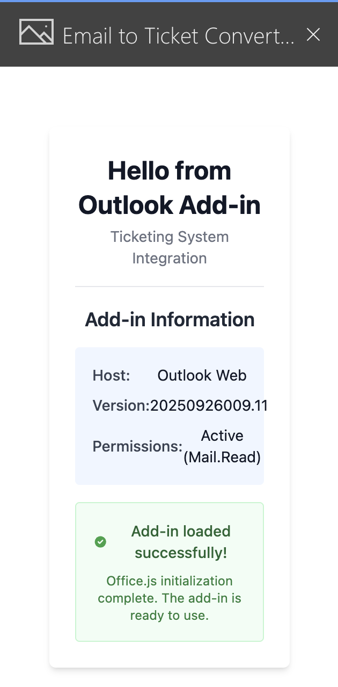

# Outlook Add-in for Ticketing System

This is the Outlook Add-in component of the Ticketing System, providing email-to-ticket conversion functionality directly within Microsoft Outlook.

## Prerequisites

- **Node.js**: v18.x or higher
- **npm**: v9.x or higher
- **Microsoft Outlook**: Desktop, Web, or Mobile (Office 365 subscription recommended)

## Technology Stack

- **React**: 18.3.1
- **TypeScript**: 5.8.3
- **Vite**: 5.4.19
- **Tailwind CSS**: 3.4.17
- **Office.js**: Loaded from Microsoft CDN

## Getting Started

### 1. Install Dependencies

```bash
npm install
```

### 2. Generate HTTPS Certificate (First-time setup only)

Office Add-ins **require HTTPS** even in local development. The project includes a self-signed SSL certificate for localhost.

**If you need to regenerate the certificate:**

Using `mkcert` (recommended):
```bash
# Install mkcert (macOS)
brew install mkcert

# Generate certificate
mkcert -install
mkcert -key-file certs/localhost-key.pem -cert-file certs/localhost.pem localhost
```

Using `openssl` (alternative):
```bash
openssl req -x509 -newkey rsa:2048 -nodes -sha256 \
  -subj '/CN=localhost' \
  -keyout certs/localhost-key.pem \
  -out certs/localhost.pem \
  -days 365
```

**Note:** Certificate files (`*.pem`) are excluded from git tracking for security.

### 3. Start Development Server

```bash
npm run dev
```

The add-in will be available at: **`https://localhost:5173`**

**First-time HTTPS warning:** Your browser will show a security warning because the certificate is self-signed. This is expected for local development:
- **Chrome/Edge**: Click "Advanced" → "Proceed to localhost (unsafe)"
- **Firefox**: Click "Advanced" → "Accept the Risk and Continue"
- **Safari**: Click "Show Details" → "visit this website"

### 4. Access the Add-in

Open your browser and navigate to `https://localhost:5173` to verify the dev server is running.

## Available Scripts

- **`npm run dev`**: Start HTTPS development server on port 5173
- **`npm run build`**: Create production build in `/dist` directory
- **`npm run lint`**: Run ESLint code quality checks
- **`npm run preview`**: Preview production build locally
- **`npm run manifest:prod`**: Generate production manifest with Railway URLs

## Project Structure

```
outlook-addin/
├── src/
│   ├── components/          # React UI components (PascalCase)
│   ├── lib/                 # Utilities and API clients
│   │   ├── api/             # API service modules (camelCase)
│   │   └── office.ts        # Office.js wrapper utilities
│   ├── hooks/               # Custom React hooks (useHookName)
│   └── types.ts             # TypeScript type definitions
├── manifest/                # Office Add-in manifest files
├── certs/                   # SSL certificates (gitignored)
├── public/                  # Static assets
└── index.html               # HTML template with Office.js CDN
```

## Manifest Validation

The Office Add-in manifest defines add-in metadata, permissions, and hosting configuration. Microsoft provides validation tooling to ensure manifest compliance.

### Validate Development Manifest

Install the Office Add-in Validator (global install):
```bash
npm install -g office-addin-manifest
```

Validate the development manifest:
```bash
office-addin-manifest validate manifest/outlook-addin-manifest.xml
```

**Expected output:** "The manifest is valid."

### Generate Production Manifest

The production manifest replaces `localhost:5173` URLs with the Railway production URL:

```bash
npm run manifest:prod
```

This creates `manifest/outlook-addin-manifest.prod.xml` with production URLs.

**Important:** Production manifests are gitignored and should be regenerated for each deployment.

## Sideloading the Add-in in Outlook Web

"Sideloading" allows you to install the add-in for testing without publishing to the Microsoft AppSource store.

### Prerequisites for Sideloading

1. **Dev server running**: `npm run dev` (must be accessible at `https://localhost:5173`)
2. **Valid manifest**: Manifest must pass validation (see Manifest Validation above)
3. **Outlook Web Access**: Navigate to [outlook.office.com](https://outlook.office.com)
4. **Office 365 account**: Personal or organizational account

### Sideloading Steps

1. **Open Outlook Web**: Navigate to [outlook.office.com](https://outlook.office.com) and sign in
2. **Access Add-ins Menu**:
   - Click the **"Get Add-ins"** button in the Outlook toolbar (icon looks like a puzzle piece)
   - If not visible, click the **three-dot menu (⋯)** in the toolbar and select "Get Add-ins"
3. **Navigate to My Add-ins**:
   - In the Add-ins dialog, click **"My add-ins"** in the left sidebar
4. **Upload Custom Add-in**:
   - Scroll down to the **"Custom add-ins"** section
   - Click **"Add a custom add-in"** → **"Add from file..."**
5. **Select Manifest File**:
   - Click **"Browse"** and navigate to: `/outlook-addin/manifest/outlook-addin-manifest.xml`
   - Click **"Upload"**
6. **Confirm Installation**:
   - Review the permissions requested (Mail.Read for email metadata)
   - Click **"Install"** to confirm
7. **Verify Add-in Appears**:
   - Open any email in your inbox
   - Look for the **"Email to Ticket"** button group in the ribbon
   - Click **"Create Ticket"** to open the task pane
   - The add-in should load from `https://localhost:5173`

### Sideloading Troubleshooting

#### Add-in Not Appearing After Sideload

**Cause:** Manifest validation failed or XML parsing error

**Solution:**
- Re-validate manifest: `office-addin-manifest validate manifest/outlook-addin-manifest.xml`
- Check browser DevTools Console for errors
- Verify manifest UUID is lowercase (schema requirement)
- Try removing and re-sideloading the add-in

#### "Unable to Download Manifest" Error

**Cause:** Dev server not running or HTTPS certificate not trusted

**Solution:**
- Ensure dev server is running: `npm run dev`
- Open `https://localhost:5173` in browser and accept certificate warning
- Verify firewall isn't blocking port 5173
- Check Vite console for errors

#### Task Pane Shows "Page Not Found"

**Cause:** SourceLocation URL in manifest doesn't match dev server

**Solution:**
- Verify dev server URL matches manifest: `https://localhost:5173`
- Check `vite.config.ts` port configuration
- Ensure `index.html` loads correctly when visited directly

#### "Add from file" Option Not Available

**Cause:** Organizational policy restrictions or insufficient permissions

**Solution:**
- Contact Office 365 administrator to enable custom add-in sideloading
- Try using personal Microsoft account instead of organizational account
- Check organization's add-in deployment policies

#### Add-in Loads But Office.js API Calls Fail

**Cause:** Office.js not properly initialized or wrong API version

**Solution:**
- Check `Office.onReady()` is called before accessing Office APIs
- Verify `index.html` includes Office.js CDN script: `<script src="https://appsforoffice.microsoft.com/lib/1/hosted/office.js"></script>`
- Check manifest `Requirements` section specifies correct Mailbox API version
- Review browser DevTools Console for Office.js errors

### Removing Sideloaded Add-in

To remove the add-in during development:

1. Go to **"Get Add-ins"** → **"My add-ins"**
2. Find **"Email to Ticket Converter"** in the custom add-ins list
3. Click the **three-dot menu (⋯)** next to the add-in name
4. Select **"Remove"**

### Refreshing After Code Changes

After making code changes to the add-in:

1. **Vite auto-refresh**: Most changes will hot-reload automatically
2. **Manifest changes**: Remove and re-sideload the add-in
3. **Office.js changes**: Close and reopen the task pane
4. **Hard refresh**: Close Outlook Web tab and reopen (clears Office.js cache)

## Hello World Verification

After sideloading the add-in, you can verify that Office.js initialization and the basic add-in functionality are working correctly.

### What to Expect

When the add-in loads successfully, you should see:

1. **HelloWorld Component** displaying "Hello from Outlook Add-in"
2. **Add-in Information Card** showing:
   - **Host**: "Outlook Web" (or other Outlook host)
   - **Version**: Office.js host version number
   - **Permissions**: Active (Mail.Read) or None
3. **Success Indicator**: Green checkmark with "Add-in loaded successfully!"

### Verification Steps

1. **Start Dev Server**:
   ```bash
   npm run dev
   ```
   Verify server starts at `https://localhost:5173`

2. **Sideload Manifest** (if not already done):
   - Follow the [Sideloading Steps](#sideloading-steps) above
   - Upload `manifest/outlook-addin-manifest.xml`

3. **Open Add-in in Outlook Web**:
   - Navigate to [outlook.office.com](https://outlook.office.com)
   - Open any email in your inbox
   - Click the **"Create Ticket"** button in the ribbon
   - The task pane should open on the right side

4. **Verify Office.js Initialization**:
   - **Loading State**: You should briefly see a loading spinner with "Initializing Office.js..."
   - **Ready State**: The HelloWorld component should appear after initialization completes
   - **Host Information**: Verify the host name shows "Outlook Web" and a version number is displayed

5. **Check Browser Console** (Optional):
   - Press `F12` to open DevTools
   - Switch to the Console tab
   - Verify **zero JavaScript errors**
   - Verify **zero Office.js API errors**
   - Check Network tab: All resources should load with 200 status

6. **Test Task Pane Persistence**:
   - With the task pane open, select a different email
   - **Expected Behavior**: Task pane should remain visible (or may reload depending on Outlook Web configuration)
   - The HelloWorld component should continue displaying correctly

### Troubleshooting Hello World

#### Task Pane is Blank

**Cause:** Office.js failed to initialize or React render error

**Solution:**
- Open browser DevTools Console and check for errors
- Verify Office.js CDN script loads: Check Network tab for `https://appsforoffice.microsoft.com/lib/1/hosted/office.js`
- Verify dev server is running and accessible at `https://localhost:5173`
- Hard refresh the browser (`Ctrl+Shift+R` or `Cmd+Shift+R`)

#### "Office.js not available" Error Message

**Cause:** Office.js CDN script failed to load or blocked by firewall

**Solution:**
- Check internet connection (Office.js loads from Microsoft CDN)
- Verify `index.html` includes Office.js script in `<head>` section
- Try accessing the Office.js CDN directly: `https://appsforoffice.microsoft.com/lib/1/hosted/office.js`
- Check corporate firewall settings (some organizations block external CDNs)

#### "Add-in must be loaded in Outlook" Error

**Cause:** Add-in opened outside of Outlook context (e.g., directly in browser)

**Solution:**
- The add-in **must** be opened through Outlook Web's task pane
- Do NOT navigate directly to `https://localhost:5173` and expect Office.js to work
- Sideload the manifest and open via the "Create Ticket" button in Outlook

#### HTTPS Certificate Warning Persists

**Cause:** Self-signed certificate not accepted by browser

**Solution:**
- Click "Advanced" → "Proceed to localhost (unsafe)" when first visiting `https://localhost:5173`
- This is **expected behavior** for local development
- Production deployment will use a valid SSL certificate from Railway

#### Host Information Shows "0" for Permissions

**Cause:** No email is selected or add-in context unavailable

**Solution:**
- Select an email in the inbox before opening the add-in
- The ReadItem permission requires an email context to be active
- If an email is selected and permissions still show "0", this is acceptable for Hello World testing

### Screenshot Example



*Screenshot shows the HelloWorld component loaded in Outlook Web's task pane, displaying host information and successful Office.js initialization.*

**Note:** Screenshot will be captured during manual testing (Story 1.5, Task 7).

## Authentication

The add-in uses **session cookie sharing** with the main application backend:
- All API requests must include `credentials: 'include'`
- Backend is configured with `sameSite: 'none'` for cross-origin cookies
- User must be logged into the main application first

## Troubleshooting

### Certificate Issues

**Problem:** "Your connection is not private" or "NET::ERR_CERT_AUTHORITY_INVALID"

**Solution:**
1. Verify certificate files exist in `certs/` directory
2. Regenerate certificates using instructions above
3. Clear browser SSL cache and restart dev server
4. On macOS, add certificate to Keychain Access and mark as trusted

### Dev Server Won't Start

**Problem:** Port 5173 already in use

**Solution:**
```bash
# Find process using port 5173
lsof -i :5173

# Kill the process (replace PID with actual process ID)
kill -9 <PID>

# Or change port in vite.config.ts
```

### Office.js Not Loading

**Problem:** Office.js script fails to load in browser

**Solution:**
1. Check browser DevTools Network tab for CDN request
2. Verify `index.html` includes Office.js script in `<head>`
3. Check internet connection (Office.js loads from Microsoft CDN)
4. Try different network (some corporate firewalls block CDN)

### Build Errors After Version Changes

**Problem:** TypeScript or dependency errors after switching branches

**Solution:**
```bash
# Clean install dependencies
rm -rf node_modules package-lock.json
npm install
```

## Development Guidelines

- **File Naming**:
  - Components: `PascalCase.tsx`
  - API modules: `camelCase.ts`
  - Hooks: `useHookName.ts`

- **Office.js Usage**:
  - Always call `Office.onReady()` before accessing Office APIs
  - Wrap Office.js calls in try-catch error handlers
  - Reference: [Office.js Documentation](https://learn.microsoft.com/en-us/office/dev/add-ins/)

- **API Calls**:
  - Use `credentials: 'include'` in fetch requests
  - Base URL: `http://localhost:3001/api` (dev) or production backend URL

## Resources

- [Office Add-ins Documentation](https://learn.microsoft.com/en-us/office/dev/add-ins/)
- [Office.js API Reference](https://learn.microsoft.com/en-us/javascript/api/office)
- [Vite Documentation](https://vitejs.dev/)
- [React Documentation](https://react.dev/)

## License

Internal use only - Part of the Ticketing System monorepo.
